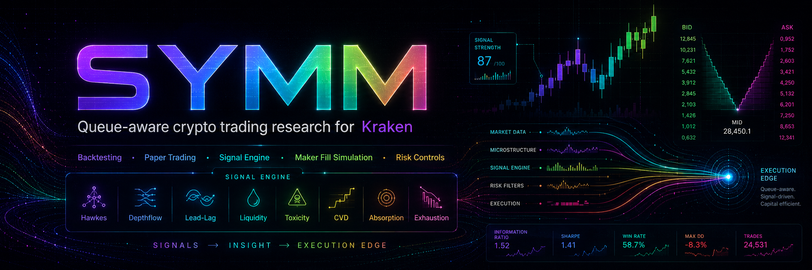

# S.Y.M.M. — Shake Your Money Maker

A Kraken spot microstructure engine. Live market data flows through eleven measurement-emitting signal systems (plus a shared toxicity tracker), each classifying its observation into a semantic **category** and scoring it against its own adaptive noise floor as an **SNR** value. The trader holds the latest reading per source per symbol, consults perspective playbooks encoded as decision trees, and allocates capital proportional to edge across the live cross-section. A paper wallet (€200 default) records fills; point at Kraken WebSocket v2 for live data, or replay a JSONL fixture for offline analysis.

Category semantics and the design rationale behind each signal row live in [`DECISION.md`](DECISION.md).

## Contents

- [Architecture](#architecture)
- [The data pipeline](#the-data-pipeline)
- [Everything is a `System`](#everything-is-a-system)
- [Boot sequence](#boot-sequence)
- [Core types](#core-types)
- [Perspectives and playbooks](#perspectives-and-playbooks)
- [Signal systems](#signal-systems)
- [Trader mechanics](#trader-mechanics)
- [Sizing](#sizing)
- [UI and telemetry](#ui-and-telemetry)
- [Numeric layer](#numeric-layer)
- [Build and run](#build-and-run)
- [Configuration reference](#configuration-reference)
- [Repository map](#repository-map)

## Architecture

```
┌──────────────────────────────────────────────────────────────────┐
│  Kraken WebSocket v2 — kraken/market (shared, auto-reconnecting) │
│    trade · ticker · book · instruments · ohlc                    │
└──────────────┬───────────────────────────────────────────────────┘
               │  multiplexed fan-out to all subscribers
               ▼
┌──────────────────────────────────────────────────────────────────┐
│  11 signal systems (signal/*) + toxicity (toxicity/)             │
│  pumpdump · depthflow · hawkes · leadlag · liquidity             │
│  sentiment · correlation · fluid · causal · cvd · exhaust        │
│  toxicity → shared book-quality service + measurements           │
└──────────────┬───────────────────────────────────────────────────┘
               │  Measurement {Symbol, Source, Category, SNR, Last}
               │  on the "measurements" broadcast
               ▼
┌──────────────────────────────────────────────────────────────────┐
│  market/ — perspective playbooks (decision trees)                │
│  trend · drive · leadlag · scarcity · pump                       │
│  Walk() → deepest reachable leaf wins                            │
└──────────────┬───────────────────────────────────────────────────┘
               │  ActionEnter / ActionStopLoss / ActionTakeProfit
               ▼
┌──────────────────────────────────────────────────────────────────┐
│  trader.Crypto — the desk                                        │
│  latest readings per (symbol, source)                            │
│  cross-section edge calibration → proportional allocation        │
│  broker.Buy / broker.Sell → paper fills or live orders           │
└──────────┬───────────────────────────┬───────────────────────────┘
           │  ui frames                │  focus.Set (open positions)
           ▼                           ▼
┌──────────────────────┐  ┌────────────────────────────────────────┐
│  view.Gauges         │  │  ui.Hub → ws://127.0.0.1:8765/ws       │
│  view.OHLC           │  │           → React dashboard            │
└──────────────────────┘  └────────────────────────────────────────┘
```

SYMM is not a single model. It is a **fleet of classifiers** — each signal is a standalone system with its own adaptive machinery — plus a **market layer** that encodes trade theses as decision trees, and a **trader** that turns those theses into wallet events.

## The data pipeline

This is the loop to understand. Everything else supports it.

```
Kraken feeds ──► Signals ──► Measurement {Source, Category, SNR, Last}
                                    │
                                    ▼
                    trader: latest reading per (symbol, source)
                                    │
                                    ▼
                         market.Decisions / Decide
                           (walk all playbook trees)
                                    │
                   ┌────────────────┴───────────────┐
                   ▼                                ▼
             flat → consider entry           held → manage exit
                   │                                │
                   └────────── broker.FillPaper ────┘
                                    │
                                    ▼
                              wallet + ui audit
```

**Three properties of this design:**

1. **Signals never call each other.** They subscribe to shared Kraken feeds and publish to the `measurements` broadcast. The only coupling is through categorized readings on the bus.

2. **Entry and exit are one thesis, re-evaluated.** A flat symbol is offered to the playbooks for `ActionEnter`. A held symbol is offered the same playbooks under `ObservationHolding`, which unlocks stop-loss and take-profit leaves. The thesis that opened the trade decides when it closes.

3. **SNR is computed in the signal, not the trader.** Each signal scores its own fused strength against a per-symbol adaptive noise floor (`numeric/adaptive.SNR`). Perspective tree branches compare `Measurement.SNR` to a unitless threshold (1 = one sigma above the signal's own baseline churn). Thresholds are self-scaling, not hand-tuned prices.

## Everything is a `System`

Every runnable unit implements:

```go
type System interface {
    Tick() error
    Close() error
}
```

`Tick` is the long-running event loop. Signals typically `range` over a shared feed channel; the trader and view systems `select` on broadcast subscribers and heartbeats. There is no timer polling.

Registration lives in `cmd/root.go`. Systems communicate only through named broadcast groups on a shared `qpool.Q`. The booter starts `ui.Hub` first, then launches each system's `Tick` in its own goroutine; any fatal `Tick` error cancels the context and triggers `Close` on all peers.

## Boot sequence

```
cmd.Execute()
  └─ rootCmd.Run
       ├─ create qpool (1 producer, NumCPU×4 workers)
       ├─ market.DiscoverSymbols(QuoteCurrency) → config.System.Symbols
       ├─ focus.NewSet()  (shared open-position symbol set)
       ├─ instantiate all systems (ordered)
       └─ Booter.Boot()
            ├─ start ui.Hub on config.UIAddr (:8765)
            ├─ ResendWallet() on systems that implement it
            └─ for each System: go Tick(); wait; any error → Close all
```

**System registration order:**

| #  | System      | Package              | Role                                     |
|----|-------------|----------------------|------------------------------------------|
| 1  | PumpDump    | `signal/pumpdump`    | Volume ignition classifier               |
| 2  | Correlation | `signal/correlation` | Cross-asset herd detector                |
| 3  | DepthFlow   | `signal/depthflow`   | Distance-decayed book imbalance          |
| 4  | Hawkes      | `signal/hawkes`      | Trade self-excitation process            |
| 5  | LeadLag     | `signal/leadlag`     | BTC/EUR anchor lag measurement           |
| 6  | Liquidity   | `signal/liquidity`   | Cross-section scarcity ranking           |
| 7  | Sentiment   | `signal/sentiment`   | Market breadth classifier                |
| 8  | Fluid       | `signal/fluid`       | Book microfluidics (Reynolds, vorticity) |
| 9  | Causal      | `signal/causal`      | Pearl's causal ladder on microstructure  |
| 10 | CVD         | `signal/cvd`         | Cumulative volume delta                  |
| 11 | Toxicity    | `toxicity`           | Shared book-quality service              |
| 12 | Exhaust     | `signal/exhaust`     | Momentum decay classifier                |
| 13 | Crypto      | `trader`             | The trade desk                           |
| 14 | OHLC view   | `view`               | Candle bars for dashboard                |
| 15 | Gauges view | `view`               | Signal strength gauges                   |

There is no separate public-client system. Kraken connectivity lives in `kraken/market` as shared, auto-reconnecting feed channels multiplexed across every subscriber.

`market.DiscoverSymbols` replaces the symbol list with every online pair in the configured quote currency at boot, so signals watch the full tradable universe rather than a fixed watch list.

## Core types

### 📐 Measurement

One signal's classified reading on one symbol at one moment.

```go
type Measurement struct {
    Symbol   string
    Source   SourceType    // fluid, hawkes, pumpdump, cvd, …
    Category CategoryType  // semantic row from DECISION.md
    Strength float64       // raw fused strength (dashboard gauges)
    SNR      float64       // strength ÷ adaptive noise floor (playbook gating)
    Last     float64       // last traded price at emit time
}
```

> [!IMPORTANT]
> `SNR` is not a historical win rate. It is a per-symbol z-score: how many standard deviations the current observation sits above this signal's own baseline churn on this specific symbol. The adaptive baseline (`numeric/adaptive.SNR`) warms up over ~12 samples before returning non-zero values. Perspective tree branches gate on `SNR > 1` — a unitless floor, not a price or percentage.

Each signal emits exactly one category at a time. Requiring a specific category in a perspective tree implicitly excludes that source's contradicting siblings — a CVD tree demanding `AggressiveDrive` will not see `StochasticBalance` from the same source simultaneously.

Freshness is trader-local: the desk keeps the newest reading per `(symbol, source)` and drops stale slots based on each source's observed inter-arrival cadence.

### 🗂️ Decision

The output of a perspective tree walk.

```go
type Decision struct {
    Name        string          // "trend", "drive", "pump", …
    Action      ActionType      // Enter, StopLoss, TakeProfit, Short, Deny, Wait
    Perspective Perspective
}
```

`market.Decisions(measurements, observations)` returns every playbook that authorizes action for the current measurement set. `market.Decide` returns the first actionable verdict in fixed priority order. `market.ExitDecisions` merges the opening playbook's exit tree with the universal exhaust overlay.

**Actions:** `ActionEnter`, `ActionDeny`, `ActionWait`, `ActionStopLoss`, `ActionTakeProfit`, `ActionShort`.

## Perspectives and playbooks

Playbooks live in `market/perspectives/` and are registered in priority order. Order is conviction-first: playbooks that require more confirming categories before entry sit earlier, so the best-supported thesis wins when several apply simultaneously.

| Priority | Playbook   | Thesis                                                                                                                  |
|----------|------------|-------------------------------------------------------------------------------------------------------------------------|
| 1        | `trend`    | Breadth + `EndogenousAlpha` + (`Frenzy`/`Laminar`/`Inertial`) + `AggressiveDrive`. Denies manipulation and overheating. |
| 2        | `drive`    | `AggressiveDrive` or `HiddenAbsorption` with lighter deny branches. Full entry and exit thesis.                         |
| 3        | `leadlag`  | Breadth + `InefficientLag`; exits on `ActiveReversal`, `AnchorStall`, `SynchronizedDrift`.                              |
| 4        | `scarcity` | `ExtremeScarcity` + ignition cue; exits on reversal, fade, or mechanical collapse.                                      |
| 5        | `pump`     | `CoiledCompression` or `SpoofTrap` entry; category exits combined with peak trail ratchet.                              |

**Tree walking:** each branch checks whether the measurement set contains the required category with `SNR > 1`. The deepest reachable leaf wins — more confirming categories produce a more specific verdict. Branches that gate without attaching an action are deny/wait guards; the first leaf that assigns an action terminates the walk.

**Universal deny branches** — evaluated by every playbook before entry gates:

| Deny branch      | Trigger category                             |
|------------------|----------------------------------------------|
| Toxic bluff      | `ToxicBluff`                                 |
| Liquidity vacuum | `LiquidityVacuum`                            |
| Turbulent chaos  | `Turbulent` + threshold                      |
| Saturation       | `Saturation`                                 |
| Systemic herd    | `SystemicHerd` (unless breadth also present) |
| Liquidity shock  | `LiquidityShock`                             |

> [!NOTE]
> The pump playbook relaxes the bluff deny for `SpoofTrap` entries — a detected spoofed wall is itself the entry signal in that playbook, so the usual deny would cancel the entry it is supposed to authorize.

Full category names and per-signal mappings are in `market/perspectives/category.go` and [`DECISION.md`](DECISION.md).

## Signal systems

Each signal:
- Subscribes to the shared Kraken feeds it needs
- Maintains per-symbol state
- Fuses raw metrics through adaptive pipelines (EMA baselines, sigma clamps, SNR)
- Emits `perspectives.Measurement` values on the `measurements` broadcast

Signals classify into four-category families (details in DECISION.md):

| Signal          | Package              | Categories (examples)                                                               | Feeds               |
|-----------------|----------------------|-------------------------------------------------------------------------------------|---------------------|
| **PumpDump**    | `signal/pumpdump`    | `vertical_ignition`, `coiled_compression`, `organic_trend`, `faded_exhaustion`      | trade               |
| **DepthFlow**   | `signal/depthflow`   | `loaded_imbalance`, `spoof_trap`, `book_thinning`, `dense_neutrality`               | book                |
| **Hawkes**      | `signal/hawkes`      | `frenzy`, `saturation`, `organic`, `exhaustion`                                     | trade               |
| **LeadLag**     | `signal/leadlag`     | `inefficient_lag`, `synchronized_drift`, `decoupled_move`, `anchor_stall`           | trade, ticker       |
| **Liquidity**   | `signal/liquidity`   | `extreme_scarcity`, `median_depth`, `robust_liquidity`                              | trade               |
| **Sentiment**   | `signal/sentiment`   | `risk_on_surge`, `divergent_move`, `systemic_slump`                                 | trade               |
| **Correlation** | `signal/correlation` | `decoupled_alpha`, `stochastic_noise`, `divergent_stress`, `systemic_herd`          | trade               |
| **Fluid**       | `signal/fluid`       | `laminar`, `turbulent`, `inertial`, `viscous`                                       | book, trade, ticker |
| **Causal**      | `signal/causal`      | `endogenous_alpha`, `systemic_beta`, `liquidity_shock`, `causal_noise`              | trade, book         |
| **CVD**         | `signal/cvd`         | `hidden_absorption`, `aggressive_drive`, `stochastic_balance`, `volume_starvation`  | trade               |
| **Toxicity**    | `toxicity`           | `toxic_bluff`, `liquidity_vacuum`, `hard_support`                                   | book, trade, ticker |
| **Exhaust**     | `signal/exhaust`     | `mechanical_collapse`, `thermal_exhaustion`, `active_reversal`, `fragile_expansion` | book, trade, ticker |

### 💥 PumpDump

Hunts verticality: volume-relative-to-baseline (RVOL) and price precursor across rolling windows, self-scaled against per-symbol EMA baselines, fused and banded into ignition categories. Three detection windows run independently: 10 s fast, 5 m medium, and hourly against a 14-day median. OHLC warmup via REST seeds the slow baseline before the WebSocket stream is live.

### 📚 DepthFlow

Distance-decayed book imbalance with anti-spoof filtering. Bid and ask volumes are weighted by exponential decay from the touch (`BookDepthDecayLambda`), so deep walls weigh less than Level-1. Fake near-touch walls are identified via the shared `toxicity.Tracker` and excluded before imbalance is computed.

### ⚡ Hawkes

Bivariate self-exciting point process fitted on the trade stream. Buy arrivals excite future buy arrivals; the fitted intensity parameters separate calm from clustering regimes. MLE refit is throttled by `HawkesFitCooldown` (5 s) per symbol to avoid churning on thin markets.

### 📡 LeadLag

Uses BTC/EUR as the anchor asset. Measures the Pearson cross-correlation between the anchor's returns and each altcoin's returns over a 256-bar per-symbol ring, then quantifies the unfinished lag fraction. When BTC has moved and an altcoin has not responded, `InefficientLag` fires. Publish rate is throttled to 200 ms to cap O(ring × maxLag × symbols) cost.

### 💧 Liquidity

Ranks symbols by daily quote volume against the running cross-section median. Illiquid outliers classify as `ExtremeScarcity`; the scarcity playbook uses this category as its primary entry condition.

### 🌡️ Sentiment

Breadth of positive returns across the full symbol universe. Fires `RiskOnSurge` when a significant fraction of symbols are simultaneously up. Acts as a macro overlay rather than a per-symbol trigger.

### 🔗 Correlation

Computes Pearson cross-symbol return correlation over `CorrelationBarSeconds × MinCorrelationSamples` bars. `SystemicHerd` (high positive correlation) is a deny in trend/leadlag playbooks; `DecoupledAlpha` (low correlation despite a broad move) is an entry condition.

### 🌊 Fluid

Partitions order-book depth into a `FluidGridSize × FluidGridSize` (32×32) grid and tracks field dynamics: Reynolds number, divergence, vorticity, and turbulence intensity. `Laminar` flow is an entry confirmation in the trend playbook; `Turbulent` is a universal deny. Also publishes `field_row` frames directly to the UI broadcast for spatial book visualization.

### 🧪 Causal

Implements Pearl's causal ladder (association → intervention → counterfactual) on a microstructure DAG: `MacroMomentum → PriceVelocity ← LocalFlow`, with `Liquidity` as a backdoor control. Hayashi-Yoshida covariance handles asynchronous tick timing without interpolation. Regime switching is gated by a Kalman-based contagion detector (`CausalConditionSwitch`, `CausalContagionBreak`). `EndogenousAlpha` — price movement driven by internal order flow rather than systemic spillover — is a required condition in the trend playbook.

### 📊 CVD

Cumulative volume delta: running buy volume minus sell volume from the trade tape. Simpler than DepthFlow (no book-level decay), purely executed-flow based. `AggressiveDrive` (sustained buy-side delta) is the primary entry condition in the drive playbook; `HiddenAbsorption` (large buy volume absorbed without price advance) signals stealth accumulation.

### ☠️ Toxicity

Splits L2 liquidity removals into fills vs cancels by joining the book and trade tape. The fill-to-cancel asymmetry produces three categories: `ToxicBluff` (cancel-heavy, wall is fake), `LiquidityVacuum` (both sides thin), `HardSupport` (fills dominate). Toxicity publishes on the `measurements` broadcast *and* provides `IsToxic` to DepthFlow and Fluid for wall exclusion. `ToxicBluff` is a universal deny across all playbooks.

### 🚪 Exhaust

Classifies microstructure decay modes rather than emitting a binary exit signal. Exit timing is decided by perspective tree leaves (`ActionStopLoss`, `ActionTakeProfit`), not a separate exit channel. `MechanicalCollapse` and `ThermalExhaustion` trigger `ActionStopLoss`; `ActiveReversal` and `FragileExpansion` trigger `ActionTakeProfit`. All soft exits respect `MinExhaustHold` after entry.

## Trader mechanics

`trader.Crypto` is deliberately thin. It does not score signals — the perspective trees do.

### Measurement ingestion

On each `measurements` message:

1. **Record** the reading in `readings[symbol][source]`, replacing the prior category for that source
2. **Snapshot** non-stale measurements for the symbol
3. **Route** to entry (`consider`) or exit (`manage`) depending on whether the wallet holds the base asset

### Entry path

1. `market.Decisions(measurements, nil)` — collect every playbook authorizing `ActionEnter`
2. **Thesis score** — RMS of playbook-relevant SNRs, scaled by √confirmations when multiple playbooks agree
3. **Friction gate** — require `thesisScore ≥ EntryEdgeMultiple × round_trip_friction` (fees + projected slippage)
4. **Economics gate** — `trader/economics` ledger: cold playbooks gather samples; warm playbooks require post-fee net forward return above `ForwardReturnSignificanceZ`
5. **Cross-section calibration** — compare the symbol's score to the robust median + MAD across all observed symbols; require positive edge above the field
6. **Size** — allocate cash proportional to edge share (see [Sizing](#sizing))
7. **Fill** — `submitEntry`: paper simulates live (submit → optional latency → fill or reject ack); binds `Playbook` and `PerspectiveTTL` to the position

### Exit path

For held symbols: enforce pump peak trail and `PerspectiveTTL` expiry, then run `market.ExitDecisions` with `ObservationHolding` (opening playbook + universal exhaust overlay). `MostUrgentExit` chooses stop before take-profit. Soft take-profits respect `MinExhaustHold` post-entry.

### Paper / live parity

Paper fills use the same `broker.Quote` path as live orders: the desk caches Kraken ticker bid/ask and L2 depth per symbol, then `market.SlippageFill` prices the order through the book (VWAP through available depth, otherwise half-spread on last). `broker.Buy` and `broker.Sell` run `PreflightGates` — quote freshness, max spread, projected slippage — before reserving cash, for both paper and live.

Per-pair taker fees are loaded from Kraken `AssetPairs` at boot (`market.LoadPairCatalog`), tiered by `Fee30DVolume`, and stored on `PositionBinding.TakerFeePct` for the exit leg.

`ExecutionStressEnabled` applies the same stale-quote, shallow-depth, and adverse-ask stress to both paper and live fills. Any new live execution behavior must be mirrored in `trader/paper.go` / `broker.SubmitPaper`.

> [!NOTE]
> Live trading: set `SYMM_KRAKEN_API_KEY`, `SYMM_KRAKEN_API_SECRET`, and `SYMM_LIVE=1`. The desk routes entries and exits through `kraken/order.Client` (authenticated WebSocket v2 + executions channel), recording the same economics labels on exchange fills as paper does on `FillPaper`.

### Execution economics

`trader/economics/` records post-fee net returns per playbook on every entry and exit. Forward labels are appended when the `ExecutionForwardWindow` matures. Audit frames include `quote_age_ms`, `depth_coverage`, and `playbook_econ_mean` so the decision log contains the live quote quality at the moment of each fill.

## Sizing

There is no fixed slot count. Capital allocation is **edge-proportional across the live cross-section**:

```
thesisScore(s) = RMS(playbook-relevant SNRs) × √confirmations

edge(s)        = thesisScore(s) − median(all scores) − MAD(all scores)

share(s)       = edge(s) / (thesisScore(s) + Σ positive scores in field)

notional(s)    = free_cash × share(s)
```

A symbol must be a genuine outlier against the rest of the market to receive capital. When multiple symbols each clear the edge bar, they share the wallet proportionally. A single broad signal that lifts all scores simultaneously dilutes its own edge. `MinCostEUR` remains the exchange-cost floor.

## UI and telemetry

`ui.Hub` subscribes to the `ui` broadcast and fans out to WebSocket clients at `ws://127.0.0.1:8765/ws`.

**Lossy telemetry ring:** default 512 slots (`UITelemetryBuffer`). Slow clients drop frames rather than back-pressuring trading goroutines.

**Audit replay:** the hub keeps a ring of recent audit frames and replays them to newly connected clients, so the decision log is not empty after a late connect or browser refresh.

**Frame producers:**

| Component       | Frames emitted                                | Rate                |
|-----------------|-----------------------------------------------|---------------------|
| `view.Gauges`   | per-source SNR gauge                          | rate-limited 200 ms |
| `view.OHLC`     | `candle_bar` (anchor + open-position symbols) | per candle close    |
| `signal/fluid`  | `field_row` (spatial book grid)               | per book update     |
| `trader.Crypto` | `wallet`, `audit`, fill events                | per event           |
| `ui.Hub`        | `heartbeat` (seq, queue depth, drop count)    | 250 ms              |

**UI frame events:**

| Event        | Source      | Contents                                                  |
|--------------|-------------|-----------------------------------------------------------|
| `confidence` | view.Gauges | per-source SNR gauge value                                |
| `wallet`     | Crypto      | balance, inventory, marks                                 |
| `audit`      | Crypto      | decision detail: conviction, edge, playbook, perspectives |
| `candle_bar` | view.OHLC   | OHLC + volume for chart                                   |
| `field_row`  | Fluid       | book-flow grid row for spatial visualization              |
| `heartbeat`  | Hub         | monotonic seq, queue depth, drop count                    |
| fill events  | Crypto      | order fill payload                                        |

`view.OHLC` reconciles candle subscriptions against `focus.Set` so chart data is only published for the anchor symbol (BTC/EUR) and symbols currently held. `view.Gauges` publishes `Measurement.Strength` (raw signal energy) as the gauge value; perspective trees still gate on `SNR` after the adaptive noise floor has warmed up (~12 samples per symbol).

## Numeric layer

Signal internals lean on `numeric/` and `numeric/adaptive/` rather than hand-written constants.

### Derived pipeline

`numeric/dynamic.go` chains `Dynamic` filter stages:

```
EMA → SigmaClamp → Peak → …
```

Each stage calls `Next(out, ...values)` and feeds into the next. Stages nest freely; `Value()` reads the last output without pushing a new observation.

### Adaptive primitives

| Type         | Location                 | Behavior                                                                                                                                                       |
|--------------|--------------------------|----------------------------------------------------------------------------------------------------------------------------------------------------------------|
| `EMA`        | `adaptive/ema.go`        | Auto-bootstraps on first observation; adaptive rate derived from per-tick delta relative to observed range                                                     |
| `SigmaClamp` | `adaptive/`              | Kalman-like volatility detector; clamps outliers beyond N-sigma                                                                                                |
| `SNR`        | `adaptive/snr.go`        | Exponentially-weighted z-score against a running noise floor; clamps spikes before folding into the baseline so a genuine surge does not inflate its own floor |
| `Classifier` | `adaptive/classifier.go` | Discretizes continuous values into named bands                                                                                                                 |
| `FracDiff`   | `adaptive/fracdiff.go`   | Fractional differentiation (order 0.4, width 16); preserves long-range memory while reducing AR(1) structure                                                   |
| `Kalman`     | `adaptive/kalman.go`     | Scalar Kalman with asymmetric gain: fast downside response, slow upside recovery                                                                               |

### Hayashi-Yoshida covariance

Cross-asset covariance uses allocation-free Hayashi-Yoshida interval overlap — handles asynchronous, irregularly-sampled tick data without interpolation or equal-time-grid assumptions.

### Robust statistics

`numeric/` provides `Median`, `Mean`, `PercentileSorted`, `Quartiles`, and `MedianAbsoluteDeviation` — used by cross-section calibration and throughout signal pipelines where outlier resistance matters.

## Build and run

SYMM links against `qpool`, which requires a linkname flag. **Always use the Makefile:**

```bash
make build          # → bin/symm
make run            # build + run (paper defaults)
make test-go        # full test suite with correct ldflags
make bench          # package benchmarks
```

> [!WARNING]
> Using bare `go test ./...` without `-ldflags=-checklinkname=0` will fail. Use `make test-go`.

**Replay captured traffic:**

```bash
make replay REPLAY_FILE=replay/fixtures/sample.jsonl REPLAY_PACE=50ms
```

**Frontend (separate terminal):**

```bash
cd frontend && pnpm install && pnpm dev
```

### Environment variables

| Variable                 | Effect                                                  |
|--------------------------|---------------------------------------------------------|
| `SYMM_REPLAY_FILE`       | JSONL replay instead of live WebSocket                  |
| `SYMM_REPLAY_PACE`       | Delay between replay lines (e.g., `50ms`)               |
| `SYMM_KRAKEN_API_KEY`    | Kraken API key for authenticated WebSocket v2           |
| `SYMM_KRAKEN_API_SECRET` | Base64-encoded API secret                               |
| `SYMM_LIVE`              | `1` or `true` to enable the live desk and crypto wallet |
| `SYMM_UI_ADDR`           | WebSocket listen address (default `:8765`)              |
| `SYMM_WALLET_EUR`        | Starting paper wallet capital (default `200.0`)         |
| `SYMM_QUOTE_CURRENCY`    | Quote currency for symbol discovery (default `EUR`)     |

Full environment wiring is in `config/config.go`.

## Configuration reference

<details>
<summary>📋 Wallet and desk</summary>

| Field               | Default | Description                                                         |
|---------------------|---------|---------------------------------------------------------------------|
| `WalletEUR`         | `200.0` | Paper trading capital                                               |
| `MinCostEUR`        | `0.45`  | Minimum trade size — avoids fees dominating small notional          |
| `PerspectiveTTL`    | `30s`   | Position binding horizon stamped at entry; forces exit when elapsed |
| `TakerFeePct`       | `0.40`  | Fallback taker fee when pair schedule is unavailable                |
| `MinExhaustHold`    | `5s`    | Suppress soft take-profits for this window after entry              |
| `EntryEdgeMultiple` | `2.0`   | Thesis score must be ≥ N× round-trip friction to enter              |

</details>

<details>
<summary>📋 Execution economics</summary>

| Field                          | Default      | Description                                            |
|--------------------------------|--------------|--------------------------------------------------------|
| `ExecutionEconomicsEnabled`    | `true`       | Record post-fee net returns per playbook               |
| `ExecutionForwardWindow`       | configurable | Horizon for forward-return labels on fills             |
| `ForwardReturnMinSamples`      | `30`         | Min fill samples before a playbook is "warm"           |
| `PumpForwardReturnMinSamples`  | `8`          | Reduced minimum for pump playbook                      |
| `ForwardReturnSignificanceZ`   | `1.96`       | Required z-score for positive forward return (95% CI)  |
| `ExecutionStressEnabled`       | `false`      | Apply stale-quote / shallow-depth stress in paper mode |
| `ExecutionStressLatency`       | configurable | Simulated fill latency under stress                    |
| `ExecutionStressDepthFraction` | configurable | Book depth fraction available under stress             |
| `ExecutionStressRejectRate`    | configurable | Order reject probability under stress                  |
| `PaperOrderLatency`            | `0`          | Baseline paper order latency                           |
| `PaperOrderRejectRate`         | `0`          | Baseline paper order reject rate                       |

</details>

<details>
<summary>📋 Exit and trail parameters</summary>

| Field               | Default | Description                                                 |
|---------------------|---------|-------------------------------------------------------------|
| `TakeProfitR`       | `2.0`   | Required return multiple relative to stop distance          |
| `TakeProfitCapture` | `0.75`  | Exit at 75% of calibrated expected return                   |
| `StopVolMultiple`   | `8.0`   | Stop distance = N× recent per-tick volatility               |
| `PumpTrailPct`      | `0.08`  | Fast pump trailing stop: 8% retrace from peak               |
| `PumpSlowTrailPct`  | `0.20`  | Slow pump trailing stop                                     |
| `PumpHardStopPct`   | `0.12`  | Hard floor 12% below entry for pump positions               |
| `PumpPullbackMin`   | `0.03`  | Minimum retrace before pump entry (anti-chase)              |
| `PumpPullbackMax`   | `0.20`  | Maximum retrace; above this the pump leg is considered dead |

</details>

<details>
<summary>📋 Market data and connectivity</summary>

| Field             | Default | Description                                       |
|-------------------|---------|---------------------------------------------------|
| `QuoteCurrency`   | `EUR`   | Universe filter applied at symbol discovery       |
| `BookDepthLevels` | `5`     | Order book snapshot depth                         |
| `SubscribeBatch`  | `50`    | Symbol subscribe batch size per WebSocket message |
| `Fee30DVolume`    | `0`     | 30-day volume for Kraken fee tier lookup          |

</details>

<details>
<summary>📋 Signal-specific parameters</summary>

| Field                    | Default | Description                                            |
|--------------------------|---------|--------------------------------------------------------|
| `FastPumpWindow`         | `10s`   | Fast pump RVOL detection window                        |
| `MediumPumpWindow`       | `5m`    | Medium pump detection window                           |
| `FastPumpVolumeRatio`    | `15`    | Fast pump RVOL threshold                               |
| `SlowRVOLThreshold`      | `5`     | Slow breakout RVOL threshold (1h vs 14d median)        |
| `HawkesFitCooldown`      | `5s`    | Minimum interval between Hawkes MLE refits             |
| `BookDepthDecayLambda`   | `1000`  | Volume weight decay half-life in ms (DepthFlow)        |
| `SpoofWeightedThreshold` | `0.5`   | Spoof detection weighted skew threshold                |
| `SpoofLevel1Reject`      | `-0.1`  | Level-1 book contradiction threshold                   |
| `MinFillToCancelRatio`   | `0.15`  | Toxicity gate: below this, walls are treated as bluffs |
| `BookFluxWindow`         | `10s`   | Book flux measurement window (Toxicity)                |
| `FluidGridSize`          | `32`    | Fluid dynamics grid dimension (N×N)                    |
| `FluidHeightEMAAlpha`    | `0.35`  | Field height smoothing factor                          |
| `CorrelationBarSeconds`  | `10`    | Bar size for correlation matrix computation            |
| `CausalConditionSwitch`  | `1000`  | Kalman Q threshold for regime switch in Causal         |
| `CausalContagionBreak`   | `0.9`   | Contagion break detection threshold                    |
| `CausalContagionWindow`  | `128`   | Sample window for contagion monitoring                 |
| `FractionalDiffOrder`    | `0.4`   | FracDiff memory parameter                              |
| `FractionalDiffWidth`    | `16`    | FracDiff Gamma series order                            |

</details>

<details>
<summary>📋 UI and infrastructure</summary>

| Field                 | Default | Description                            |
|-----------------------|---------|----------------------------------------|
| `UIAddr`              | `:8765` | WebSocket listen address               |
| `UITelemetryBuffer`   | `512`   | Lossy telemetry ring capacity (frames) |
| `UIHeartbeatInterval` | `250ms` | Heartbeat and wallet republish cadence |
| `LogDir`              | `runs`  | Directory for run logs                 |
| `LogLevel`            | `info`  | Logging verbosity                      |
| `LogFileActive`       | `true`  | Write structured logs to file          |
| `LogStdoutActive`     | `false` | Mirror logs to stdout                  |

</details>

## Repository map

| Path                   | Contents                                                                 |
|------------------------|--------------------------------------------------------------------------|
| `cmd/`                 | Cobra entry point, booter, system registration                           |
| `market/`              | Perspective registry, `Decide` / `Decisions` / `ExitDecisions`           |
| `market/perspectives/` | Category types, decision tree engine, individual playbooks               |
| `signal/`              | All microstructure signal systems                                        |
| `toxicity/`            | Shared book-quality service — measurements + `IsToxic` helper            |
| `trader/`              | Crypto desk, cross-section sizing, reading freshness, economics          |
| `kraken/`              | Shared feed channels, market types, order client                         |
| `broker/`              | Paper and live order execution (`Buy`, `Sell`, `Quote`, preflight gates) |
| `wallet/`              | Balance, inventory, position bindings                                    |
| `focus/`               | Lock-free open-position symbol set (copy-on-write)                       |
| `view/`                | Dashboard feeds: `Gauges` (SNR) and `OHLC` (candle bars)                 |
| `ui/`                  | WebSocket hub, lossy telemetry ring, audit replay                        |
| `frontend/`            | React dashboard                                                          |
| `numeric/`             | Derived pipelines, adaptive filters, robust statistics                   |
| `numeric/adaptive/`    | EMA, SNR, SigmaClamp, Classifier, FracDiff, Kalman                       |
| `config/`              | Runtime parameters and environment wiring                                |
| `DECISION.md`          | Category semantics and signal design rationale                           |
| `AGENTS.md`            | Agent contract: tests, benchmarks, style                                 |

**Adding a signal:** implement `Tick` / `Close`, subscribe to the feeds you need, fuse metrics through `numeric/adaptive` pipelines, publish `perspectives.Measurement` values with `Source`, `Category`, `SNR`, and `Last` set, and register the constructor in `cmd/root.go`. Register or extend a perspective tree in `market/perspectives/` if the new categories should authorize or block trades.
