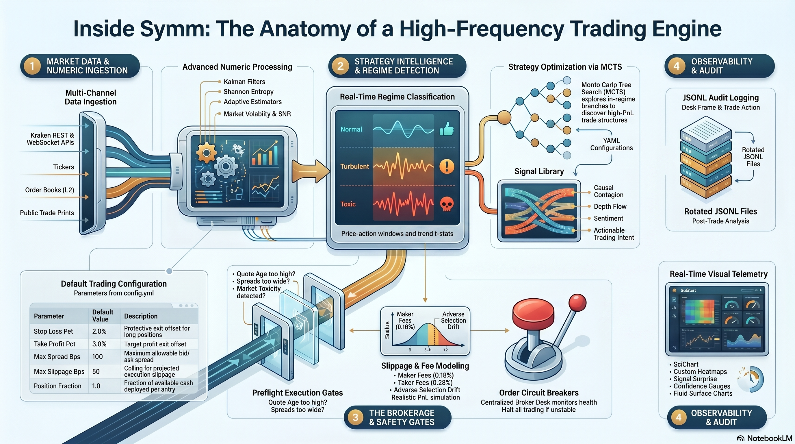

# S.Y.M.M. — Shake Your Money Maker

A Kraken spot microstructure engine. Live market data is written once into a shared **DMT tree** as `datura.Artifact` rows. Signal systems **Measure** by seeking tree prefixes and running composed **nomagique** pipelines; each emits categorized readings with finite **confidence** and temporal **surprise**. The trader queries those measurements, walks YAML playbooks in `logic/rules/tree.yml`, and allocates capital proportional to edge across the live cross-section. A paper wallet (€200 default) records fills against Kraken WebSocket v2.

Category semantics and design rationale: [`DECISION.md`](DECISION.md).  
Agent and architecture contract: [`AGENTS.md`](AGENTS.md) §8.  
Migration tasks and acceptance: [`spec/SPEC.md`](spec/SPEC.md).

## Contents

- [Architecture](#architecture)
- [The data pipeline](#the-data-pipeline)
- [Boot sequence](#boot-sequence)
- [Core types](#core-types)
- [Playbooks](#playbooks)
- [Signal systems](#signal-systems)
- [Trader mechanics](#trader-mechanics)
- [Sizing](#sizing)
- [UI and telemetry](#ui-and-telemetry)
- [nomagique layer](#nomagique-layer)
- [Build and run](#build-and-run)
- [Configuration reference](#configuration-reference)
- [Repository map](#repository-map)



## Architecture

**Canonical contract** (`AGENTS.md` §8): one tree, write at ingest, query everywhere else. If wiring beyond **websocket → tree → Seek → FlipFlop → nomagique.Number** seems necessary, fix nomagique, artifact schema, or ingest prefixes — do not grow relay layers in the trader or signals.

```
┌──────────────────────────────────────────────────────────────────┐
│  Kraken WebSocket v2 — kraken/public, kraken/paper, kraken/user  │
│    trade · ticker · book · instrument · ohlc                     │
│    parse frame → datura.Artifact → tree.Insert(prefix, wire)     │
└──────────────┬───────────────────────────────────────────────────┘
               │
               ▼
┌──────────────────────────────────────────────────────────────────┐
│  dmt.Tree (shared process bus)                                   │
│    ingest:  role/scope/origin/…  (e.g. book/BTC-USD)             │
│    measure: measurement/<scope>/<origin>/…                       │
└──────────────┬───────────────────────────────────────────────────┘
               │  tree.Seek(prefix) → transport.NewFlipFlop → Number
               ▼
┌──────────────────────────────────────────────────────────────────┐
│  signal/* — Measure only (reference: signal/toxicity/signal.go)  │
│  pumpdump · depthflow · hawkes · leadlag · liquidity · sentiment │
│  correlation · fluid · causal · cvd · exhaust · toxicity · …     │
└──────────────┬───────────────────────────────────────────────────┘
               │  logic.Measurement {Source, Category, Confidence, Surprise}
               ▼
┌──────────────────────────────────────────────────────────────────┐
│  logic.Tree — embedded logic/rules/tree.yml                      │
│  Walk() → deepest reachable leaf wins; exits before entries      │
└──────────────┬───────────────────────────────────────────────────┘
               │  ActionEnter / ActionStopLoss / ActionTakeProfit
               ▼
┌──────────────────────────────────────────────────────────────────┐
│  trader.Crypto — desk                                            │
│  latest readings per (symbol, source); edge-proportional sizing  │
│  broker → paper fills or live orders                             │
└──────────────┬───────────────────────────────────────────────────┘
               ▼
┌──────────────────────────────────────────────────────────────────┐
│  ui.Hub → ws://127.0.0.1:8765/ws → React dashboard               │
└──────────────────────────────────────────────────────────────────┘
```

SYMM is a **fleet of classifiers** plus a **playbook layer** and a **desk**. Signals do not call each other; they read the same tree the websockets write.

> **Migration note:** The `curious` branch is mid-migration. Legacy relay paths (`trader/crypto.go` → `updateSignals` → `signal.Update`, `signal/replay/`, `signal/codec/`, `signal/buffer/`) are **debt to remove**, not targets to restore. See `spec/SPEC.md` Phase 1–2.

## The data pipeline

```
Kraken WS ──► tree.Insert (raw JSON artifacts)
                    │
                    ▼
         signal.Measure ──► measurement artifacts
                    │
                    ▼
         trader: latest reading per (symbol, source)
                    │
                    ▼
              logic.Tree.Walk
                    │
        ┌───────────┴────────────┐
        ▼                        ▼
   flat → consider entry    held → manage exit
        │                        │
        └──── broker fill ───────┘
                    │
                    ▼
              wallet + ui audit
```

**Four properties:**

1. **Single ingress.** Market data enters once at the websocket. No duplicate fan-out through trader book/trade/ticker types or per-signal `Update`.

2. **Measure-only signals.** Each signal seeks ingest prefixes on the shared tree, runs one `nomagique.Number` pipeline, and writes measurement artifacts. Reference: `signal/toxicity/signal.go`.

3. **Signal trust before the desk.** Publishable measurements carry finite `Confidence` ∈ (0, 1] and temporal `Surprise` (playbook YAML may still say `SNR`; the Go field is `logic.Measurement.Surprise`). Playbook branches gate on explicit `value:` thresholds.

4. **Forward feedback.** `market.Story` records per-source forward movement labels; calibrated scales sharpen or soften feature scoring before category evidence is derived.

## Boot sequence

Current entry point: `cmd/root.go` → four concurrent roles:

```
cmd.Execute()
  └─ rootCmd.Run
       ├─ qpool.NewQ (workers from runtime.NumCPU())
       ├─ go public.NewWebSocket(...).Run(WebSocketURL)
       ├─ go paper.NewWebSocket(...).Run()
       ├─ go trader.NewCrypto(...).Run()
       ├─ trader.PublishDecisionTreeSnapshot(pool)
       └─ ui.NewHub(...).Run()   // blocks; serves ws://127.0.0.1:8765/ws
```

Config loads from `cmd/cfg/config.yml` (embedded default), overridable via `--config` or `$HOME/.symm/config.yml`.

Paper mode uses `kraken/paper` for simulated private channel responses. Live desk requires `SYMM_KRAKEN_API_KEY`, `SYMM_KRAKEN_API_SECRET`, and `SYMM_LIVE=1`.

## Core types

### Measurement

One signal's classified reading on one symbol at one moment (`logic/measurement.go`):

```go
type Measurement struct {
    Symbol     string
    Source     SourceType
    Category   CategoryType
    Strength   float64   // raw fused strength (dashboard gauges)
    Confidence float64   // finite selection trust ∈ (0, 1]
    Surprise   float64   // temporal category surprise (playbook gating)
    Price      float64
    ObservedAt time.Time
    // …
}
```

> `Confidence` exact `0` means no publishable evidence; above `1` is invalid signal math. `Surprise` is how unexpected the selected category is against that symbol's recent category prior — not a win rate. Playbook branches often gate on `surprise > 1`.

Bridge from tree artifacts: `logic.MeasurementFromArtifact`. Each signal emits exactly one category at a time.

### Decision

Output of a playbook walk (`logic/action.go`). `logic.Tree` evaluates embedded `rules/tree.yml`; deepest reachable leaf wins. Exits are evaluated before entries.

**Actions:** `ActionEnter`, `ActionDeny`, `ActionWait`, `ActionStopLoss`, `ActionTakeProfit`, `ActionShort`.

## Playbooks

Canonical source: **`logic/rules/tree.yml`** (embedded via `logic/tree.go`). Not `market/perspectives/` — that package is removed.

| Priority | Playbook   | Thesis (summary) |
|----------|------------|------------------|
| 1        | `trend`    | Breadth + endogenous alpha + laminar/frenzy + aggressive drive |
| 2        | `drive`    | Aggressive drive or hidden absorption |
| 3        | `leadlag`  | Breadth + inefficient lag |
| 4        | `scarcity` | Extreme scarcity + ignition cue |
| 5        | `pump`     | Coiled compression or spoof trap entry |

**Tree walking:** branches gate on category, observation, or metric. Category branches compare `Surprise` (or `confidence` when configured) to explicit YAML `value:` thresholds. Metric branches read trader context (`thesis_score`, `spread_bps`, `fee_pct`, etc.).

Builtin deny categories (`ToxicBluff`, `LiquidityVacuum`, `Turbulent`, `Saturation`, `SystemicHerd`, `LiquidityShock`) appear in the embedded tree. Full mappings: `logic/category.go` and [`DECISION.md`](DECISION.md).

## Signal systems

Each signal package:

- Composes **one** `nomagique.Number` in `NewSignal` (schema on a `datura.Artifact`, not hardcoded Go params)
- Implements **`Measure(query)`** — `tree.Seek(query.Prefix())`, `transport.NewFlipFlop`, pipeline evaluate
- Does **not** ingest feeds, hold `Update`, or switch on category index inside `Measure`

| Signal          | Package              | Categories (examples)                                                               | Ingest prefix |
|-----------------|----------------------|-------------------------------------------------------------------------------------|---------------|
| **PumpDump**    | `signal/pumpdump`    | `vertical_ignition`, `coiled_compression`, `organic_trend`, `faded_exhaustion`      | trade         |
| **DepthFlow**   | `signal/depthflow`   | `loaded_imbalance`, `spoof_trap`, `book_thinning`, `dense_neutrality`               | book          |
| **Hawkes**      | `signal/hawkes`      | `frenzy`, `saturation`, `organic`, `exhaustion`                                     | trade         |
| **LeadLag**     | `signal/leadlag`     | `inefficient_lag`, `synchronized_drift`, `decoupled_move`, `anchor_stall`           | trade, ticker |
| **Liquidity**   | `signal/liquidity`   | `extreme_scarcity`, `median_depth`, `robust_liquidity`                              | trade         |
| **Sentiment**   | `signal/sentiment`   | `risk_on_surge`, `divergent_move`, `systemic_slump`                                 | trade         |
| **Correlation** | `signal/correlation` | `decoupled_alpha`, `stochastic_noise`, `divergent_stress`, `systemic_herd`          | trade         |
| **Fluid**       | `signal/fluid`       | `laminar`, `turbulent`, `inertial`, `viscous`                                       | book, trade   |
| **Causal**      | `signal/causal`      | `endogenous_alpha`, `systemic_beta`, `liquidity_shock`, `causal_noise`              | trade, book   |
| **CVD**         | `signal/cvd`         | `hidden_absorption`, `aggressive_drive`, `stochastic_balance`, `volume_starvation`  | trade         |
| **Toxicity**    | `signal/toxicity`    | `toxic_bluff`, `liquidity_vacuum`, `hard_support`                                   | book, trade   |
| **Exhaust**     | `signal/exhaust`     | `mechanical_collapse`, `thermal_exhaustion`, `active_reversal`, `fragile_expansion` | book, trade   |

Per-signal narratives below remain valid product descriptions; wiring must follow the Measure-only tree contract above.

### 💥 PumpDump

Hunts verticality: volume-relative-to-baseline (RVOL) and price precursor across rolling windows, self-scaled against per-symbol EMA baselines. Three detection windows: 10 s fast, 5 m medium, hourly against a 14-day median.

### 📚 DepthFlow

Distance-decayed book imbalance with anti-spoof filtering. Bid and ask volumes weighted by exponential decay from the touch; fake near-touch walls excluded before imbalance is computed.

### ⚡ Hawkes

Bivariate self-exciting point process on the trade stream. MLE refit throttled per symbol on thin markets.

### 📡 LeadLag

BTC/EUR anchor lag vs follower universe. Hayashi-Yoshida cross-correlation over per-symbol history; `InefficientLag` when the anchor moved and followers lag.

### 💧 Liquidity

Cross-section rank by daily quote volume; `ExtremeScarcity` for illiquid outliers.

### 🌡️ Sentiment

Breadth of positive returns across the universe; macro overlay.

### 🔗 Correlation

Pearson cross-symbol return correlation; `SystemicHerd` as deny, `DecoupledAlpha` as entry cue.

### 🌊 Fluid

Book depth field dynamics: Reynolds number, divergence, vorticity. `Laminar` confirms trend; `Turbulent` is a universal deny.

### 🧪 Causal

Pearl's causal ladder on a microstructure DAG with Hayashi-Yoshida covariance and contagion-gated regime switching. `EndogenousAlpha` required in trend playbook.

### 📊 CVD

Cumulative volume delta from the trade tape. `AggressiveDrive` and `HiddenAbsorption` drive drive-playbook entries.

### ☠️ Toxicity

Cancel-vs-fill asymmetry on book updates. `ToxicBluff`, `LiquidityVacuum`, `HardSupport`. Reference implementation for signal shape: `signal/toxicity/signal.go`.

### 🚪 Exhaust

Microstructure decay modes; exit timing via playbook leaves (`ActionStopLoss`, `ActionTakeProfit`), not a separate exit channel.

## Trader mechanics

`trader.Crypto` scores through playbooks, not by re-deriving signal math.

**Target ingestion:** query measurement artifacts from the shared tree (or consolidated story readings) — not `measurements` broadcast fan-out from per-signal `Update`.

**Entry path (summary):**

1. Collect playbook entries authorizing `ActionEnter`
2. Thesis score — RMS of playbook-relevant surprises
3. Friction and economics gates
4. Cross-section edge calibration
5. Edge-proportional size → `broker` fill

**Exit path:** pump peak trail, perspective TTL, then exit branches with `ObservationHolding`. Stops before take-profits when both fire.

**Paper / live parity:** `broker.QuoteCache`, `SlippageFill`, `PreflightGates`, Kraken fee schedule from `AssetPairs`, latency profile in `runs/network_latency.json`. Live: `SYMM_LIVE=1` + API credentials; boot fails closed if live session cannot start.

**Forward truth:** `market.Story` records per-signal forward labels independent of fills; scales feed back into signal feature scoring.

## Sizing

Edge-proportional across the live cross-section:

```
thesisScore(s) = RMS(playbook-relevant surprises) × √confirmations
edge(s)        = thesisScore(s) − median(all scores) − MAD(all scores)
share(s)       = edge(s) / (thesisScore(s) + Σ positive scores)
notional(s)    = free_cash × share(s)
```

`MinCostEUR` remains the exchange-cost floor.

## UI and telemetry

`ui.Hub` serves `ws://127.0.0.1:8765/ws` (default `127.0.0.1:8765`; set `ui.addr` or `SYMM_UI_ADDR` to `:8765` for all interfaces).

On connect, the hub sends a snapshot from `trader.ConnectSnapshotFrames` (wallet, decision tree, layout). Live frames arrive via `ui.Publish*` from trader and signals.

| Event / frame   | Typical source   | Contents |
|-----------------|------------------|----------|
| `layout`        | ui.Hub           | dashboard schema |
| `confidence`    | measurements     | per-source confidence and surprise |
| `wallet`        | trader           | balance, inventory, marks |
| `audit`         | trader           | conviction, edge, playbook |
| `ohlc`          | kraken/public    | anchor / open-position candles |
| `decision_tree` | trader           | embedded playbook snapshot |
| `heartbeat`     | ui.Hub           | seq, queue depth |

Frontend: `cd frontend && pnpm install && pnpm dev`. Override WS URL with `VITE_SYMM_WS_URL`.

## nomagique layer

Signal math lives in **`github.com/theapemachine/nomagique`**, composed in each signal's `NewSignal`:

```go
nomagique.Number(
    vector.NewFeatureExtractor(schemaArtifact),
    probability.NewClassifier(
        logic.NewCircuit(/* rules */),
        logic.NewCircuit(/* rules */),
    ),
    probability.NewTransitionSurprise(/* … */),
)
```

- **FeatureExtractor** — reads payload JSON using schema artifact attributes
- **Classifier** — score source order is the category index; no symm-side `switch`
- **Circuit** — priority-ordered rules (`Match` / `Then`)
- **Transport** — `datura/transport.FlipFlop` between tree seek and pipeline

Do not add domain types to nomagique; do not hardcode thresholds in Go — declare transforms and keys on schema artifacts (`AGENTS.md` §8).

## Build and run

`qpool` uses `go:linkname` hooks. **Use the Makefile** (exports `GOFLAGS=-ldflags=-checklinkname=0`):

```bash
make build          # → bin/symm (includes capnp-ts codegen)
make run            # paper defaults; UI at ws://127.0.0.1:8765/ws
make test-go        # full Go suite
make test-frontend  # tsc + Vitest
make bench          # package benchmarks
make test-cover     # → runs/coverage.out
```

> Bare `go test ./...` without `GOFLAGS` fails at link time. Use `make test-go` or `export GOFLAGS=-ldflags=-checklinkname=0`.

Profile while running: `make run-profile` → http://127.0.0.1:6060/debug/pprof/

**CLI tuning / replay eval** (`symm tune`, `symm eval`, `make record`) are **deferred** until the tree + Measure path is stable (`spec/SPEC.md` Phase 5). Offline tests insert artifacts directly into the tree or use package-level websocket harnesses — not a `signal/replay` relay package.

### Environment variables

| Variable                 | Effect |
|--------------------------|--------|
| `SYMM_KRAKEN_API_KEY`    | Live desk + L3 when paired with secret |
| `SYMM_KRAKEN_API_SECRET` | Base64-encoded API secret |
| `SYMM_LIVE`              | `1` or `true` for live desk |
| `SYMM_UI_ADDR`           | WebSocket listen address |
| `SYMM_WALLET_EUR`        | Paper starting capital (default `200`) |
| `SYMM_QUOTE_CURRENCY`    | Symbol discovery quote (config default `EUR`) |

Full wiring: `cmd/cfg/config.yml` and viper `SYMM_*` overrides.

## Configuration reference

<details>
<summary>📋 Wallet and desk</summary>

| Field               | Default | Description |
|---------------------|---------|-------------|
| `WalletEUR`         | `200.0` | Paper capital |
| `MinCostEUR`        | `0.45`  | Minimum trade notional |
| `PerspectiveTTL`    | `30s`   | Position binding horizon |
| `EntryEdgeMultiple` | `2.0`   | Thesis vs round-trip friction |

</details>

<details>
<summary>📋 Execution economics</summary>

| Field                        | Default | Description |
|------------------------------|---------|-------------|
| `ExecutionEconomicsEnabled`  | `true`  | Post-fee return ledger |
| `ForwardReturnMinSamples`    | `30`    | Warm playbook threshold |
| `ForwardReturnSignificanceZ` | `1.96`  | Economics gate z-score |

</details>

<details>
<summary>📋 Exit and trail parameters</summary>

| Field             | Default | Description |
|-------------------|---------|-------------|
| `TakeProfitR`     | `2.0`   | Return multiple vs stop |
| `StopVolMultiple` | `8.0`   | Stop = N× tick volatility |
| `PumpTrailPct`    | `0.08`  | Fast pump trail |
| `PumpHardStopPct` | `0.12`  | Pump hard floor |

</details>

<details>
<summary>📋 Market data and connectivity</summary>

| Field           | Default | Description |
|-----------------|---------|-------------|
| `QuoteCurrency` | `EUR`   | Discovery filter |
| `BookDepthLevels` | `5`   | Book depth maintained locally |

</details>

<details>
<summary>📋 Signal-specific parameters</summary>

| Field                 | Default | Description |
|-----------------------|---------|-------------|
| `HawkesFitCooldown`   | `5s`    | MLE refit interval |
| `BookDepthDecayLambda`| `1000`  | DepthFlow decay (ms) |
| `FluidGridSize`       | `32`    | Fluid grid N×N |
| `CausalContagionBreak`| `0.9`   | Regime break threshold |

See `cmd/cfg/config.yml` for the full set.

</details>

<details>
<summary>📋 UI and infrastructure</summary>

| Field               | Default          | Description |
|---------------------|------------------|-------------|
| `UIAddr`            | `127.0.0.1:8765` | Dashboard WebSocket |
| `UITelemetryBuffer` | `512`            | Lossy client ring |

</details>

## Repository map

| Path | Contents |
|------|----------|
| `cmd/` | Cobra entry, embedded `cfg/config.yml`, boot |
| `spec/SPEC.md` | Migration spec (tasks, acceptance) |
| `logic/` | Playbooks (`rules/tree.yml`), `Measurement`, tree walk |
| `signal/` | Measure-only classifiers |
| `trader/` | Desk, economics, cognitive memory |
| `market/` | Story, forward feedback (not playbooks) |
| `kraken/public/` | Public REST + WebSocket → tree ingest |
| `kraken/paper/` | Paper private WebSocket |
| `kraken/user/` | Authenticated user streams |
| `kraken/market/` | Kraken frame helpers / tree ingest (thin; no feed multiplexer) |
| `broker/` | Paper and live execution, quote cache |
| `ui/` | WebSocket hub, publish helpers |
| `frontend/` | React dashboard |
| `datura/`, `nomagique/`, `qpool/`, `errnie/` | External libs (see go.mod) |
| `DECISION.md` | Category semantics |
| `AGENTS.md` | Agent contract; §8 = architecture |

**Removed / do not restore:** `market/perspectives/`, `signal/replay/`, `signal/codec/`, `signal/buffer/`, trader `updateSignals` relay.

**Adding a signal:**

1. Compose one `nomagique.Number` in `NewSignal` from schema artifact attributes.
2. Implement `Measure(query)` — seek ingest prefix on the shared tree, `FlipFlop`, return measurement artifacts.
3. Do **not** add `Update`, feed subscriptions, or category switches in `Measure`.
4. Register measurement prefixes consistent with `logic.SourceType` and `DECISION.md`.
5. Extend `logic/rules/tree.yml` if new categories should authorize or deny trades.

See `signal/toxicity/signal.go` and `AGENTS.md` §8.


