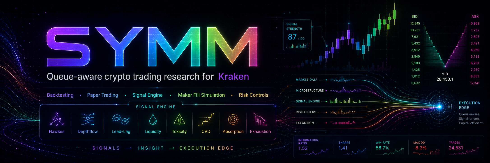
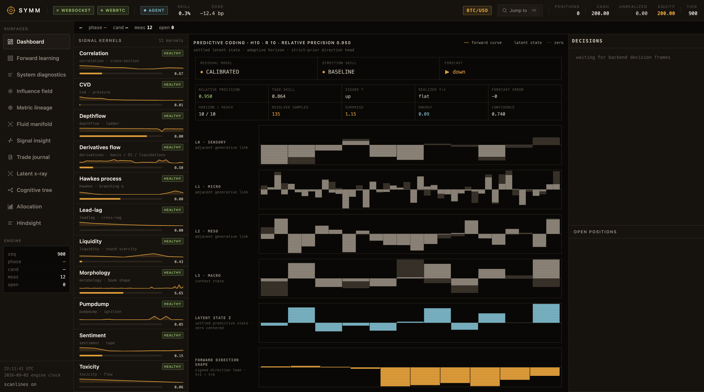
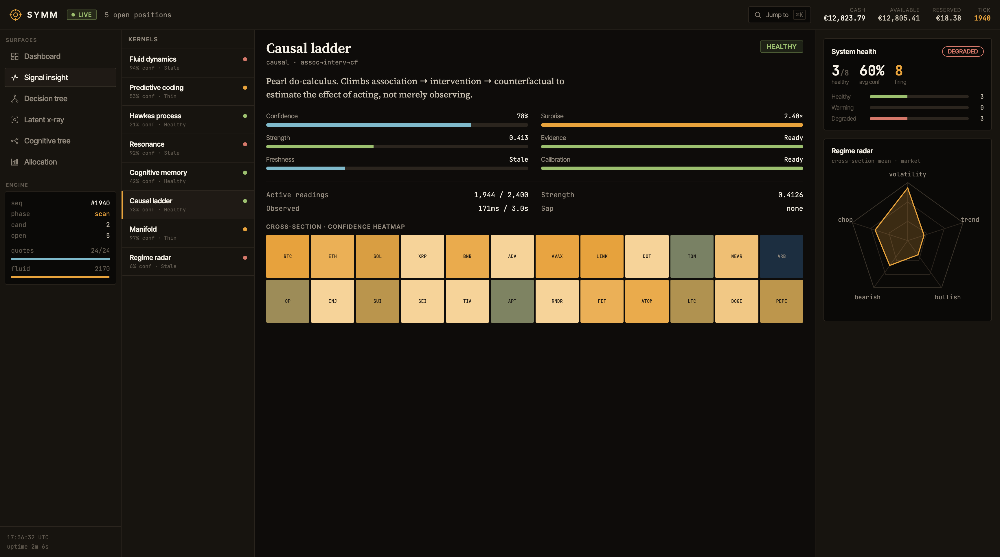
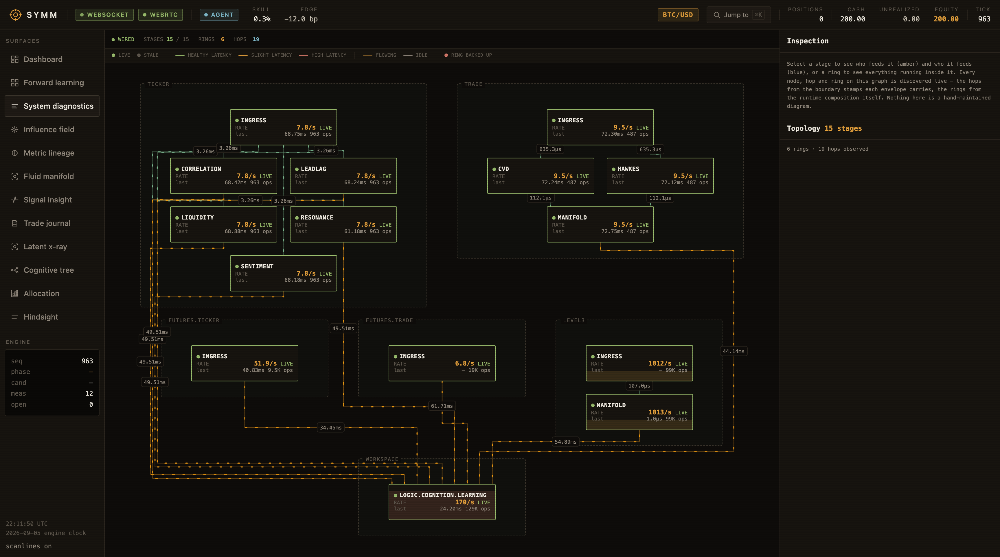
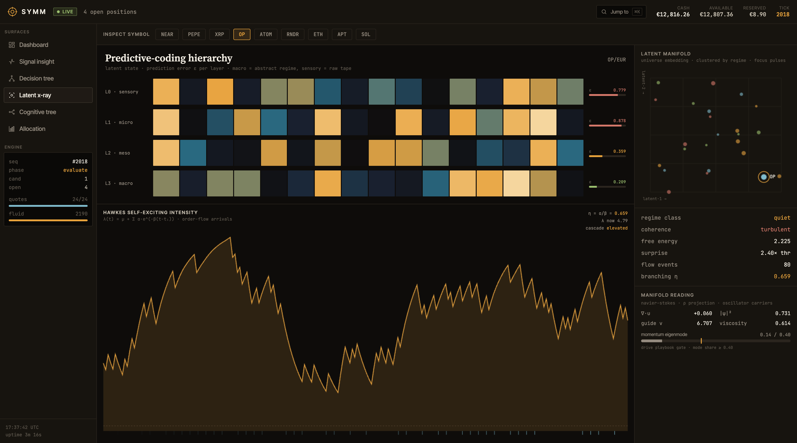
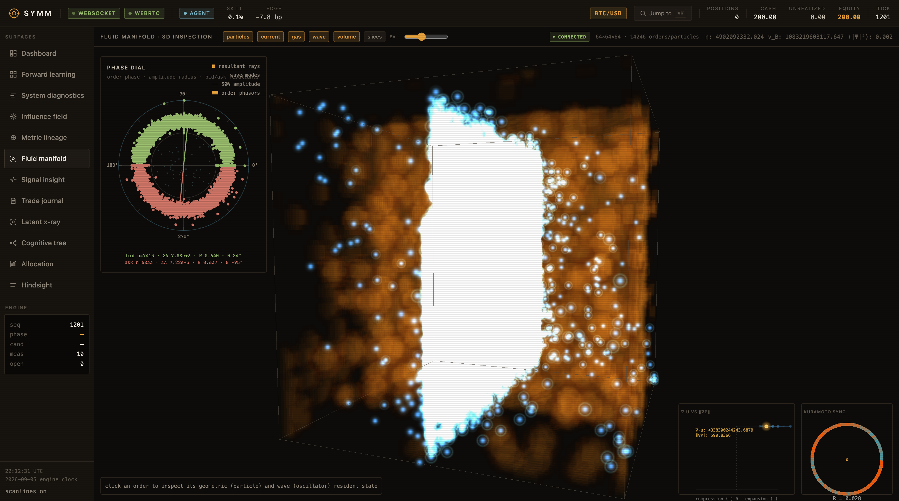
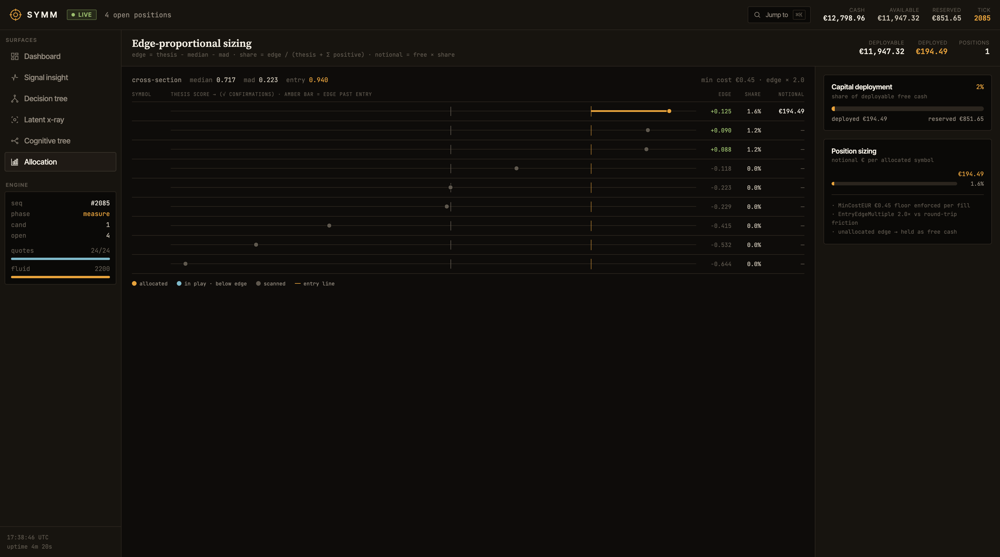

# S.Y.M.M. — Shake Your Money Maker

**A personal research project about whether a machine can learn to trade a crypto
market by measuring its own results — and prove, afterwards, that it was thinking
straight when it did.**

S.Y.M.M. conditions live Kraken ticker, trade, futures and Level 3 order-book data
into typed numerical measurements; rasterizes those measurements into a self-
organizing *impulse map*; and hands the map's hot regions to a reinforcement agent
that explores actions on independent virtual accounts, scores every decision over a
market-derived forward window, and earns the right to touch a real account only when
its own measured skill exceeds its own measurement error.

Everything that crosses the wire is captured byte-for-byte, so **Hindsight** can later
reconstruct exactly what the system knew at any historical moment and check whether the
machinery was sane.

---

> ### ⚠️ Read this first
>
> - **This is a personal project.** It is my own experiment, built for my own curiosity.
>   It is not a product, not a service, and comes with no support, no roadmap, and no
>   stability promises. **It may change completely, or be abandoned, at any moment.**
> - **This is not financial advice.** Nothing here is a recommendation to buy, sell, or
>   hold anything. Nothing here is investment, tax, or legal advice.
> - **No guarantee of any kind.** There is no claim, implied or otherwise, that this
>   system is or will be profitable. The evidence so far is that markets are hard and
>   fees are relentless. Most of this code exists to *measure* whether an edge is real,
>   precisely because assuming one is the most expensive mistake available.
> - **The virtual accounts are not proof.** Simulated fills are forward observations
>   under a stated, deliberately conservative execution model. They are not exchange
>   profitability, and their totals are records of what a lane realized — never a balance
>   anyone holds.
> - **Trading real funds risks losing them.** Setting `trading.model: real` points
>   experimental software at real money. Doing so is entirely at your own risk.
> - Software provided **as is**, without warranty of any kind.

---

## Contents

- [What changed](#what-changed)
- [Architecture](#architecture)
- [Runtime data flow](#runtime-data-flow)
- [Signals](#signals)
- [Logic solvers](#logic-solvers)
- [The learning agent](#the-learning-agent)
- [Execution](#execution)
- [Hindsight](#hindsight)
- [Nomagique](#nomagique)
- [Telemetry](#telemetry)
- [Dashboard](#dashboard)
- [Configuration](#configuration)
- [Build and run](#build-and-run)
- [Tests and benchmarks](#tests-and-benchmarks)
- [Repository map](#repository-map)
- [Design references](#design-references)

## What changed

Earlier versions of this system decided by committee: advisors deliberated, a planner
scored candidates, an opportunity layer gated entries, allocation sized them, and a
stoploss regulator closed them. That whole stack is **gone** — deleted, not unmounted.

| Removed | Replaced by |
|---|---|
| `strategy` advisors, planner, opportunity, allocation | one reinforcement `strategy.Agent` |
| stoploss engine and momentum exits | the agent commands its own exits |
| `regulator/` online control optimizer | measured skill gates authority instead |
| `logic.Analyzer`, evidence graph, causal solver | the impulse map and its regions |
| `types.Thesis` shared coordination object | `types.Envelope` on a streaming workspace |
| `backtest/` replay driver | forward review — the reviewer runs *behind* the tape |

The reason is singular: a second mechanism that could open or close a position is a
second policy, learning nothing and contradicting the one whose outcomes are being
measured. There is now exactly one decision path.

## Architecture

```text
      Kraken WebSocket v2 · public · authenticated · L3 · futures
                              │
              ┌───────────────┴───────────────┐
              │                               │
       raw frame capture              parsed envelopes
    (byte-for-byte, sequenced)                │
              │                               ▼
              │                    ┌──────────────────────┐
              │                    │  streaming workspace │
              │                    ├──────────────────────┤
              │                    │ ticker · trade       │
              │                    │ level3 · executions  │
              │                    │ futures              │
              │                    └──────────┬───────────┘
              │                               │  eleven signals
              │                               │  + category / cognition
              │                               │  + resonance / manifold
              │                               ▼
              │                    ┌──────────────────────┐
              │                    │   impulse map (grid) │
              │                    │  regions, ranked     │
              │                    └──────────┬───────────┘
              │                               ▼
              │                    ┌──────────────────────┐
              │                    │   strategy.Agent     │
              │                    │ 4 virtual lanes      │
              │                    │ + 1 policy lane      │
              │                    │ skill meter → mode   │
              │                    └──────────┬───────────┘
              │                               │ intents (queued, async)
              ▼                               ▼
       events.sqlite  ◄── witnesses ──   broker.Desk ──► paper or Kraken orders
              │
              ▼
      Hindsight: episodes · replay · validation · forward review
```

There is **one numerical grid** and no observation transport. Signal and logic
producers finish first; the shared grid update, the policy step and on-demand
inspection then run on the same consumer, in the same event turn. Keeping those
dependent steps together avoids separate polling barriers and stops a pending
cognition batch from withholding all learner progress.

## Runtime data flow

### Boot

[`cmd.Boot`](cmd/root.go) assembles the system in dependency order:

1. Open `events.sqlite`, mint a Hindsight **run identity** (start instant + nonce,
   code commit, build ID, config digest, schema versions) and persist it.
2. Start the ordered capture writer and the async witness writer.
3. Open public, private and futures transports, each writing raw frames to capture.
4. Build the price cache, instrument universe, balance, position store and desk.
5. Recover exchange inventory and working orders.
6. Construct the shared grid and the agent, then **warm up** its priors from the
   recent learning journal.
7. Start the forward reviewer, mount the workloads, cross the readiness barrier,
   *then* subscribe.
8. Serve the dashboard WebSocket, HTTP inspection routes, and manifold WebRTC.

Nothing subscribes to market data until every consumer can accept an envelope.
Connected transports stay `BUSY` and deliberately discard frames until both runtime
layers cross `READY`.

### Ingress

Level 3 orders never leave the websocket transport and its resident book.
Delta-dependent signals run at that transport boundary; their measurements and a
lightweight symbol/time notification enter the workspace. The learner reads the book
through the guarded API — it does not transport order arrays.

A read can legitimately be **newer** than the notification that triggered it, so
journal records keep local decision/valuation time separate from the triggering market
timestamp. These are different facts and are never conflated.

### Measurements

A measurement is a source-and-symbol observation with explicit provenance: observation
interval, event-time validity, estimator maturity, SNR (which may be *undefined* rather
than zero), and named metrics with raw value, optional normalization, and unit.

A signal reports numbers. It does not choose a market category or a trading action.
The governing test, from [`signal/README.md`](signal/README.md):

> Two downstream consumers may disagree about what a metric implies while agreeing
> completely about what the metric measures.

## Signals

Eleven signals fill the canonical measurement slots the grid consumes. Their estimators
derive windows and scales from observed data rather than sharing fixed horizons.

| Signal | Inputs | Measures |
|---|---|---|
| `correlation` | ticker | Asynchronous signed return correlation, dependence magnitude, covariance and temporal overlap between supplied price paths. |
| `cvd` | trade, ticker | Executed aggressive flow — quantity, notional, one-sidedness, execution rate — against contemporaneous midpoint response. |
| `depthflow` | L3 | How displayed depth is distributed bid/ask and how it is added, removed and redistributed through time. |
| `derivatives` | futures | Open interest and its change, derivative/reference basis, basis drift, and aligned derivative vs reference returns. |
| `hawkes` | trade | Arrival counts and rates, conditional buy/sell intensities, background rates, self- and cross-excitation, stability. |
| `leadlag` | ticker | Temporal alignment of two return paths: dependence at zero lag, at explicit shifts, and the best shift found. |
| `liquidity` | ticker, book | Displayed executable capacity at touch, the cost separating those prices, and divergence from the symbol's own causal baseline. |
| `morphology` | L3 | Book shape as geometry — Wasserstein distance and worst local disagreement between sides, concentration, entropy. |
| `pumpdump` | trade, L3 | Volume-clocked tape activity, spread structure and midpoint response. (The package name is legacy; "pump" and "dump" are interpretations, not measurements.) |
| `sentiment` | ticker | Cross-sectional cohort state: per-member returns, advance/decline participation, signed breadth, directional agreement. |
| `toxicity` | ticker, trade, L3 | What happened to previously displayed touch liquidity — executed, price-moved-away, withdrawn or replenished beyond what fills explain. |

Mathematical specifications live beside each implementation in `signal/<name>/README.md`.
The measurement contract itself is [`signal/README.md`](signal/README.md), and the
metric→category mapping is generated into `signal/metric_map.json` by `make metric-map`.

## Logic solvers

Four stateful solvers are mounted directly in the workloads that produce their inputs.

| Solver | Output |
|---|---|
| [`category`](logic/category/) | Cross-signal hypotheses from metric support, opposition, and missing evidence — a dimensionality reduction over the measurement set. |
| [`cognition`](logic/cognition/) | DMT-backed episodic sequences, prefix-tree activations and cognitive paths. |
| [`resonance`](logic/resonance/) | Per-symbol predictive-coding state and an online forward-return forecast with a Student-t predictive distribution. |
| [`manifold`](logic/manifold/) | A GPU (Metal) fluid readout of the visible L3 order population, with Hawkes excitation injected into the oscillators. |

The manifold steps on its own goroutine and publishes itself to the dashboard through a
viewer; it is never published from the workspace's own step.

## The learning agent

Full specification: [`strategy/REINFORCEMENT.md`](strategy/REINFORCEMENT.md).
Original design intent: [`strategy/LEARNING.md`](strategy/LEARNING.md).

### The impulse map

Signals and solvers write their observations into a shared 2D grid. Each cell records
the supplied raw value *and* a separate presence mask — a missing observation supplies no
activity and is never inferred. Signed changes are scaled by adaptive level dispersion,
baseline maturity, measurement maturity and a signal-power fraction; when a producer
supplies SNR it is used, otherwise the grid estimates movement-to-dispersion power from
its own numeric history (without marking the producer's missing SNR as defined).

A rank-two incremental signed profile sketch estimates relative affinities, so quantities
that move together attract and inconsistent ones repel. One present coordinate advances
per update by weighted distance-error descent. This is a streaming approximation, in the
spirit of [Brand's incremental SVD](https://www.merl.com/publications/docs/TR2006-059.pdf)
— not a claim of globally optimal clustering.

### Regions

Current quality-conditioned activity is rasterized into a square with
`ceil(sqrt(n))` cells per side. Equal-height connected plateaus merge, uphill paths form
watershed basins, and Otsu between-class variance retains the stronger basin class. There
is **no** configured cluster count, activation threshold, or neighborhood radius.

Regions are ordered by strength, and a region's identity names the strongest quantity at
its peak cell. Those ordered identities — plus a delimiter and dyadic inventory exposure —
form the numeric context the agent decides under. A context carries its own grid version,
so one symbol's activity can never reissue another's impulse.

### Actions and priors

The vocabulary is `WAIT`, `ENTER`, `EXIT`, `SCALE`. Quantity candidates successively
bisect the currently executable range down to venue lot and cost minimums; bisection is a
search basis, not a chosen allocation percentage.

The model matches context identities **exactly** — it neither parses their names nor
merges nearby contexts with an invented tolerance. An outcome trains its action at every
*ordered prefix* of its context. Recall then follows learned paths **greedily**: at each
depth it first tries the token at that depth, then scans the unused supplied tokens in
input order for an existing child. That recovers permutations and subsets when region
ranks jitter — it is neither strict prefix matching nor an exhaustive permutation search,
and `PriorReading.Depth` counts matched tokens rather than a prefix length.

Depth is not automatically preferred. A deeper reading must retain at least the broader
reading's **retained input authority** — `sum(w²)/sum(w)`, independent of reward sign and
magnitude — and must define dispersion whenever the broader one can; ties favour
specificity. Old deep evidence therefore yields to refreshed broader evidence without an
arbitrary age cutoff, and a measured zero reward is never mistaken for missing evidence.

Exploration balances issued counts while dispersion is unestimable, then samples around
the authority-weighted mean using measured standard error. This is empirical Gaussian
sampling, not a calibrated Bayesian posterior — see the
[Thompson sampling tutorial](https://arxiv.org/abs/1707.02038) for the distinction. No
exploration bonus, temperature, or warmup count is configured.

### Lanes, fills and reward

Each symbol runs **four exploratory lanes and one policy lane**. The four are independent
samplers of the same vocabulary, not one lane per action; they raise the evidence rate in
parallel. Each starts with its own full copy of the known cash balance. **Lanes do not
share capital and their profits must never be summed into a purported fundable account.**

Fills model taker IOC execution on subsequently available displayed depth, capped at each
price by what actually stood there when the decision was made — liquidity that arrived
later was never available, and liquidity since cancelled is a race the order loses.
Partial fills, unfilled-remainder cancellation and the account's real fee schedule apply.
Exact rational arithmetic preserves mixed price/quantity/cash precision. The model
excludes maker queue position, hidden liquidity, market impact and exchange latency, and
it never fabricates missing depth. An unmarkable account is displayed as *unvalued* and
retried; new risk is not issued while valuation is incomplete.

A lane that spends its capital on execution costs **restarts**: it resolves its
outstanding decisions against the equity it actually ended with and begins a new episode
on a fresh clone of the known balance. Episodes are separate accounts in sequence.

Every decision is scored over the same forward window — change from issue equity, minus
the reward rate known at issue times actual elapsed seconds, divided by starting capital.
The window is `horizonEpochs` (8) multiples of the market's own measured cadence of
impulse change, so a fast instrument gets a fast window and an unmeasured cadence
resolves nothing rather than assuming one. Settlement runs on every book update and open
positions are valued at executable liquidation prices including exit fees, so **waiting
and holding are measured, not merely permitted**.

### Measured skill and going live

[`strategy.SkillMeter`](strategy/skill.go) estimates the policy lane's forward competence
from its own resolved outcomes under exponential forgetting, so an edge earned in one
regime decays out instead of being averaged away.

Only decisions covering **disjoint** forward windows enter that estimate. Decisions issue
far faster than a window closes, and admitting overlapping ones reports one observation
as many, collapsing measured dispersion and saturating confidence. Excluded decisions
still train their own action priors — this gate governs execution authority, not learning.

- **Promotion** requires the mean minus `skillSigma` (2.0) standard errors to exceed zero,
  on effective evidence of at least `skillSigma²`. An edge must be larger than its own
  measurement error, and a short run of similar outcomes cannot read as certainty.
- **Demotion** requires only a non-positive mean. That asymmetry is deliberate hysteresis.
- A reading below the floor is reported *unqualified*, with no bound displayed at all,
  rather than shown as a number an operator could mistake for a measurement.

There are exactly **two modes**: *calibrating*, and *trading the account*.
`trading.model` names which account that is — `paper` or `real` — and the agent does not
earn its way from one to the other. Paper and real are the same behaviour against
different accounts; only *whether it is trading at all* is earned. Learning never stops,
which is what lets a degrading edge pull a trading agent back to calibrating without any
separate supervision.

A separate [`RealizationMeter`](strategy/realization.go) can veto execution independently
of skill — repeated submission failures or fills that diverge from their reference price
revoke authority regardless of how good the estimate looks.

The account is live from the first tick either way, so an operator watching a calibrating
agent is watching a real balance rather than an empty one.

### Forward testing

**There is no backtest.** Replaying history against the current model lets it see what
came next. [`cmd.forwardReviewer`](cmd/hindsight_forward.go) instead runs ~30s *behind*
the live tape, discovers confirmed price excursions on the captured run, and reports them
to `Agent.Review`, which compares each against the exposure the policy lane actually had
at the time.

Reviewing is measurement, never training: an outcome discovered after the fact is never
fed back into a decision, because a policy trained on episodes it could not have seen is a
policy leaking the future. "Sat it out" is not a mistake — the excursion was not visible
when the decision was made — but a policy exposed to *none* of them has no path to an
edge, and that is what the reading is for.

### Attribution

[`strategy.attribution`](strategy/attribution.go) accumulates, per hot quantity and action
kind, the outcomes of decisions issued while that quantity was hot. That answers the
discovery question — which measurements should determine which actions — from resolved
evidence rather than by hand. It is association under the agent's own exploration, not a
controlled comparison.

## Execution

The agent decides from its own simulated wallet, which is *not* the account. The two can
disagree — an entry on a symbol the account already holds, or an exit on one it never
opened. [`cmd.learningDesk`](cmd/learning_desk.go) reconciles against the desk's actual
position and **counts** the disagreement rather than acting on it. A submission the venue
refuses is counted and reported, never fatal: halting the workload on one refused order
would stop every symbol from learning.

`ExecutionDesk.Submit` must never talk to the venue. The agent runs inside the workspace
consumer that also feeds the terminal, so a synchronous REST round-trip there froze the
dashboard the instant a position opened. Reconciliation is now an inline `sync.Map` read
plus a queue; one worker goroutine places orders, preserving per-symbol intent order. A
full queue **drops** rather than blocks, because an intent that waited behind a backlog
was priced against a book that no longer exists. `strategy.ExecutionStatus` reports
*submitted*, *diverged*, *dropped* and *refused* separately — they are different facts and
only one of them is an error.

Entries reach [`broker.Desk`](broker/desk.go) self-managed: the agent re-evaluates every
open position on each book update and issues its own `EXIT`. The desk still sizes the
entry under its own risk plan and retains that plan as a catastrophic floor.
`broker.Position` marks and reports but never closes itself. Partial reductions execute
through `Position.Reduce` — "hold less of this" is not "stop holding this", and a
reduction that closed the whole lot would record an account state the agent never decided
on.

On boot, [`broker.Recovery`](broker/recovery.go) reconciles exchange balances, trade
history and working orders. The exchange wallet is authoritative: snapshots replace the
local wallet rather than merging into it.

### Paper and real

`trading.model: paper` routes balances, fills, history and orders through the native
`kraken paper` CLI while public market data continues to come from Kraken. The paper
ledger is external to this process; it is not an in-memory fake exchange.

`trading.model: real` routes account operations and orders to Kraken.

| Environment variable | Purpose |
|---|---|
| `KRAKEN_API_KEY` | Kraken API public key. |
| `KRAKEN_API_SECRET` | Kraken API secret consumed by the SDK. |
| `SYMM_PPROF` | Enables the pprof listener even when config disables it. |
| `DATURA_INSPECT` | Enables DMT/datura inspection output. |

There is no automatic `SYMM_*` mapping for Viper configuration; use a YAML file for
everything else.

## Hindsight

Full specification: [`hindsight/README.md`](hindsight/README.md) — sixty numbered sections
of contract.

Hindsight is the retrospective inspection and mathematical-validation engine. It answers:

> When the market entered an objectively interesting historical condition, what exactly
> did SYMM know, calculate, retain, infer and produce at that moment — and was that
> machinery mathematically, semantically, numerically, temporally and causally sane?

It is explicitly **not** a strategy tuner, threshold optimizer, parameter search, profit
simulator, regret calculator, or "what should we have done?" engine.

### Three laws

1. **Future selects, past determines.** The future may tell Hindsight *where to look*. It
   may never change what SYMM *knew* there. A later +20% excursion identifies a reference
   point; it is not an input to the reconstructed state at that point.
2. **Exact provenance.** Every derived fact traces to the exact captured frame that caused
   its computation and the exact resident state version that participated. Timestamp
   proximity is not provenance.
3. **Correctness, not profit.** A mathematically valid system may select cash immediately
   before a +40% move — if every contract held, Hindsight reports no defect. A profitable
   trade containing broken mathematics is reported as a defect regardless of outcome.

### How it works

Every raw websocket frame is captured byte-for-byte with a minted **capture identity**
before it is parsed, tagged with its origin kind and endpoint. Envelope manifests record
that one raw frame may produce zero, one, or many envelopes. Witnesses record what
*changed* at bounded decision moments. Runs carry code commit, build ID, config digest and
schema versions, so a capture is never silently compared across incompatible code.

Episodes are objectively interesting market regions — upward and downward excursions,
reversals, volatility expansion and contraction, spread expansion, liquidity collapse,
arrival clusters — selected without consulting any SYMM trading output. Reference points
are coordinates on the historical record: an *anchor* is where an excursion retrospectively
began, which never means SYMM should have bought there. A market excursion is never called
profit, and undefined is never rendered as zero.

Witness overflow marks the run `GAPPED` rather than silently losing records.

### Tools

```bash
go run ./cmd/hindsight_export -summary        # where the funnel dies, per stage
go run ./cmd/hindsight_probe                  # capture integrity probe
```

The dashboard's `/hindsight` surface reads the same store: runs, captures, persisted
states, gaps, envelopes, lifecycle records and the position index, with a
plain-language/expert explainer that translates only *declared* vocabulary. Colour there
encodes **knowability, not desirability** — it never judges a value good or bad.

## Nomagique

[`nomagique/`](nomagique/) is the embedded numeric library, vendored in-repo. The name is
the thesis: **no magic numbers**. Window sizes, adaptation rates and baseline half-lives
are derived from observed data — its event-time spacing, dispersion and stability — so
estimators self-calibrate.

The contract is a composed pipeline of `Step(Number) Number` nodes. A primitive owns no
goroutines, no locks and no magic constants; a signal is one such pipeline and holds no
math of its own. The library implements EWMA and windowed statistics, Hawkes fitting,
recursive least squares, adaptive standardization, resonance predictive coding, the
learning grid and its region watershed, prior/model recall, reward ledgers, correlation
and vector engines, and the Metal fluid solver.

**The package boundary is absolute.** `nomagique` organizes and optimizes numbers. It has
no knowledge of market symbols, wallets, orders, fills, equity or funding — including in
its tests. `symm` owns all execution rules, economic accounting and display vocabulary.

## Telemetry

[`telemetry/`](telemetry/) defines the binary wire format for high-throughput frontend
frames. The schema is [`telemetry.fbs`](telemetry/telemetry.fbs) (FlatBuffers); generated
Go lands in `telemetry/generated/` and generated TypeScript in
`frontend/src/providers/telemetry/`.

Regenerate both sides together — never run bare `flatc`:

```bash
make generate-telemetry
```

FlatBuffers keeps frame serialization allocation-free on the hot path. WebRTC data
channels carry binary manifold and particle frames; the WebSocket carries JSON for
lower-frequency state.

## Dashboard

[`ui.Hub`](ui/hub.go) serves on `127.0.0.1:8765`:

| Endpoint | Purpose |
|---|---|
| `ws://…/ws` | JSON state and telemetry stream, plus focus-symbol commands. |
| `POST …/webrtc/manifold` | Non-trickle WebRTC signaling for binary manifold frames. |
| `GET …/learning` | Coherent on-demand agent state for the selected symbol. |
| `GET …/learning/skill` | Current skill reading and mode. |
| `GET …/learning/events` | The run's durable decision journal. |
| `GET …/trades` | Completed round trips. |
| `GET …/hindsight/*` | Runs, captures, states, gaps, envelopes, lifecycle, timeline, resident state, metric map. |

The frontend is a React 19 / TanStack Start terminal on port 3000.

| Surface | What it shows |
|---|---|
| `/` Dashboard | Equity, balances, positions, queue depths, system telemetry. |
| `/learning` | The agent: impulse map, regions, candidates, per-lane wallets, skill panel, forward review, metric influence, and the live decision journal. |
| `/hindsight` | Run and capture browser, episode timeline, state inspector, position index, comparison view. |
| `/fluid` | Live L3 manifold: particle fields and pressure maps over WebRTC. |
| `/signals` | Per-signal metric timeseries and estimator state. |
| `/xray` | Resonance hidden state and prequential skill history. |
| `/cortex` | DMT prefix-tree activations and episodic paths. |
| `/graph`, `/influence`, `/lineage` | Relationship, influence and metric-lineage views. |
| `/journal` | Completed round trips and realized PnL. |
| `/allocation` | Sizing and exposure. |
| `/diagnostics` | Live pipeline topology, per-stage and per-queue health and latency. |

The browser sends the selected focus symbol back to the backend, so detailed telemetry is
gated to the active market rather than broadcast for every pair.

Build-time overrides: `VITE_SYMM_WS_URL`, `VITE_SYMM_WEBRTC_URL`.

> **Leftovers:** `/regulator` is a surface from the removed control-optimizer subsystem
> and has no backend producer. Its `regulator:` config block is likewise inert.

## Configuration

Configuration loads in this order:

1. `--config <path>` when supplied (failure is fatal).
2. `cmd/cfg/config.yml`
3. `./config.yml`
4. `$HOME/.symm/config.yml`
5. The copy of `cmd/cfg/config.yml` embedded in the binary.

The checked-in defaults give you: data under `~/.symm/data`; **paper execution**; USD
quote-market discovery; authenticated L3 depth alongside ticker, trade and futures;
bounded ordered capture and witness queues; an in-memory DMT cognitive tree; a 0.50
per-entry quote-notional ceiling; and pprof disabled. See
[`cmd/cfg/config.yml`](cmd/cfg/config.yml) for the complete file.

Runtime files under `system.data_path`:

| File | Purpose |
|---|---|
| `events.sqlite` | Raw captures, manifests, witnesses, lifecycle and `learning_events`. |
| `positions.sqlite` | Persisted position and completed-trade state. |
| nonce state | Monotonic Kraken nonce continuity across restarts. |

### What survives a restart

The durable learning journal does. On startup the agent replays recent resolved decisions
from `learning_events` into its action priors and feature attribution, so a new process
starts warm rather than cold. It is a head start, not a checkpoint: the grid geometry is
rebuilt from the live tape, and **execution authority is never inherited** — skill is
re-earned by forward calibration on the current session.

## Build and run

### Prerequisites

- Go 1.26.1
- pnpm 10.28.1
- A sibling checkout of `../datura` (used by the cognition solver via `go.mod` replace)
- macOS with Metal for the GPU manifold path
- The native `kraken` CLI for paper account and execution operations
- Kraken credentials for authenticated private and L3 connections
- `flatc` only if regenerating telemetry bindings

`qpool`, reached through DMT, uses `go:linkname` runtime hooks, so Go 1.26 needs
`GOFLAGS=-ldflags=-checklinkname=0` to link. The Makefile exports it — use the Makefile so
the setting reaches nested Go and cgo subprocesses.

### Run

```bash
make run          # backend + dashboard as one interruptible session; Ctrl+C stops both
make run CONFIG=/absolute/path/to/config.yml
```

Then open **http://127.0.0.1:3000** (dashboard) or **http://127.0.0.1:3000/learning**
(the agent).

Other entry points:

```bash
make build                 # race-enabled binary → bin/symm  (rebuilds the Metal lib first)
make experimental          # live observability stack, forced paper-only
make debug                 # DATURA_INSPECT=1
make run-profile           # pprof at http://127.0.0.1:6060/debug/pprof/
make physics-metallib      # regenerate the embedded Metal library after editing a .metal file
make metric-lineage        # regenerate frontend/public/metric-lineage.json
make metric-map            # regenerate signal/metric_map.json
```

Editing a `.metal` file requires `make physics-metallib` — the library is `go:embed`ed, so
`go build` alone will not pick up the change.

Frontend on its own:

```bash
cd frontend && pnpm install && pnpm dev
```

## Tests and benchmarks

The Go suite uses GoConvey and covers package behaviour, concurrency, calculation
benchmarks, transport fixtures and a deterministic Level 3 market model under
[`tests/market`](tests/market/).

Metal pipeline creation is XPC-global, so package binaries must not initialize independent
domains concurrently — tests run with `-p 1` and a 30m budget. The linker flag is required
to **link**; compile and vet pass without it.

```bash
make test-go          # Go tests
make test-race        # Go race suite
make test-cover       # coverage → runs/coverage.out
make bench            # benchmarks with allocations
make test             # Go tests + race + frontend production build
```

```bash
cd frontend
pnpm test             # Vitest
pnpm typecheck        # TypeScript
pnpm lint             # Biome
pnpm build            # production build
pnpm bench            # Vitest benchmarks
```

`make test-frontend` runs `pnpm build` only; it does not run Vitest.

## Repository map

| Path | Responsibility |
|---|---|
| `main.go`, `cmd/` | Cobra entrypoint, config loading, system assembly, grid/workload nodes, learning desk, forward reviewer, Hindsight CLI tools. |
| `kraken/` | Kraken wire models and normalized exchange payloads. |
| `kraken/websocket/` | Public/private/futures/L3 transport, subscriptions, nonce management, paper routing, raw capture hooks. |
| `types/` | Envelope, measurement, action, decision, cognition, holding, phase and UI types. |
| `signal/` | The eleven numerical conditioners, their specs and the metric map. |
| `logic/` | Category, cognition, resonance and manifold solvers. |
| `strategy/` | The learning agent: impulse consumption, virtual lanes, reward, skill meter, realization veto, execution intents, forward review, attribution. |
| `broker/` | Instruments, price and fee economics, wallet, desk, positions, persistence, recovery. |
| `hindsight/` | Capture identity, sequencing, manifests, witnesses, episodes, replay, integrity, validation. |
| `store/` | SQLite engine, ordered capture writer, async witness writer, learning journal, repositories. |
| `nomagique/` | Embedded numeric library (composed primitives, learning grid, physics, estimators). |
| `telemetry/` | FlatBuffers schema and generated Go bindings. |
| `ui/` | Dashboard WebSocket, HTTP inspection routes, WebRTC manifold transport. |
| `frontend/` | React/TanStack terminal and its stores. |
| `tests/` | Deterministic Level 3 market model and fixtures. |
| `system/` | Runtime configuration and pipeline diagnostics. |
| `tools/` | Metric lineage and metric map generators. |
| `specs/` | Design contracts, research notes and reviews (some historical). |

### Adding or changing a signal

1. Emit dimensional numerical metrics with correct timestamps, units, maturity and
   uncertainty — and leave SNR *undefined* rather than zero when no noise model exists.
2. Keep market categories and trading actions out of the signal package.
3. Compose one `nomagique` pipeline; the signal itself holds no state and does no math.
4. Mount it in the workload that produces its inputs and register its measurement slots.
5. Document it in `signal/<name>/README.md` and regenerate the metric map.
6. Cover multi-step behaviour and invalid input with mirrored GoConvey tests.
7. Add a benchmark when the change affects repeated calculation.

## Design references

- [`AGENTS.md`](AGENTS.md) — implementation, safety, testing and architecture rules.
- [`strategy/REINFORCEMENT.md`](strategy/REINFORCEMENT.md) — the agent contract in full.
- [`strategy/LEARNING.md`](strategy/LEARNING.md) — the original impulse-map design intent.
- [`hindsight/README.md`](hindsight/README.md) — the sixty-section inspection contract.
- [`signal/README.md`](signal/README.md) — the measurement envelope contract.
- [`signal/METRIC_MAP.md`](signal/METRIC_MAP.md) — metric→category mapping rules.
- [`nomagique/README.md`](nomagique/README.md), [`nomagique/DESIGN.md`](nomagique/DESIGN.md) — the numeric library.
- [`specs/manifold.md`](specs/manifold.md), [`specs/pnl.md`](specs/pnl.md), [`specs/market-simulator.md`](specs/market-simulator.md) — subsystem contracts.
- Remaining `specs/` documents predate the agent rewrite and are historical.

## Terminal













---

<sub>Personal research project · no warranty · not financial advice · may change or disappear at any time.</sub>
