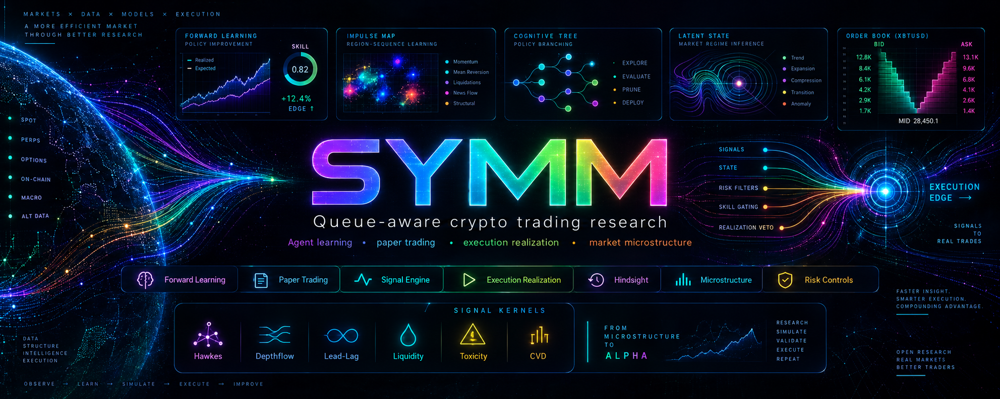

# S.Y.M.M. — Shake Your Money Maker

**SYMM is a visual computer.** You wire nodes together on a canvas, and that
drawing *is* the running program — not a picture of one, not a config file some
hand-written program reads, not a template that generates code you then
maintain. The graph is compiled in memory straight into something that executes.
Change a wire and the running system changes.

It ships with **390 node types**: arithmetic and calculus, linear algebra,
probability distributions, statistics, optimisers, graph algorithms, samplers,
machine learning, storage, HTTP/WebSocket/WebRTC transports — and 129 user
interface components, so the screen you look at is drawn by the same editor,
from the same kind of graph, as the computation behind it.

The flagship application built in it is a market system that learns to recognise
what the tape does *before* it does it. That is where the name comes from. The
machine underneath it has nothing to do with markets.

---

## How it works

You draw a graph. Each node is one small, complete operation — "multiply",
"mean", "solve this matrix", "open a WebSocket", "write these rows to storage",
"draw a panel". Each has input sockets on the left, output sockets on the right,
and you connect them.

That drawing is a JSON document. When SYMM starts, the compiler turns it into a
running program:

1. Look up each node type and construct the real object behind it.
2. Ask that object's **schema** what inputs and outputs it has. The sockets in
   the editor are read from the thing itself, so they cannot drift out of date.
3. Validate every connection — both ends exist, types agree, topology resolves.
4. Compile the routing away. At runtime there is no JSON being interpreted and
   no name lookups: numeric indices, pre-resolved methods, readiness masks.

Three things follow from that:

**No code is generated.** There is no `mygraph.json → mygraph.go` step and
nothing generated to check in. The graph is the artifact.

**A broken edit cannot break the running system.** Editing compiles a
*candidate*, which is swapped in only once it validates. Otherwise the running
program carries on untouched and the editor shows you what was wrong.

**Adding a node type is cheap.** Describe its inputs and outputs in a schema,
write the operation. The editor, the sockets and the type checking follow.

### What a node is

Every node speaks the same two-call protocol: `write` hands it its inputs,
`done` returns its result and resets it for the next round. A node knows nothing
about the graph around it — not its neighbours, not its position, not the
schedule. Routing belongs to the compiled program.

Nodes also don't quietly remember things between rounds. When something must be
remembered you wire in a storage node, so the memory is visible on the canvas
instead of hidden inside a box.

---

## The screen is part of the graph

Most systems like this stop at the computation and hand you an API to build a
frontend against. SYMM doesn't. **The interface is authored in the same editor,
in the same graph, out of the same kind of node.**

The React component library is the catalog. A generator runs the TypeScript type
checker across it and turns every exported component into a node type — 129 of
them. It resolves each component's real props through aliases, intersections and
inherited types, and gives each one a typed socket with the right control: a
string becomes a text field, a number becomes a number field, and a union like
`"info" | "success" | "warning"` becomes a dropdown of exactly those values.

Nobody maintains that list. Add a component to the library, regenerate, and it
is a node you can drop on the canvas. Rename a prop and the socket follows.

**Nesting is wiring.** A component's output socket is `self`, and you plug it
into a parent's `components` socket. Wiring one more child in is what makes a
panel wider. So this, on the canvas:

```
Route "/overview"
  └── Flex.Column
        └── Panel
              ├── Panel.Header
              ├── Meter
              └── Badge
```

is what renders. The graph stays structural — no HTML or JSX is ever stuffed
into a node's value. A renderer walks the compiled result, resolves each name
through the generated registry, and hands the props and children to the real
React component. Routes are nodes too: a `UIRoute` carries a path and a title
and points at the subgraph that is that page.

And a number port is a number port. `Meter` has a `percent` socket typed as a
float, validated exactly like an edge between two pieces of arithmetic. The same
output that feeds an average can feed a meter — no endpoint to define, no
serialisation boundary, no client-side fetching layer to keep in sync. The
measurement and the thing displaying it are two nodes in one graph.

---

## What's in the box

| Area           | Some of what's there                                                                |
|----------------|-------------------------------------------------------------------------------------|
| Numbers        | arithmetic, calculus, integration, differentiation (gradients, Jacobians, Hessians) |
| Linear algebra | SVD, QR, LU, Cholesky, eigendecomposition, solvers                                  |
| Statistics     | moments, correlation, regression, quantiles, entropy, distance measures             |
| Probability    | ~35 distributions plus divergences (KL, Wasserstein, Hellinger, …)                  |
| Sampling       | Metropolis-Hastings, importance, rejection, Latin hypercube                         |
| Optimisation   | BFGS, L-BFGS, CMA-ES, Nelder-Mead, Newton, conjugate gradient                       |
| Graphs         | PageRank, betweenness, shortest paths, components, spanning trees                   |
| Learning       | online fits, forecasting, causal tools, a prefix-trie memory, policies              |
| Control flow   | loops, conditions, matching, batching, delays, run-once                             |
| Transport      | fan-out/in, forking, joining, gating, JSON encode/decode, pacing                    |
| Networking     | WebSocket client and server, HTTP server, WebRTC, QUIC, HMAC/bearer auth            |
| Storage        | keyed grid, radix stores, capture tapes, Apache Iceberg tables                      |
| Interface      | 129 React components as nodes, plus routes                                          |
| Markets        | the one domain area — indicators, strategy, paper execution                         |

Markets are a single folder (`nomagique/financial/`) among thirty. Everything
else is domain-free on purpose: domain vocabulary leaking into the primitives is
what turns a general machine into a single-purpose one.

## What else you could build with it

No Go required — these are compositions of nodes that already exist.

- **A dashboard for anything.** A WebSocket or HTTP source, some statistics, and
  the interface nodes. No frontend code, no API in between.
- **A client for any authenticated API.** HMAC, bearer and nonce nodes plus JSON
  nodes. The Kraken connection in the default graph isn't special — it's just
  the API someone wired up first.
- **A data pipeline.** Scan Iceberg tables, filter, map, reduce, write new ones.
  A server-side DuckDB engine answers SQL over the same catalog and streams
  Arrow straight into a Perspective viewer.
- **A statistics bench.** Sample from a distribution, run inference, compare
  against another with a real divergence measure, and plot it.
- **A parameter fitter.** Point an optimiser at anything the rest of the graph
  can score, with real gradients from the differentiation nodes.
- **Network analysis.** Load a graph of people, packages or machines, run
  PageRank or betweenness, render the ranking.
- **An online learner.** Anomaly detection, recommendation or a control policy,
  learning from a live stream rather than a training run.
- **A simulation.** Physics, integrators and linear algebra stepped in time and
  drawn live.
- **A service.** The HTTP and WebSocket *server* nodes let a graph be the thing
  answering requests, not just the thing making them.

---

## The market system

SYMM's own graphs connect to a crypto exchange, measure the order flow, capture
every frame to storage, and mine that archive for the moments where price ran.

It predicts **precursors, not price**. Not a forecast of a number — a
recognition of the shape the market makes before something happens, producing an
action (wait, enter, exit) graded on whether it called the turn in the right
place.

```
raw market data ──► virtual grid ──► impulse map ──► region token ──► radix trie
   (5 streams)      (metrics)        (remapper)      (N hot regions)   (WAIT/ENTER/EXIT)
```

No agent, no advisor panel, no planner. The trie is the decision mechanism, and
there is no second path to a decision. [TRAINING.md](TRAINING.md) is the long
version.

---

## Features

**Compiler**

- [x] Flume JSON compiled in memory into an executable program
- [x] Ports and types reflected from Cap'n Proto schemas
- [x] Connection, type and topology validation, reported to the editor
- [x] Routing compiled to numeric indices and readiness masks
- [x] Fan-out and fan-in
- [x] Nested, reusable definitions
- [x] Hot recompile with quiescent swap
- [x] Capability reuse across recompiles
- [x] Workbench: compile and run individual nodes from the editor
- [ ] Nodes backed by capabilities on another machine (QUIC/UDP/IPC transports
      exist; the compiler doesn't place nodes remotely yet)

**Node library**

- [x] 390 node types across 30 domain-free packages
- [x] Streaming contract: one observation, one step, sufficient statistics
- [x] Iceberg tables, capture tapes, keyed grid and radix stores
- [x] WebSocket / HTTP / WebRTC / QUIC transports with auth nodes
- [x] GPU solver for the physics simulation (Metal; CUDA behind a build tag)

**Interface**

- [x] React library reflected into 129 node types, props and all
- [x] Generated component registry and recursive renderer
- [x] Routes authored as nodes
- [x] Drift check that fails when the registry and the library disagree
- [ ] Live measurement values bound into component props

**Market system**

- [x] Exchange connection and keepalive
- [x] Virtual grid — metrics declare the fields they need, keep per-symbol state
- [x] 15 signal graphs composed from generic primitives
- [x] Raw capture into Iceberg with session and sequence cursors
- [x] Ordered, deduplicated tape replay
- [x] Excursion mining with persisted event batches
- [x] Fragment A/B/C/D reference selection
- [x] 2D coordinates for metrics
- [x] Impulse map and sympathy clustering
- [x] Remapper and settling gate
- [x] Region tokens
- [ ] Radix trie *(partial — structure exists, sensory keys don't)*
- [ ] Full fragment replay
- [ ] A/B/C grading
- [ ] Fragment training loop
- [ ] Live paper process

---

## Getting started

The Go version is in `go.mod`. The Makefile supplies a linker flag an indirect
dependency currently needs.

```sh
make build
make run
```

To run a specific graph:

```sh
GOFLAGS=-ldflags=-checklinkname=0 go run . --graph manifest/system.json
```

The editor and dashboard, from `frontend/`:

```sh
pnpm install
pnpm dev
```

`manifest/` holds the graphs embedded in the binary: `system.json` is the root,
`capture.json` records raw frames to storage, `training.json` mines the archive,
`ui_overview.json` is a screen, and the rest are measurements.

## Layout

- `cmd/` — the command line, and starting a graph.
- `manifest/` — the graphs.
- `nomagique/compiler/` — schema reflection, compilation, evaluation, workbench.
- `nomagique/` — the node library, one folder per area.
- `workbench/` — server-side DuckDB over the Iceberg catalog, answering in Arrow.
- `frontend/` — the node editor, the rendered interface, inspection views.

## Verification

```sh
GOFLAGS=-ldflags=-checklinkname=0 go test -race -p 1 ./cmd ./nomagique/compiler ./nomagique/temporal ./nomagique/runtime/... ./nomagique/network/...
```

From `frontend/`:

```sh
pnpm test
pnpm typecheck
pnpm build
```

`make test-go` runs the whole Go suite, `make bench` the benchmarks.

Two build notes that cost time if missed. When regenerating Cap'n Proto
bindings, compile all schemas in a package together — the generator emits one
registration function per package, and separate runs create duplicates. And
Metal kernels are embedded, so editing a `.metal` file needs `make
physics-metallib`; a plain `go build` will use the stale one.
