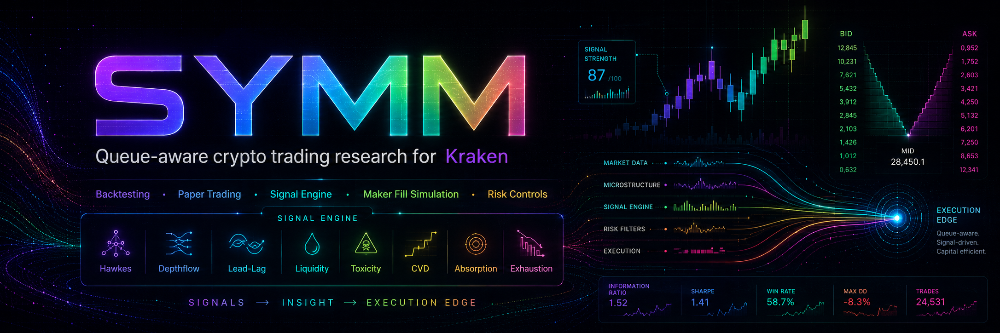

# S.Y.M.M. — Shake Your Money Maker

**A personal research project about whether a machine can learn to trade a crypto
market by measuring its own results — and prove, afterwards, that it was thinking
straight when it did.**

S.Y.M.M. conditions live Kraken ticker, trade, futures and Level 3 order-book data
into typed numerical measurements; rasterizes those measurements into a self-
organizing *impulse map*; extracts watershed regions and cognitive precursors into an
immutable prefix-tree cognition engine; evaluates actions through a statistical
training coordinator gated by cognitive confidence and measured skill exceeding
measurement error; and dispatches authorized decisions through an atomic exchange
execution desk.

Everything that crosses the wire is captured byte-for-byte, so **Hindsight** can later
reconstruct exactly what the system knew at any historical moment and check whether the
machinery was sane.

> ### ⚠️ Read this first
>
> - **This is a personal project.** It is my own experiment, built for my own curiosity.
>   It is not a product, not a service, and comes with no support, no roadmap, and no
>   stability promises. **It may change completely, or be abandoned, at any moment.**
> - **This is not financial advice.** Nothing here is a recommendation to buy, sell, or
>   hold anything. Nothing here is investment, tax, or legal advice.
> - **No guarantee of any kind.** There is no claim, implied or otherwise, that this
>   system is or will be profitable. The evidence so far is that markets are hard and
>   fees are relentless. Most of this code exists to *measure* whether an edge is real,
>   precisely because assuming one is the most expensive mistake available.
> - **Simulation is not proof.** Simulated fills are forward observations
>   under a stated, deliberately conservative execution model. They are not exchange
>   profitability, and their totals are records of what the learner realized — never a balance
>   anyone holds.
> - **Trading real funds risks losing them.** Setting `trading.model: real` points
>   experimental software at real money. Doing so is entirely at your own risk.
> - Software provided **as is**, without warranty of any kind.

## Contents

- [What changed](#what-changed)
- [Architecture](#architecture)
- [Runtime data flow](#runtime-data-flow)
- [Signals](#signals)
- [Logic solvers](#logic-solvers)
- [The learning pipeline](#the-learning-pipeline)
- [Execution and order lifecycle](#execution-and-order-lifecycle)
- [Hindsight](#hindsight)
- [Nomagique](#nomagique)
- [Telemetry](#telemetry)
- [Dashboard](#dashboard)
- [Configuration](#configuration)
- [Build and run](#build-and-run)
- [Tests and benchmarks](#tests-and-benchmarks)
- [Repository map](#repository-map)
- [Design references](#design-references)

## What changed

Earlier versions of this system decided by committee: advisors deliberated, a planner
scored candidates, an opportunity layer gated entries, allocation sized them, and a
stoploss regulator closed them. That whole stack is **gone** — deleted, not unmounted.

| Removed                                               | Replaced by                                                             |
|-------------------------------------------------------|-------------------------------------------------------------------------|
| `strategy` advisors, planner, opportunity, allocation | streaming `strategy.Training` coordinator and `strategy.Trader`         |
| stoploss engine and momentum exits                    | `Training` evaluates actions and commands exits from live market state  |
| `regulator/` online control optimizer                 | cognitive confidence and empirical skill vs. uncertainty gate authority |
| `logic.Analyzer`, evidence graph, causal solver       | the impulse map, watershed regions, and prefix-tree cognition           |
| `types.Thesis` shared coordination object             | `types.Envelope` on a streaming workspace                               |
| `backtest/` replay driver                             | delayed supervision with `Rehearsal` against catalog excursions         |

The reason is singular: a second mechanism that could open or close a position is a
second policy, learning nothing and contradicting the one whose outcomes are being
measured. There is now exactly one decision path.

## Architecture

```text
      Kraken WebSocket v2 · public · authenticated · L3 · futures
                              │
              ┌───────────────┴───────────────┐
              │                               │
       raw frame capture              parsed envelopes
     (catalog & storeTee)                     │
              │                               ▼
              │                    ┌──────────────────────┐
              │                    │  streaming workspace │
              │                    ├──────────────────────┤
              │                    │ ingress (pub/prv/fut)│
              │                    │ eleven signals       │
              │                    │ logic solvers        │
              │                    │ cognition solver     │
              │                    └──────────┬───────────┘
              │                               │
              │                               ▼
              │                    ┌──────────────────────┐
              │                    │   strategy.impulse   │
              │                    │  quality grid & maps │
              │                    └──────────┬───────────┘
              │                               │
              │                               ▼
              │                    ┌──────────────────────┐
              │                    │  strategy.Precursor  │
              │                    │  token sequence path │
              │                    └──────────┬───────────┘
              │                               │
              │                               ▼
              │                    ┌──────────────────────┐
              │                    │   cognition.Engine   │
              │                    │ iradix CAS state     │
              │                    └──────────┬───────────┘
              │                               │
              │                               ▼
              │                    ┌──────────────────────┐
              │                    │  strategy.Training   │
              │                    │ confidence & skill vs│
              │                    │ uncertainty gating   │
              │                    └──────────┬───────────┘
              │                               │
              │                               ▼
              │                    ┌──────────────────────┐
              │                    │   strategy.Trader    │
              │                    │ atomic per-symbol    │
              │                    │ order lifecycle      │
              │                    └──────────┬───────────┘
              │                               │
              │                               ▼
              │                    ┌──────────────────────┐
              │                    │     broker.Desk      │
              │                    │   Kraken or Paper    │
              │                    └──────────┬───────────┘
              │                               ▲
              │                               │ fills (ApplyExecution)
              │                               │
              ▼                               ▼
       catalog (Iceberg)  ◄── drain ───  Rehearsal (delayed supervision)
```

There is **one numerical pipeline** and no observation transport overhead. Signal and logic
producers finish first; the shared grid update, precursor generation, cognitive query, policy
evaluation and on-demand inspection run within the same consumer turn. Keeping those
dependent steps together avoids separate polling barriers and stops a pending
cognition batch from withholding all learner progress.

## Runtime data flow

### Boot

[`cmd.rootCmd`](cmd/root.go) assembles the system in dependency order:

1. Open the Hindsight Iceberg catalog (`tables.Open(ctx)`) and ensure schemas.
2. Initialize WebSocket transports (`public`, `private`, `futures`).
3. Build the price cache, instrument registry, and balance manager.
4. Verify initial fee tables and cash balances are ready.
5. Construct `strategy.Training` and `strategy.Trader`, wiring execution callbacks.
6. Mount `ui.Hub` on `127.0.0.1:8765` and attach state providers.
7. Restore stored catalog excursions into `Rehearsal` to warm up prior weights.
8. Start periodic checkpointing and background `PollUntrained` replay.
9. Record the active run identity (commit, build ID, config digest) in the catalog.
10. Construct numerical signals, solvers (manifold, category, resonance), and cognition.
11. Assemble the multi-tier `nmruntime.Workspace` with strict execution boundaries.
12. Subscribe to market instruments, transition all subsystems to `READY`, start catalog drain, and open market ingress.

Nothing subscribes to market data until every consumer can accept an envelope.
Connected transports stay `BUSY` and deliberately discard frames until both runtime
layers cross `READY`.

### Ingress

Level 3 orders never leave the websocket transport and its resident book.
Delta-dependent signals run at that transport boundary; their measurements and a
lightweight symbol/time notification enter the workspace. The learner reads the book
through the guarded API — it does not transport order arrays.

A read can legitimately be **newer** than the notification that triggered it, so
journal records keep local decision/valuation time separate from the triggering market
timestamp. These are different facts and are never conflated.

### Measurements

A measurement is a source-and-symbol observation with explicit provenance: observation
interval, event-time validity, estimator maturity, SNR (which may be *undefined* rather
than zero), and named metrics with raw value, optional normalization, and unit.

A signal reports numbers. It does not choose a market category or a trading action.
The governing test, from [`signal/README.md`](signal/README.md):

> Two downstream consumers may disagree about what a metric implies while agreeing
> completely about what the metric measures.

## Signals

Eleven signals fill the canonical measurement slots the grid consumes. Their estimators
derive windows and scales from observed data rather than sharing fixed horizons.

| Signal        | Inputs            | Measures                                                                                                                                                     |
|---------------|-------------------|--------------------------------------------------------------------------------------------------------------------------------------------------------------|
| `correlation` | ticker            | Asynchronous signed return correlation, dependence magnitude, covariance and temporal overlap between supplied price paths.                                  |
| `cvd`         | trade, ticker     | Executed aggressive flow — quantity, notional, one-sidedness, execution rate — against contemporaneous midpoint response.                                    |
| `depthflow`   | L3                | How displayed depth is distributed bid/ask and how it is added, removed and redistributed through time.                                                      |
| `derivatives` | futures           | Open interest and its change, derivative/reference basis, basis drift, and aligned derivative vs reference returns.                                          |
| `hawkes`      | trade             | Arrival counts and rates, conditional buy/sell intensities, background rates, self- and cross-excitation, stability.                                         |
| `leadlag`     | ticker            | Temporal alignment of two return paths: dependence at zero lag, at explicit shifts, and the best shift found.                                                |
| `liquidity`   | ticker, book      | Displayed executable capacity at touch, the cost separating those prices, and divergence from the symbol's own causal baseline.                              |
| `morphology`  | L3                | Book shape as geometry — Wasserstein distance and worst local disagreement between sides, concentration, entropy.                                            |
| `pumpdump`    | trade, L3         | Volume-clocked tape activity, spread structure and midpoint response. (The package name is legacy; "pump" and "dump" are interpretations, not measurements.) |
| `sentiment`   | ticker            | Cross-sectional cohort state: per-member returns, advance/decline participation, signed breadth, directional agreement.                                      |
| `toxicity`    | ticker, trade, L3 | What happened to previously displayed touch liquidity — executed, price-moved-away, withdrawn or replenished beyond what fills explain.                      |

Mathematical specifications live beside each implementation in `signal/<name>/README.md`.
The measurement contract itself is [`signal/README.md`](signal/README.md), and the
metric→category mapping is generated into `signal/metric_map.json` by `make metric-map`.

## Logic solvers

Four stateful solvers are mounted directly in the workloads that produce their inputs.

| Solver                          | Output                                                                                                                               |
|---------------------------------|--------------------------------------------------------------------------------------------------------------------------------------|
| [`category`](logic/category/)   | Cross-signal hypotheses from metric support, opposition, and missing evidence — a dimensionality reduction over the measurement set. |
| [`cognition`](logic/cognition/) | DMT-backed episodic sequences, prefix-tree activations and cognitive paths.                                                          |
| [`resonance`](logic/resonance/) | Per-symbol predictive-coding state and an online forward-return forecast with a Student-t predictive distribution.                   |
| [`manifold`](logic/manifold/)   | A GPU (Metal) fluid readout of the visible L3 order population, with Hawkes excitation injected into the oscillators.                |

The manifold steps on its own goroutine and publishes itself to the dashboard through a
viewer; it is never published from the workspace's own step.

## The learning pipeline

### The impulse map

Signals and solvers write their observations into a per-symbol 2D grid (`strategy/impulse`). Each cell records the supplied raw value and presence mask — missing observations provide no activity and are never inferred. Signed changes are scaled by adaptive level dispersion, baseline maturity, measurement maturity, and signal power.

Current quality-conditioned activity is rasterized into a square grid. Connected plateaus merge, uphill paths form watershed basins, and Otsu between-class variance retains the stronger basin class. There is **no** arbitrary cluster count or neighborhood radius. Regions are ordered by peak intensity.

### Precursor and token paths

[`strategy.Precursor`](strategy/precursor.go) translates impulse snapshot states into ordered token sequences. It extracts the top watershed basin identifiers, encodes net inventory exposure into dyadic tokens, and formats them into sequential paths for prefix-tree retrieval. Because token sequences maintain strict causal ordering, contextual prefixes represent increasingly specific market regimes.

### The cognition engine

[`cognition.Engine`](logic/cognition/engine.go) maintains episodic situational memory backed by an immutable prefix tree (`iradix.Tree`).
The engine state couples the prefix tree and logical step clock into a single immutable `engineState` that is published via Compare-And-Swap (CAS):
```go
type engineState struct {
    root *iradix.Tree[[]byte]
    step uint64
}
```
Committed tree roots never disagree with their logical clock. Retrieval traverses prefix paths to match active market precursors against historical outcomes, producing:
- Empirical support (count of verified observations)
- Class posterior probabilities (policy bias $P(\text{action}) - 0.5$)
- Contextual ambiguity (entropy over candidate actions)
- Surprisal metrics against current regime transitions

### Training coordinator and authority gating

[`strategy.Training`](strategy/training.go) consumes streaming workspace measurements, advances the precursor, queries cognition, and evaluates action candidates (`WAIT`, `ENTER`, `EXIT`, `SCALE`).

`ActionEnter` execution authority is rigorously gated. It is granted only when:
1. **Learned situations exist**: Historical precedents have been recorded for the context.
2. **Support is positive**: Empirical support $> 0$.
3. **Cognitive confidence exceeds prior**: Posterior action probability exceeds the uninformative baseline (0.5 for binary outcomes).
4. **Surprisal is bounded**: The observation does not trigger a surprisal break.
5. **Low ambiguity**: Normalized entropy is below 0.85.
6. **Measured skill exceeds uncertainty**: For sample count $N \ge 2$, the sample mean return $\bar{r} = \frac{\sum r_i}{N}$ must exceed its own standard error $SE(\bar{r}) = \sqrt{\frac{s^2}{N}}$, where $s^2 = \frac{\sum r_i^2 - \frac{(\sum r_i)^2}{N}}{N - 1}$:
   $$\bar{r} - SE(\bar{r}) > 0$$
   An edge must be statistically larger than its own economic measurement error before touching real risk. Models with fewer than 2 completed trades or non-positive lower bounds remain unentitled to live risk.

Training continuously tracks live metrics (`wins`, `losses`, `pnl`, and empirical win rate) without artificial smoothing or synthetic distributions.

### Rehearsal and delayed supervision

[`strategy.Rehearsal`](strategy/rehearsal.go) provides delayed supervision without leaking future tape.
- As the catalog drains confirmed market records, `Rehearsal.Step` discovers objective price excursions over verified horizons.
- Excursions evaluate pending decisions against real forward price moves, generating supervision records and updating the shared `cognition.Engine`.
- The most recent excursion is published atomically as an immutable `*tables.ExcursionRecord` (`rehearsal.LastExcursion()`), eliminating data races with the live `Training.Step()` loop.
- Periodic background checkpointing persists catalog training state. The background worker (`PollUntrained`) replays newly cataloged records into the shared cognition engine *without* invoking `Engine.Restore()`, protecting live inference from transient empty model states.

## Execution and order lifecycle

### Atomic per-symbol lifecycle and capital admission

Order placement and cancellation are inherently stateful exchange transactions. To eliminate race conditions where simultaneous signals could dispatch duplicate orders or overwrite positions:
- [`strategy.Trader`](strategy/trader.go) coordinates portfolio admission across symbols through an atomic capital reservation boundary, and serializes order operations with per-symbol locks.
- For `ActionEnter`, `Trader` generates a stable UUID client order ID (`ClOrdId`), reserves capital, and registers a pending [`position.Regulator`](broker/position/regulator.go) *before* the order request is dispatched to the exchange.
- Incoming exchange execution events arriving over WebSocket cannot outrun local position awareness.

### Cumulative fill reconciliation and lifecycle states

[`position.Regulator`](broker/position/regulator.go) exclusively owns position inventory, pending order state, and cumulative venue fill reconciliation.
- When Kraken WebSocket execution events arrive, `Trader.ApplyExecution()` matches the authoritative order ID and reconciles cumulative executed volume, price, and fees via `Regulator.ReconcileFill()`. Fills update inventory deltas, and fee allocations are retained with exact subtraction.
- The position transitions through explicit lifecycle states (`entry_pending` -> `open` -> `exit_pending` -> `closed`), preventing exit fills from overwriting entry facts or premature position removal upon exit dispatch.
- Readers in risk, UI telemetry, and accounting observe consistent position state without mutex contention or torn reads.

### Authoritative exit sizing

[`broker.Desk.Exit`](broker/desk.go) derives exit order quantity strictly from held inventory (`regulator.Volume()`) rather than the originally requested entry volume. When an entry order only partially fills, subsequent exit orders sell only the volume that was actually filled on exchange; zero-inventory exits are rejected immediately.

### Paper and real

`trading.model: paper` routes balances, fills, history and orders through the native `kraken paper` CLI while public market data continues to come from Kraken. The paper ledger is external to this process; it is not an in-memory fake exchange.

`trading.model: real` routes account operations and orders to Kraken.

| Environment variable | Purpose                                                  |
|----------------------|----------------------------------------------------------|
| `KRAKEN_API_KEY`     | Kraken API public key.                                   |
| `KRAKEN_API_SECRET`  | Kraken API secret consumed by the SDK.                   |
| `SYMM_PPROF`         | Enables the pprof listener even when config disables it. |
| `DATURA_INSPECT`     | Enables DMT/datura inspection output.                    |

There is no automatic `SYMM_*` mapping for Viper configuration; use a YAML file for
everything else.

## Hindsight

Full specification: [`hindsight/README.md`](hindsight/README.md) — sixty numbered sections
of contract.

Hindsight is the retrospective inspection and mathematical-validation engine. It answers:

> When the market entered an objectively interesting historical condition, what exactly
> did SYMM know, calculate, retain, infer and produce at that moment — and was that
> machinery mathematically, semantically, numerically, temporally and causally sane?

It is explicitly **not** a strategy tuner, threshold optimizer, parameter search, profit
simulator, regret calculator, or "what should we have done?" engine.

### Three laws

1. **Future selects, past determines.** The future may tell Hindsight *where to look*. It
   may never change what SYMM *knew* there. A later +20% excursion identifies a reference
   point; it is not an input to the reconstructed state at that point.
2. **Exact provenance.** Every derived fact traces to the exact captured frame that caused
   its computation and the exact resident state version that participated. Timestamp
   proximity is not provenance.
3. **Correctness, not profit.** A mathematically valid system may select cash immediately
   before a +40% move — if every contract held, Hindsight reports no defect. A profitable
   trade containing broken mathematics is reported as a defect regardless of outcome.

### How it works

Every raw websocket frame is captured byte-for-byte with a minted **capture identity**
before it is parsed, tagged with its origin kind and endpoint. Envelope manifests record
that one raw frame may produce zero, one, or many envelopes. Witnesses record what
*changed* at bounded decision moments. Runs carry code commit, build ID, config digest and
schema versions, so a capture is never silently compared across incompatible code.

Episodes are objectively interesting market regions — upward and downward excursions,
reversals, volatility expansion and contraction, spread expansion, liquidity collapse,
arrival clusters — selected without consulting any SYMM trading output. Reference points
are coordinates on the historical record: an *anchor* is where an excursion retrospectively
began, which never means SYMM should have bought there. A market excursion is never called
profit, and undefined is never rendered as zero.

Witness overflow marks the run `GAPPED` rather than silently losing records.

### Tools

```bash
make metric-map            # regenerate signal/metric_map.json from signal/metric_map.csv
make metric-lineage        # regenerate frontend/public/metric-lineage.json
```

The dashboard's `/hindsight` surface reads the same store: runs, captures, persisted
states, gaps, envelopes, lifecycle records and the position index, with a
plain-language/expert explainer that translates only *declared* vocabulary. Colour there
encodes **knowability, not desirability** — it never judges a value good or bad.

## Nomagique

[`nomagique/`](nomagique/) is the embedded numeric library, vendored in-repo. The name is
the thesis: **no magic numbers**. Window sizes, adaptation rates and baseline half-lives
are derived from observed data — its event-time spacing, dispersion and stability — so
estimators self-calibrate.

The contract is a composed pipeline of `Step(Number) Number` nodes. A primitive owns no
goroutines, no locks and no magic constants; a signal is one such pipeline and holds no
math of its own. The library implements EWMA and windowed statistics, Hawkes fitting,
recursive least squares, adaptive standardization, resonance predictive coding, the
learning grid and its region watershed, prior/model recall, reward ledgers, correlation
and vector engines, and the Metal fluid solver.

**The package boundary is absolute.** `nomagique` organizes and optimizes numbers. It has
no knowledge of market symbols, wallets, orders, fills, equity or funding — including in
its tests. `symm` owns all execution rules, economic accounting and display vocabulary.

## Telemetry

[`telemetry/`](telemetry/) defines the binary wire format for high-throughput frontend
frames. The schema is [`telemetry.fbs`](telemetry/telemetry.fbs) (FlatBuffers); generated
Go lands in `telemetry/generated/` and generated TypeScript in
`frontend/src/providers/telemetry/`.

Regenerate both sides together — never run bare `flatc`:

```bash
make generate-telemetry
```

FlatBuffers keeps frame serialization allocation-free on the hot path. WebRTC data
channels carry binary manifold and particle frames; the WebSocket carries JSON for
lower-frequency state.

## Dashboard

[`ui.Hub`](ui/hub.go) serves on `127.0.0.1:8765`:

| Endpoint                 | Purpose                                                                                   |
|--------------------------|-------------------------------------------------------------------------------------------|
| `ws://…/ws`              | JSON state and telemetry stream, plus focus-symbol commands.                              |
| `POST …/webrtc/manifold` | Non-trickle WebRTC signaling for binary manifold frames.                                  |
| `GET …/learning`         | Coherent on-demand agent state for the selected symbol.                                   |
| `GET …/learning/skill`   | Current skill reading and mode.                                                           |
| `GET …/learning/events`  | The run's durable decision journal.                                                       |
| `GET …/trades`           | Completed round trips.                                                                    |
| `GET …/hindsight/*`      | Runs, captures, states, gaps, envelopes, lifecycle, timeline, resident state, metric map. |

The frontend is a React 19 / TanStack Start terminal on port 3000.

| Surface                  | What it shows                                                                                                |
|--------------------------|--------------------------------------------------------------------------------------------------------------|
| `/` Dashboard            | Equity, balances, positions, queue depths, system telemetry.                                                 |
| `/learning`              | The learning coordinator: impulse map, regions, cognition predictions, training metrics, and live decisions. |
| `/hindsight`             | Run and capture browser, episode timeline, state inspector, position index, comparison view.                 |
| `/fluid`                 | Live L3 manifold: particle fields and pressure maps over WebRTC.                                             |
| `/signals`               | Per-signal metric timeseries and estimator state.                                                            |
| `/xray`                  | Resonance hidden state and prequential skill history.                                                        |
| `/cortex`                | DMT prefix-tree activations and episodic paths.                                                              |
| `/influence`, `/lineage` | Relationship, influence and metric-lineage views.                                                            |
| `/journal`               | Completed round trips and realized PnL.                                                                      |
| `/diagnostics`           | Live pipeline topology, per-stage and per-queue health and latency.                                          |
| `/workbench`             | Interactive development and inspection workbench.                                                            |

The browser sends the selected focus symbol back to the backend, so detailed telemetry is
gated to the active market rather than broadcast for every pair.

Build-time overrides: `VITE_SYMM_WS_URL`, `VITE_SYMM_WEBRTC_URL`.

## Configuration

Configuration loads in this order:

1. `--config <path>` when supplied (failure is fatal).
2. `cmd/cfg/config.yml`
3. `./config.yml`
4. `$HOME/.symm/config.yml`
5. The copy of `cmd/cfg/config.yml` embedded in the binary.

The checked-in defaults give you: data under `~/.symm/data`; **paper execution**; USD
quote-market discovery; authenticated L3 depth alongside ticker, trade and futures;
bounded ordered capture and witness queues; an in-memory DMT cognitive tree; a 0.50
per-entry quote-notional ceiling; and pprof disabled. See
[`cmd/cfg/config.yml`](cmd/cfg/config.yml) for the complete file.

Runtime files under `system.data_path`:

| File               | Purpose                                                                 |
|--------------------|-------------------------------------------------------------------------|
| `catalog/`         | Iceberg metadata and Parquet tables for runs, captures, and excursions. |
| `positions.sqlite` | Persisted position and completed-trade state.                           |
| `checkpoint.bin`   | Periodic binary model state checkpoint.                                 |

### What survives a restart

The catalog and model checkpoints do. On startup `Rehearsal` restores recent catalog
excursions and checkpoints to warm up prior weights, so a new process starts with learned
situations rather than cold. Execution authority is never inherited — empirical win rate and
skill must be confirmed in the active session.

## Build and run

### Prerequisites

- Go 1.26.1
- pnpm 10.28.1
- A sibling checkout of `../datura` (used by the cognition solver via `go.mod` replace)
- macOS with Metal for the GPU manifold path
- The native `kraken` CLI for paper account and execution operations
- Kraken credentials for authenticated private and L3 connections
- `flatc` only if regenerating telemetry bindings

`qpool`, reached through DMT, uses `go:linkname` runtime hooks, so Go 1.26 needs
`GOFLAGS=-ldflags=-checklinkname=0` to link. The Makefile exports it — use the Makefile so
the setting reaches nested Go and cgo subprocesses.

### Run

```bash
make run          # backend + dashboard as one interruptible session; Ctrl+C stops both
make run CONFIG=/absolute/path/to/config.yml
```

Then open **http://127.0.0.1:3000** (dashboard) or **http://127.0.0.1:3000/learning**
(the agent).

Other entry points:

```bash
make build                 # race-enabled binary → bin/symm  (rebuilds the Metal lib first)
make experimental          # live observability stack, forced paper-only
make debug                 # DATURA_INSPECT=1
make run-profile           # pprof at http://127.0.0.1:6060/debug/pprof/
make physics-metallib      # regenerate the embedded Metal library after editing a .metal file
make metric-lineage        # regenerate frontend/public/metric-lineage.json
make metric-map            # regenerate signal/metric_map.json
```

Editing a `.metal` file requires `make physics-metallib` — the library is `go:embed`ed, so
`go build` alone will not pick up the change.

Frontend on its own:

```bash
cd frontend && pnpm install && pnpm dev
```

## Tests and benchmarks

The Go suite uses GoConvey and covers package behaviour, concurrency, calculation
benchmarks, transport fixtures and a deterministic Level 3 market model under
[`tests/market`](tests/market/).

Metal pipeline creation is XPC-global, so package binaries must not initialize independent
domains concurrently — tests run with `-p 1` and a 30m budget. The linker flag is required
to **link**; compile and vet pass without it.

```bash
make test-go          # Go tests
make test-race        # Go race suite
make test-cover       # coverage → runs/coverage.out
make bench            # benchmarks with allocations
make test             # Go tests + race + frontend production build
```

```bash
cd frontend
pnpm test             # Vitest
pnpm typecheck        # TypeScript
pnpm lint             # Biome
pnpm build            # production build
pnpm bench            # Vitest benchmarks
```

`make test-frontend` runs `pnpm build` only; it does not run Vitest.

## Repository map

| Path                | Responsibility                                                                                                                                                                                                                      |
|---------------------|-------------------------------------------------------------------------------------------------------------------------------------------------------------------------------------------------------------------------------------|
| `main.go`, `cmd/`   | Cobra entrypoint, config loading, system assembly, runtime workspace, and telemetry streaming.                                                                                                                                      |
| `kraken/`           | Kraken wire models and normalized exchange payloads.                                                                                                                                                                                |
| `kraken/websocket/` | Public/private/futures/L3 transport, subscriptions, nonce management, paper routing, raw capture hooks.                                                                                                                             |
| `types/`            | Envelope, measurement, action, decision, cognition, holding, phase and UI types.                                                                                                                                                    |
| `signal/`           | The eleven numerical conditioners, their specs and the metric map.                                                                                                                                                                  |
| `logic/`            | Category, cognition, resonance and manifold solvers.                                                                                                                                                                                |
| `strategy/`         | The learning coordinator: impulse map and watershed regions, precursor token paths, cognition tree integration, training evaluation and skill-vs-uncertainty gating, atomic trader order management, rehearsal delayed supervision. |
| `broker/`           | Instruments, price and fee economics, wallet, desk, position regulation.                                                                                                                                                            |
| `hindsight/`        | Capture identity, sequencing, manifests, witnesses, episodes, replay, integrity, validation.                                                                                                                                        |
| `store/`            | SQLite engine, ordered capture writer, async witness writer, learning journal, repositories.                                                                                                                                        |
| `nomagique/`        | Embedded numeric library (composed primitives, learning grid, physics, estimators).                                                                                                                                                 |
| `telemetry/`        | FlatBuffers schema and generated Go bindings.                                                                                                                                                                                       |
| `ui/`               | Dashboard WebSocket, HTTP inspection routes, WebRTC manifold transport.                                                                                                                                                             |
| `frontend/`         | React/TanStack terminal and its stores.                                                                                                                                                                                             |
| `tests/`            | Deterministic Level 3 market model and fixtures.                                                                                                                                                                                    |
| `system/`           | Runtime configuration and pipeline diagnostics.                                                                                                                                                                                     |
| `tools/`            | Metric lineage and metric map generators.                                                                                                                                                                                           |
| `specs/`            | Design contracts, research notes and reviews (some historical).                                                                                                                                                                     |

### Adding or changing a signal

1. Emit dimensional numerical metrics with correct timestamps, units, maturity and
   uncertainty — and leave SNR *undefined* rather than zero when no noise model exists.
2. Keep market categories and trading actions out of the signal package.
3. Compose one `nomagique` pipeline; the signal itself holds no state and does no math.
4. Mount it in the workload that produces its inputs and register its measurement slots.
5. Document it in `signal/<name>/README.md` and regenerate the metric map.
6. Cover multi-step behaviour and invalid input with mirrored GoConvey tests.
7. Add a benchmark when the change affects repeated calculation.

## Design references

- [`AGENTS.md`](AGENTS.md) — implementation, safety, testing and architecture rules.
- [`hindsight/README.md`](hindsight/README.md) — the sixty-section inspection contract.
- [`signal/README.md`](signal/README.md) — the measurement envelope contract.
- [`nomagique/README.md`](nomagique/README.md), [`nomagique/DESIGN.md`](nomagique/DESIGN.md) — the numeric library.
- [`specs/manifold.md`](specs/manifold.md), [`specs/pnl.md`](specs/pnl.md), [`specs/market-simulator.md`](specs/market-simulator.md) — subsystem contracts.
- Remaining `specs/` documents predate the agent rewrite and are historical.

## Terminal

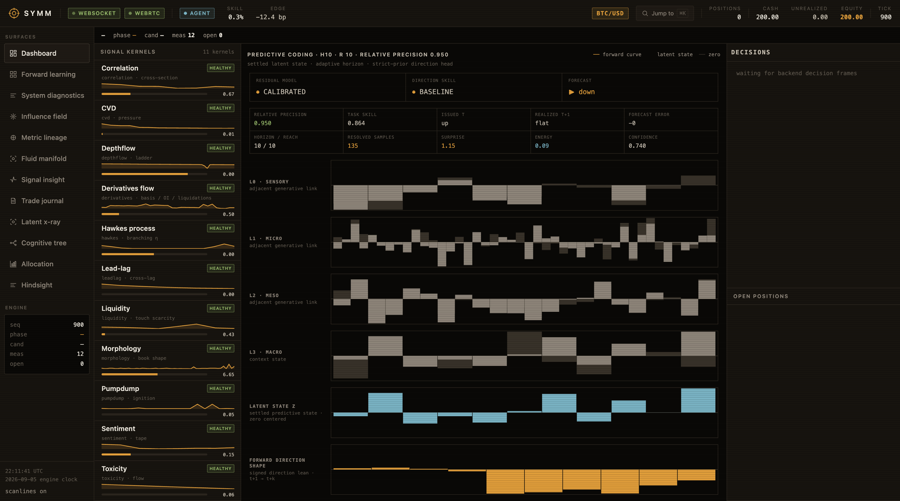

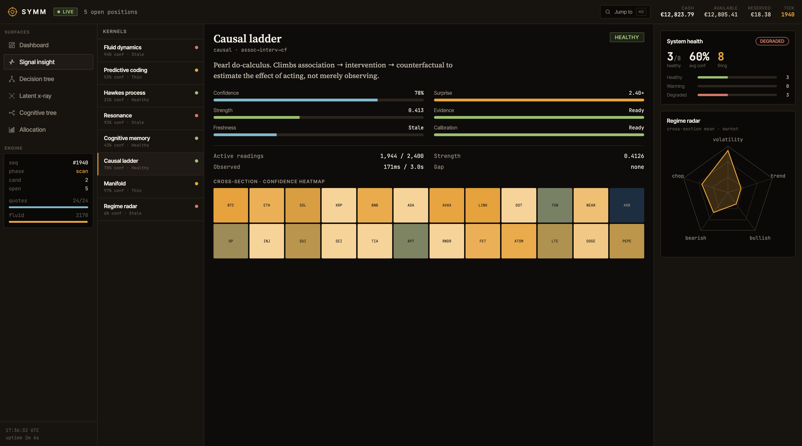

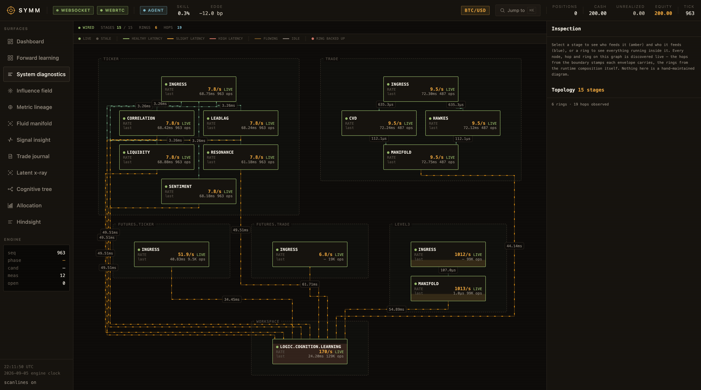

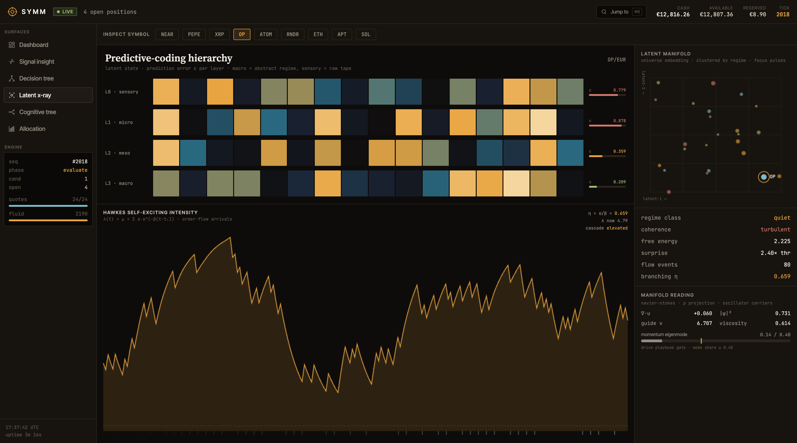

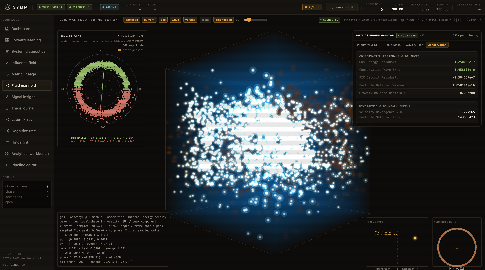

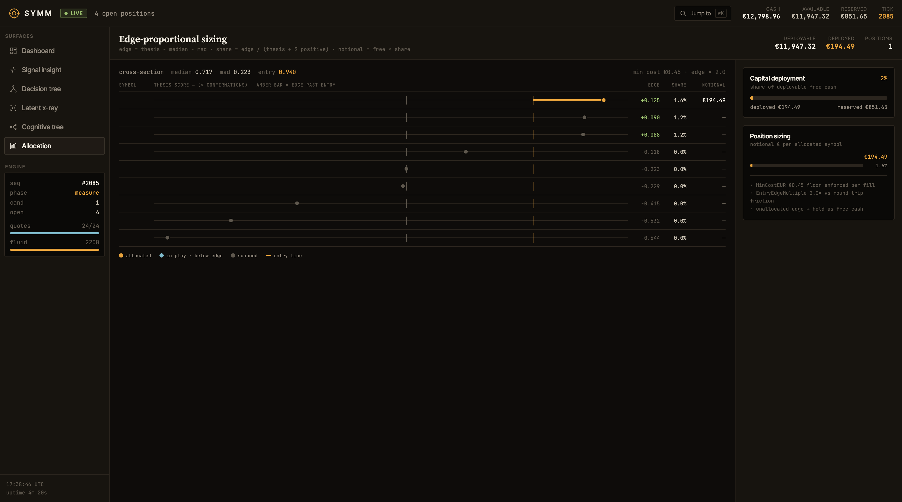

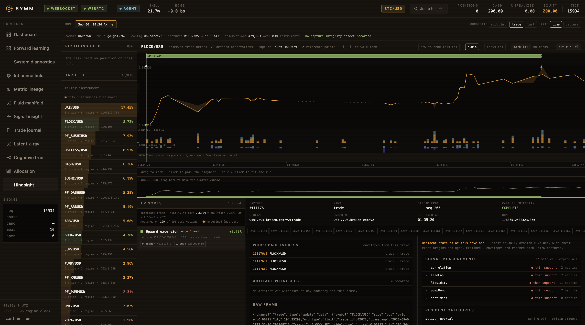

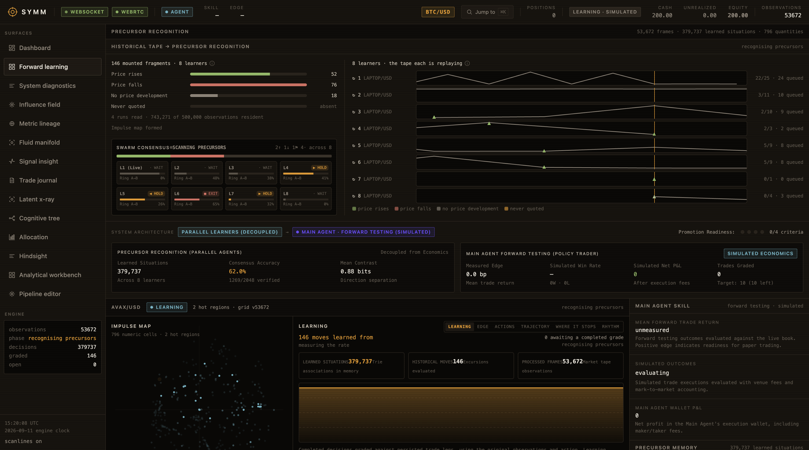

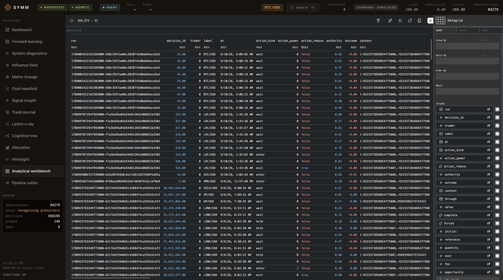

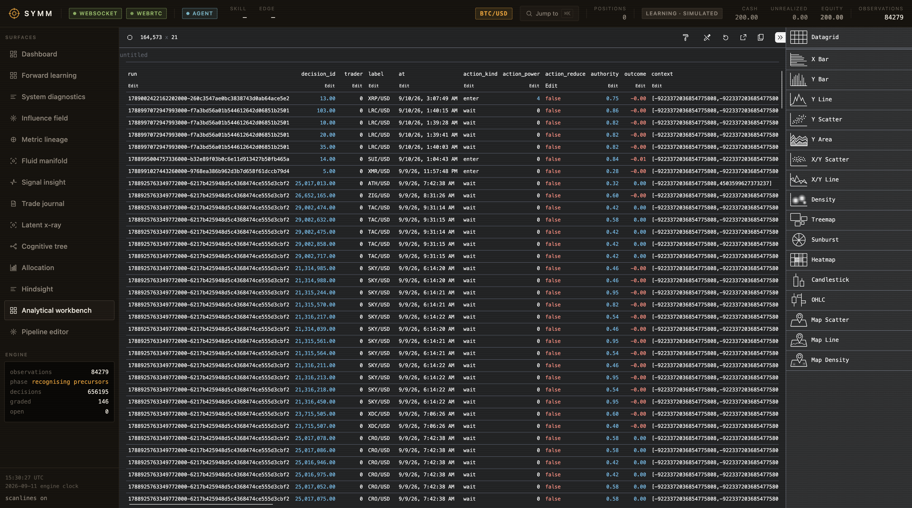

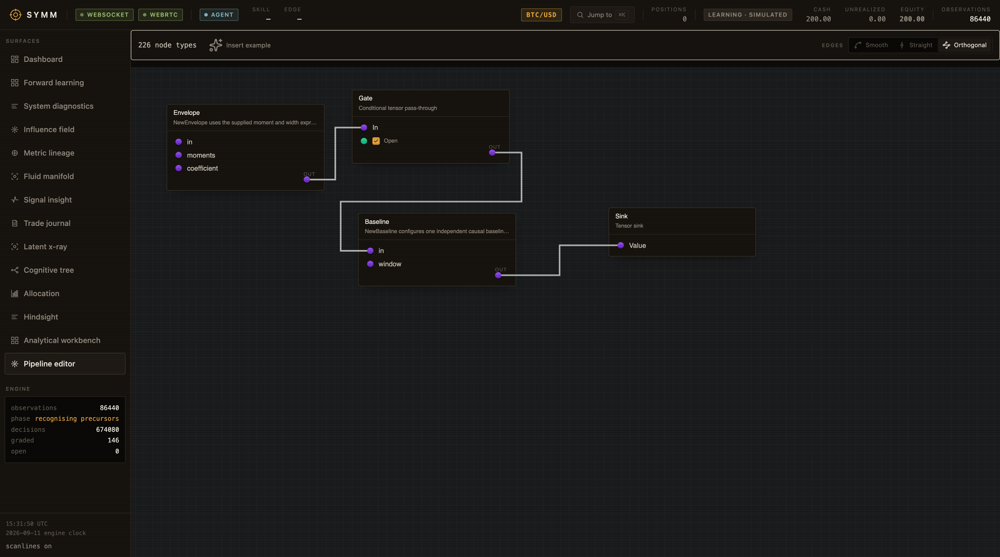

---

<sub>Personal research project · no warranty · not financial advice · may change or disappear at any time.</sub>