# SYMM Pipeline Empirical Audit

**State:** INCOMPLETE EVIDENCE | **Epoch:** `1791386907328978000` | **Symbol:** `ALL` | **Ticks:** `1000` | **Generated:** `2026-10-07T21:04:12Z`

This report follows [the empirical audit contract](../hindsight/audit/AUDIT_CONTRACT.md): hard mathematical contracts may fail; descriptive stages report measurements; missing evidence is explicit.

| Stage | Question | Experiment state | Observation |
| :--- | :--- | :---: | :--- |
| **0. Contracts** | Do declared hard domains hold? | **VALID** | 0/19190 series breached (0 observations) |
| **1. Vitality** | What raw/canonical evidence actually exists? | **MEASURED** | 19190 raw series; 373 canonical cells; 62 constant canonical cells |
| **2. Sympathy** | Do observed deformations relate beyond a mask-preserving shuffled null? | **MEASURED** | 48205 pairs; |null| p95 0.090; 39.5% real |r| above it; KS 0.362 |
| **3. Grid reproducibility** | Do disjoint periods recover the same co-memberships? | **MEASURED** | ARI 0.055; 100.0% universe overlap (373 shared cells) |
| **4. Token dynamics** | What does a frozen grid emit on unseen tape? | **MEASURED** | 329 emissions; 19 regions; H=2.772 vs null mean 3.134 |
| **5. Precursors** | Are A->B and B->C populations measurable? | **A->B INSUFFICIENT_DATA / B->C INSUFFICIENT_DATA** | A->B N=0/577, JSD 0.000 vs null95 0.000; B->C N=27/0 |
| **6. Cognitive Trie** | Does prequential recall beat baselines and retain memory? | **MEASURED** | 6 phases; hits 3/6 (50.0%) vs baseline 6/6 (100.0%); retention 100.0% |

---

### Stage 0: Declared mathematical contracts

- Series checked: `19190`
- Series with hard-domain breaches: `0`
- Breach observations: `0`

> The audit reports the disagreement only. It does not infer a root cause or clamp the observation to fit the contract.

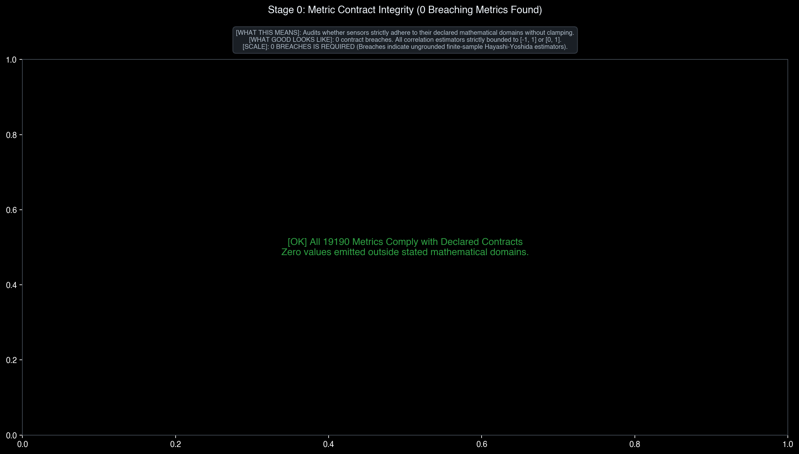

### Stage 1: Observed metric population

- Raw named series: `19190` (varying `17378`, constant `1812`)
- Canonical grid cells: `373` (varying `311`, constant `62`)
- High-correlation canonical pairs shown by the current reference filter: `666`

> Coverage is reported per metric but is not itself a health threshold. High pairwise correlation is not treated as proof that a metric can be removed.

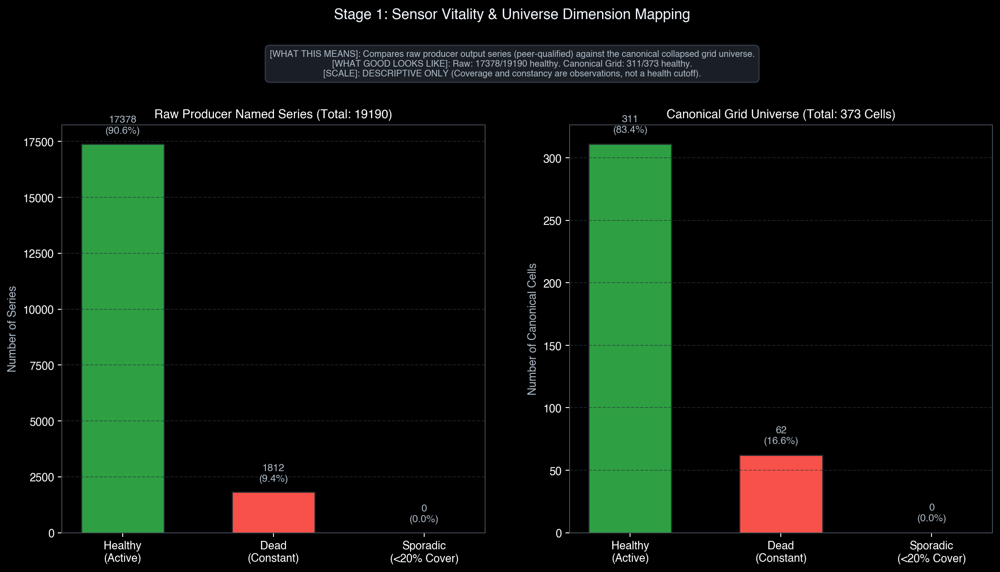

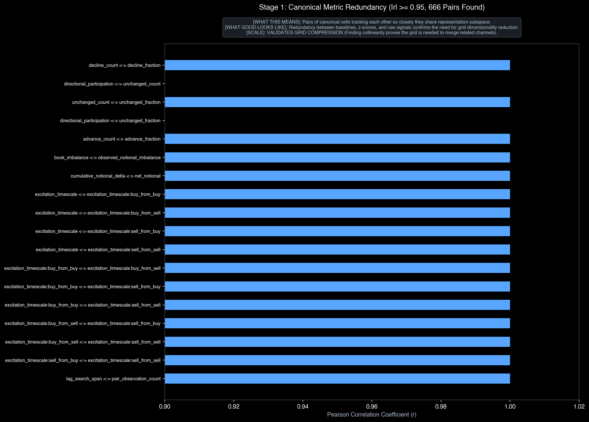

### Stage 2: Sympathy against an empirical null

- Simultaneously observed pairs: `48205`
- Direct relationships: `25517`; inverse relationships: `22687`
- Signed real mean: `0.017`; signed shuffled mean: `-0.000`
- 95th percentile of `|null r|`: `0.090`
- Real `|r|` above that empirical bound: `39.5%`
- KS distance in `|r|` space: `0.362`

> Missing deformations remain missing in both real and shuffled populations; the null preserves each channel's observation mask.

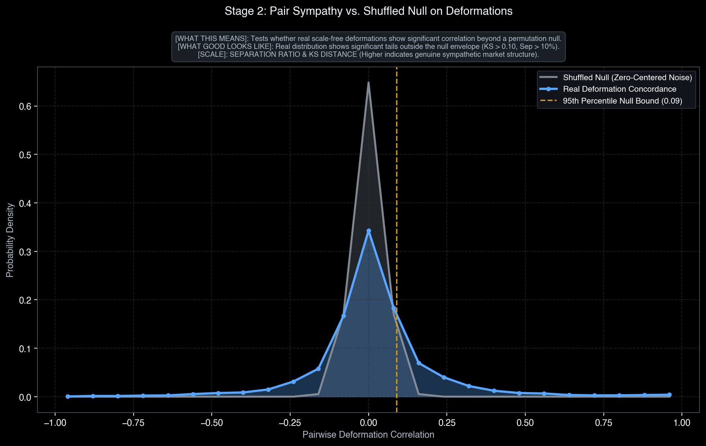

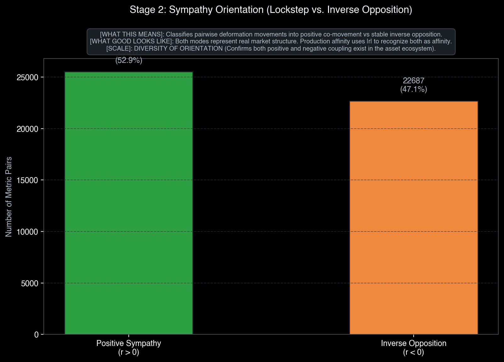

### Stage 3: Grid reproducibility

- Early grid: `373` cells / `20` regions
- Late grid: `373` cells / `20` regions
- Shared universe: `373` cells (`100.0%`)
- Adjusted Rand Index: `0.055`

> Balanced region sizes are enforced by the partitioner and are not presented as empirical evidence. No ARI health cutoff is applied.

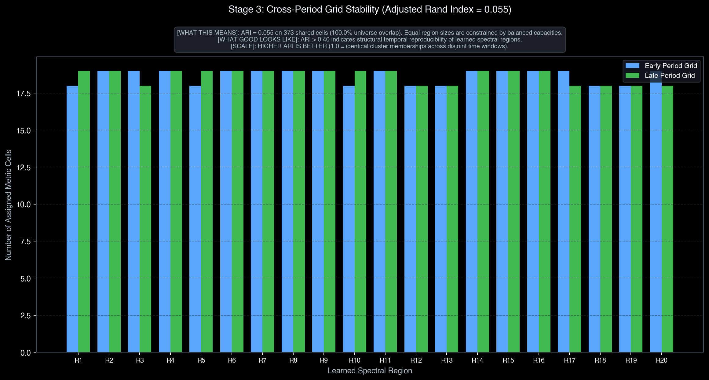

### Stage 4: Held-out token dynamics & excitation strength

- Held-out emissions: `329` across `19` regions
- Excitation strength: mean `4.587`, peak `57.247`, runner-up margin `1.581`
- Active cell coverage: `66.2%` mean
- Maximum observed token share: `18.5%`
- Real transition entropy: `2.772` bits
- Empirical dwell-block null mean: `3.134` bits
- Difference (null - real): `0.361` bits

> The same causal Stream continues across the train/holdout boundary. The report does not turn an entropy difference into a PASS/FAIL cutoff.

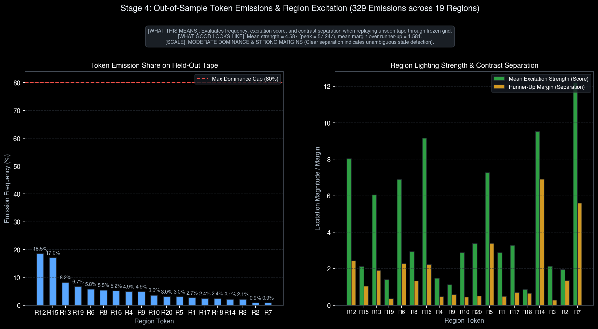

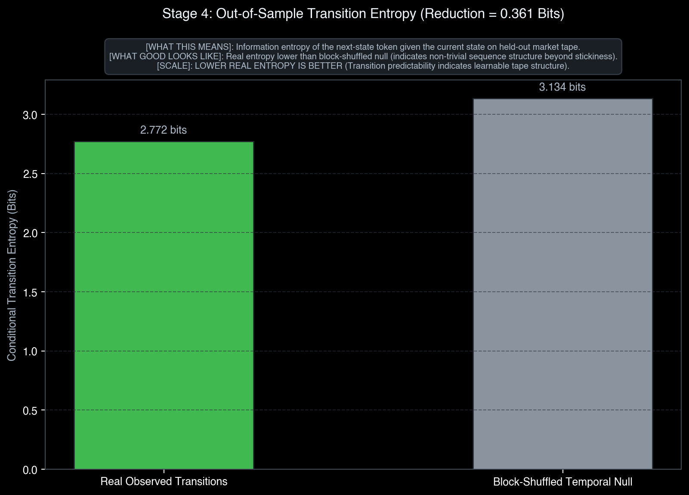

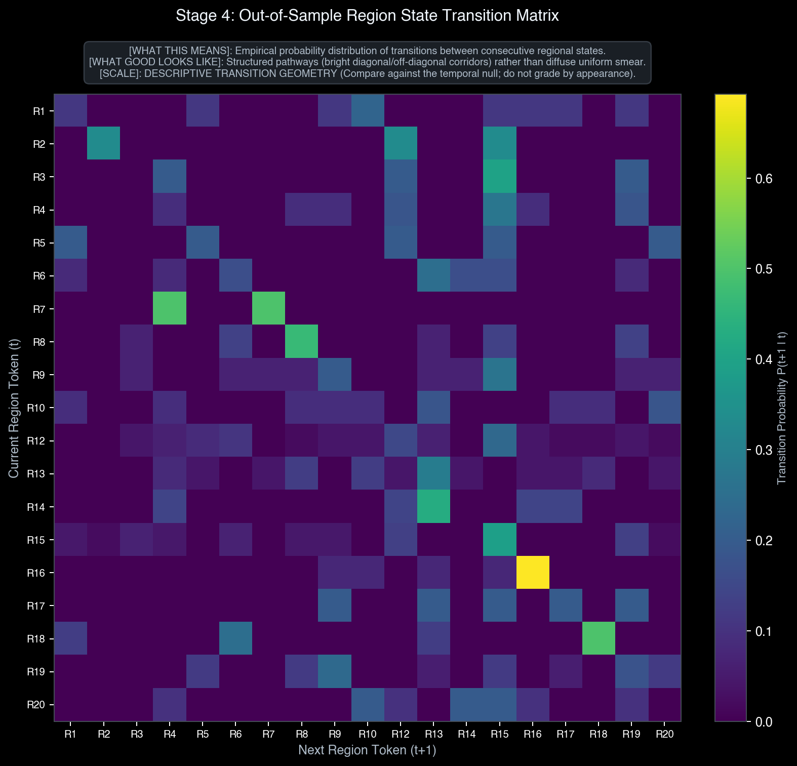

### Stage 5: Event-centred precursor populations

- Detections: `2390` (chop, down, flat, up, up_friction)
- A->B: `INSUFFICIENT_DATA`, event/control `0/577`, JSD `0.000`, null95 `0.000`
- B->C: `INSUFFICIENT_DATA`, event/control `27/0`, JSD `0.000`, null95 `0.000`
- Supplemental non-excursion background observations: `577`

> Current trading semantics are long-only: only profitable `up` excursions populate the positive A->B set. Event windows are loaded directly from the archive rather than requiring them to occur inside the first-N audit sample.

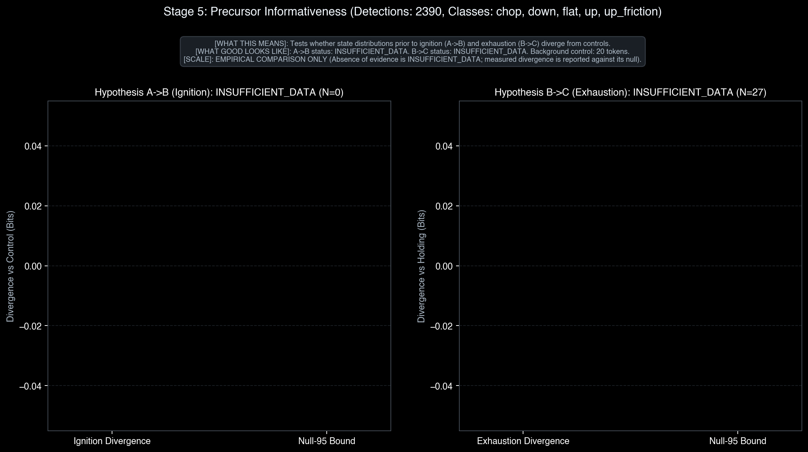

### Stage 6: Cognitive Engine & Radix Trie Learning Dynamics

- Evaluated excursions: `2390` forming `6` sequential phases (enter: `0`, exit: `6`, wait: `0`)
- Prequential accuracy: `3/6` (`50.0%`) vs best constant policy (`always_exit`): `6/6` (`100.0%`)
- Label-shuffled empirical null: mean `3.0` hits, std `0.0`, 95th percentile `3.0` hits (empirical p-value: `1.000`)
- Separates from null: `false`
- Post-teach memory retention: `6/6` (`100.0%`)
- Trie topology: `45` nodes, max depth `6`, mean depth `2.6`, branching factor `1.38`
- Basin geometry: records `26`, span `5`, active enter basins `0`, active exit basins `13` (total: `13`)
- Decisiveness: abstention rate `50.0%`, mean confidence `0.500`, mean contrast `0.000`
- Unseen background false-alarm rate: `46.50%` spurious triggers on continuous tape

> Prequential recall evaluates the trie strictly before learning each phase. Abstention is the appropriate stance on controls, not a terminal action. Shuffled null tests whether sequential prefix structure holds predictive edge over class priors.

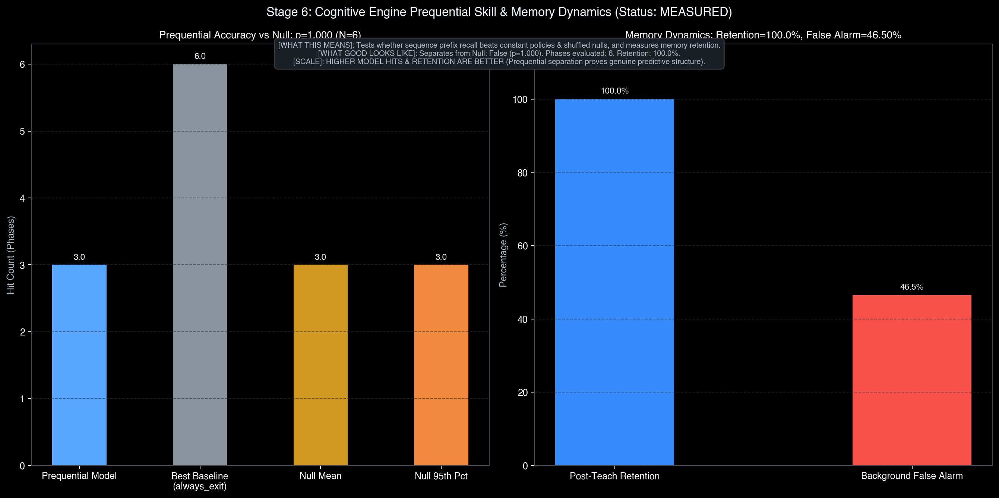

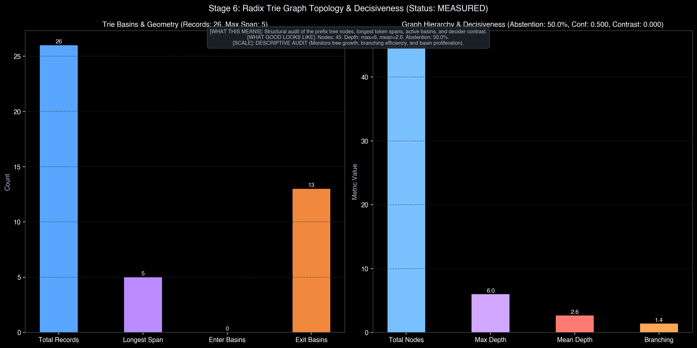

