Yes. The final direction should be:

> Replace the category/source manifold with a per-symbol kinetic model of the visible L3 order population. Treat orders or conservatively aggregated order cohorts as carriers. Keep the gas, oscillator, GPE, and pilot-wave machinery, but give every state variable a market-defined meaning and validate each layer independently before allowing it to affect trading.

The existing category/source lattice should be removed rather than retained as a fallback.

## Target model

For each symbol, the physical state represents the visible order population:

\[
\mathbf q_i =
\begin{bmatrix}
x_i\\y_i\\z_i
\end{bmatrix}
\]

where:

\[
x_i =
\frac{\operatorname{side}_i\log(p_i/p_{\mathrm{mid}})}
     {\sigma_{\log p}}
\]

is signed log-price displacement from the current mid,

\[
y_i =
\frac{\log(1+n_i)-\mu_{\log n}}
     {\sigma_{\log n}}
\]

is normalized remaining order size or quote-notional coordinate, and

\[
z_i = F_{\mathrm{lifetime}}(\mathrm{age}_i)
\]

is the empirical survival coordinate of the order’s age.

The conserved carrier mass should initially be normalized remaining base quantity:

\[
m_i = \frac{q_i}{\sum_j q_j}
\]

Base quantity is preferable to quote notional for conservation because it does not change merely because the market reprices.

From the carrier population:

\[
\rho = \frac{\sum_i m_i}{V}
\]

\[
\mathbf u = \frac{\sum_i m_i\mathbf v_i}{\sum_i m_i}
\]

\[
\rho\mathbf u = \frac{\sum_i m_i\mathbf v_i}{V}
\]

\[
P =
\frac{1}{V}
\sum_i
m_i
(\mathbf v_i-\mathbf u)
(\mathbf v_i-\mathbf u)^T
\]

The pressure tensor must be measured before deciding whether the existing scalar ideal-gas closure is appropriate.

## Dependency sequence

```mermaid
flowchart LR
    L3["Gap-free L3 lifecycle"] --> Population["Order population ledger"]
    Population --> Coordinates["Adaptive coordinates and scales"]
    Coordinates --> Moments["Carrier moments and pressure tensor"]
    Moments --> Reference["CPU reference implementation"]
    Reference --> Kernel["Metal transport and boundaries"]
    Kernel --> Batch["Shared GPU batching"]
    Batch --> Modes["Order-flow oscillator modes"]
    Modes --> Readout["Typed physical readout"]
    Readout --> Forecasts["Calibrated market forecasts"]
    Forecasts --> Strategy["Entry, sizing, and exit"]
    Strategy --> Paper["Paper validation"]
    Paper --> Live["Live eligibility"]
```

## Phase 0: Establish the mathematical contract

Create a canonical specification in `DECISION.md` or a dedicated `MANIFOLD.md`. It should define:

- Every coordinate and its units.
- Carrier mass.
- Velocity and event-time conventions.
- Conserved gas quantities.
- Pressure and internal-energy closure.
- Population sources and sinks.
- Boundary topology for each axis.
- Gas/GPE separation.
- Operator ordering.
- Readout fields.
- Readiness and invalidation rules.
- Validation and live-eligibility gates.

The specification must state explicitly that:

- Categories and signal names are not manifold axes.
- Signal scores are not carrier mass, momentum, or energy.
- Missing or stale L3 data invalidates the manifold.
- There is no synthetic-data or legacy-mapping fallback.
- Pilot-wave guidance is an internal coherence-field velocity until predictive value is demonstrated independently.
- A numerically healthy manifold is not automatically a trading signal.

This phase also freezes terminology so the Go bridge, Metal kernel, tests, and strategy use identical definitions.

## Phase 1: Build an authoritative L3 population ledger

The wire-level parsing remains in [kraken/level3.go](/Users/theapemachine/go/src/github.com/theapemachine/symm/kraken/level3.go). The feed integration remains anchored in [trader/level3.go](/Users/theapemachine/go/src/github.com/theapemachine/symm/trader/level3.go).

Add a composed population owner under `logic`, rather than making `Manifold` manage transport, lifecycle, coordinates, and physics itself.

Suggested responsibilities:

- `logic/population.go`
  - Own the current per-symbol order registry.
  - Apply snapshots and incremental events.
  - Maintain exact quantity accounting.
  - Expose immutable population epochs to the mapper.

- `logic/order.go`
  - Represent physical order identity and lifecycle state.
  - Preserve exact price ticks and quantities.
  - Track side, timestamps, remaining quantity, and update history required for velocity.

- `logic/cohort.go`
  - Conservatively aggregate carriers when individual-order GPU population is impractical.
  - Preserve total mass, first moment, and second central moment.

The ledger must recognize at least:

- Add.
- Amend size.
- Reprice.
- Partial fill.
- Full fill.
- Cancel.
- Snapshot replacement.
- Duplicate event.
- Sequence gap.
- Reconnection and resynchronization.

A sequence gap, checksum disagreement, malformed lifecycle transition, or missing snapshot must make that symbol unavailable to the manifold. It must not continue with a partially trusted book.

### Required accounting identity

For every replay interval:

\[
M_{\mathrm{final}}
=
M_{\mathrm{initial}}
+M_{\mathrm{added}}
-M_{\mathrm{cancelled}}
-M_{\mathrm{filled}}
+M_{\mathrm{amended}}
\]

This identity should be checked in exact exchange quantity units before normalization.

### Required tests

- Snapshot followed by ordinary updates.
- Partial fill followed by cancel.
- Reprice preserving order identity.
- Duplicate event handling.
- Out-of-order and missing sequences.
- Snapshot replacement after resynchronization.
- Exact remaining-quantity accounting.
- Multi-leg lifecycle replays, not isolated one-event fixtures.

## Phase 2: Implement adaptive market coordinates

Create a coordinate mapper owned by the manifold pipeline, not by the transport.

Its responsibilities are:

- Derive the current price reference.
- Maintain per-symbol coordinate scales.
- Transform raw orders into dimensionless physical coordinates.
- Version every scale epoch.
- Perform conservative remapping when scales change.

### Price coordinate

Use signed log displacement from a defensible reference price:

\[
x =
\operatorname{side}
\frac{\log(p/p_{\mathrm{reference}})}
     {\sigma_{\log p}}
\]

The reference should normally be the current mid or another explicitly justified executable-price reference.

The price scale must be derived per symbol from observed book geometry or price movement. It must not assume that one tick, one percent, or one fixed depth range has the same meaning across symbols.

### Size coordinate

Use a log transform of remaining size or quote notional, followed by robust per-symbol standardization.

The coordinate may use quote notional because it describes an order’s economic scale. Carrier mass should remain base quantity unless later evidence supports a different conserved measure.

### Age coordinate

Transform wall-clock age through an empirical lifetime distribution:

\[
z=F_{\mathrm{lifetime}}(\mathrm{age})
\]

The lifetime estimator must account for right-censored orders at snapshot or replay boundaries. This gives the age coordinate comparable meaning across markets with different event rates and order lifetimes.

### Scale transitions

Changing mid-price or scale parameters must not manufacture or destroy mass, momentum, or internal energy.

Use one of these explicit mechanisms:

1. Freeze coordinates for an integration epoch and conservatively remap between epochs.
2. Include coordinate-grid motion as an explicit transport term.

The first is likely simpler and safer initially.

### Required invariance tests

- Equivalent books quoted in different currencies.
- Different tick sizes.
- Different lot sizes.
- Uniform rescaling of base quantities.
- Coordinate-scale transition.
- Mid-price recentering.
- Identical population processed with different event chunk sizes.

## Phase 3: Build carriers, cohorts, and physical moments

Individual orders may be too numerous to send directly to the GPU. Begin with conservative cohorts.

A cohort should group nearby orders only when doing so preserves:

- Total mass.
- Mass centroid.
- Mean coordinate velocity.
- Second central velocity moment.
- Side.
- Lifecycle/source accounting.

For every cell, calculate:

\[
\rho = \frac{\sum m}{V}
\]

\[
\mathbf u = \frac{\sum m\mathbf v}{\sum m}
\]

\[
\rho \mathbf u = \frac{\sum m\mathbf v}{V}
\]

\[
e_{\mathrm{int}}
=
\frac{1}{2V}
\sum_i m_i\|\mathbf v_i-\mathbf u\|^2
\]

Velocity must be the causal event-time change in the order’s transformed coordinates. It must not be copied from category scores or ticker summary fields.

### Pressure closure gate

Before using the kernel’s scalar pressure equation, calculate the full empirical pressure tensor:

\[
P_{ab}
=
\frac{1}{V}
\sum_i m_i(v_{i,a}-u_a)(v_{i,b}-u_b)
\]

Replay analysis must determine whether coordinate normalization makes this approximately isotropic.

- If isotropy is supported within statistical uncertainty, retain scalar pressure.
- If diagonal anisotropy remains material, extend the solver to diagonal stress.
- If cross-axis stresses remain material, implement the required tensor transport rather than concealing them in scalar energy.

The decision criterion should be based on confidence intervals and predictive/numerical ablation, not an arbitrary anisotropy threshold.

### CPU reference implementation

Before changing the GPU path, implement a small deterministic CPU reference for:

- Carrier-to-cell deposition.
- Moment construction.
- Source and sink application.
- Boundary fluxes.
- One transport step on a small grid.

This becomes the correctness oracle for the Metal implementation.

### Required analytic tests

- One carrier in one cell.
- Multiple carriers with identical velocity.
- Equal and opposite velocities.
- Known anisotropic population.
- Translation of all velocities by the same vector.
- Cohort aggregation versus unaggregated carriers.
- Positive internal energy.
- Zero internal energy for a perfectly coherent population.
- Exact mass preservation during deposition and remapping.

## Phase 4: Correct the solver bridge and kernel topology

The bridge currently exposes an additive cell-deposit interface. That is insufficient for exact lifecycle events, conservative remapping, and explicit source/sink accounting.

Relevant files include:

- [bridge.h](/Users/theapemachine/go/src/github.com/theapemachine/nomagique/physics/manifold/bridge.h)
- [config.go](/Users/theapemachine/go/src/github.com/theapemachine/nomagique/physics/manifold/config.go)
- [solver_darwin.go](/Users/theapemachine/go/src/github.com/theapemachine/nomagique/physics/manifold/solver_darwin.go)

### Bridge changes

Add explicit APIs for:

- Replacing or remapping a population epoch.
- Applying ordered population events.
- Applying source and sink buffers.
- Advancing to an event timestamp.
- Reading conservation diagnostics.
- Reading typed side-specific fluxes.
- Reading numerical readiness and failure state.

The interface should not represent removals as unexplained negative deposits.

### Axis-specific geometry

The solver configuration must carry:

- `dx`, `dy`, `dz`, or their inverses.
- Explicit dimensionless domain extents.
- Axis-specific boundary modes.
- Actual runtime integration time.
- Per-axis CFL diagnostics.

The current assumption that one spacing derived from one axis describes the entire grid must be removed.

### Boundary topology

The gas grid should not be globally periodic.

Recommended initial topology:

- Price axis: open/outflow boundaries, with conservative recentering before relevant population reaches the domain edge.
- Size axis: absorbing boundary at zero remaining quantity.
- Age axis: injection at zero age and outflow at the empirical tail.
- GPE frequency lattice: retain its mathematically intended frequency-space boundary independently.

Index clamping alone is not a reflecting boundary under a Rusanov flux. Boundaries must be implemented through explicit ghost states or boundary face fluxes.

### Source/sink semantics

Population lifecycle operations remain distinct:

- New order: mass injection.
- Quantity increase: positive mass source.
- Quantity decrease: negative mass source with explicit cause.
- Cancel: mass removal.
- Fill: mass removal and execution boundary flux.
- Reprice: conservative transport or removal plus reinjection with identity preserved.

A fill must not automatically become “heat.” Heat may only be introduced if derived from an explicit work, impact, or unresolved-dispersion balance.

### Operator ordering

Define and test a single causal event-time sequence, for example:

1. Advance the physical field to event time.
2. Apply ordered population changes.
3. Recompute or deposit affected carrier moments.
4. Apply source/sink operator.
5. Advance transport to the next event boundary.
6. Produce readout at the requested observation boundary.

GPU command batching may combine work, but it must not change this logical ordering.

### Stability constraints

The host must enforce at least:

\[
\Delta t
\le
C
\min_a
\frac{\Delta a}{|u_a|+c}
\]

and the appropriate diffusion/conduction constraint:

\[
\Delta t
\le
C_{\mathrm{diff}}
\min_a
\frac{\Delta a^2}{\kappa}
\]

Any GPE-specific propagation constraint must be evaluated independently. A failed condition invalidates the step; it does not silently clamp state into apparent health.

### Kernel parity tests

Compare CPU and Metal outputs for:

- Uniform stationary field.
- Uniform translating field.
- Linear pressure field.
- Closed-domain conservation.
- Known source/sink balance.
- Boundary-directed pulse.
- Conservative recentering.
- Event-stream chunking invariance.
- One large step versus valid subdivided steps.
- Plane-wave pilot-current direction.
- Zero-amplitude and low-density numerical behavior.

## Phase 5: Establish the GPU resource model

[logic/analyzer.go](/Users/theapemachine/go/src/github.com/theapemachine/symm/logic/analyzer.go) should not allocate an independent full Metal environment for every discovered symbol.

Introduce a composed engine responsible for:

- One Metal device and command queue.
- One compiled library and pipeline set.
- Batched per-symbol solver slots.
- Buffer pooling with explicit ownership.
- Capacity admission.
- Fair event scheduling.
- Latency and queue-age telemetry.

Each symbol retains independent physical state, but the GPU infrastructure is shared.

### Capacity

Capacity must be derived from:

- Measured bytes per solver slot.
- Available Metal working set.
- Desired queue-age limit.
- Observed event rates.
- Measured integration latency.

It must not be a copied fixed symbol count.

If capacity is exhausted, symbols should be rejected or retired according to an explicit observable admission policy. Existing symbols must not silently lose events.

### Performance benchmarks

Benchmark at realistic carrier/cohort counts for:

- One symbol.
- Moderate batch.
- Large batch.
- Full admitted universe.
- Quiet and burst event regimes.
- Scale remapping.
- Readback with and without GPE layers.

Record:

- Event-to-field p50 and p99 latency.
- Queue age.
- Metal working-set size.
- CPU preparation time.
- GPU execution time.
- Readback time.
- Cohort compression ratio.
- Event throughput.
- Numerical step subdivision count.

The live requirement is that p99 processing latency remain below the empirically measured staleness budget of the market data and strategy.

## Phase 6: Map real order-flow modes into the oscillator layer

Only begin this phase after the gas population and transport layer pass conservation and parity tests.

Oscillators should represent coherent local order-flow modes, not strategy categories.

For each empirically identified mode:

- Position: carrier/cohort centroid in the physical grid.
- Amplitude: coherent mass-flow energy.
- Phase: causal phase of signed local add/cancel/fill flow.
- Frequency: event-time phase derivative.
- Velocity: centroid motion.
- Heat coupling: bounded by an explicit available internal-energy or work budget.

Frequency support should be derived from the observed event spectrum of the symbol rather than copied frequency bins or fixed time windows.

The oscillator population should be data-selected and allowed to be empty. The system must not manufacture oscillators merely because the kernel supports them.

### Separation of responsibilities

- Gas sources and sinks describe visible population lifecycle.
- Oscillators describe coherent flow modes.
- GPE norm describes coherence-field state.
- Pilot current describes internal GPE probability/current transport.

These quantities must not be exchanged without a documented coupling equation and budget.

### Validation

- Recover phase and frequency from a known synthetic mode.
- Recover multiple separated modes.
- Show no coherence without coherent drive.
- Show decay after drive removal.
- Verify oscillator order does not affect output.
- Verify mode extraction under changed event rate.
- Compare gas-only, gas-plus-oscillator, and full GPE variants.
- Test whether pilot guidance adds out-of-sample information after ordinary flow variables are controlled for.

Until the last test succeeds, pilot guidance must not directly determine order direction.

## Phase 7: Replace projection labels with typed physical readout

The current logic in [logic/manifold.go](/Users/theapemachine/go/src/github.com/theapemachine/symm/logic/manifold.go) should no longer collapse category/source cells into hand-labelled values.

Return a typed per-symbol state containing fields such as:

- Event timestamp.
- Population epoch and coordinate-scale version.
- Readiness.
- Invalidation reason.
- Visible mass and conservation residual.
- Bid-side touch density.
- Ask-side touch density.
- Bid-side outward normal flux.
- Ask-side outward normal flux.
- Touch pressure and temperature.
- Signed pressure-gradient vector.
- Velocity-divergence field or summaries.
- Stress anisotropy.
- Local source/sink rates.
- Coherence.
- Guidance vector.
- Numerical uncertainty and stability diagnostics.

Touch flux must be calculated separately by side, using the correct outward normal. It cannot be represented by a generic “negative x flux at zero.”

Existing signals may consume these physical fields downstream, but they must not define the fields.

Examples:

- Exhaustion may use declining support, outward touch flux, and failed replenishment.
- Liquidity-vacuum logic may use density gradients and depletion flux.
- Flow/coherence logic may use coherent source motion.
- Entry logic may consume a calibrated forecast derived from these observations.

The strategy must not rename pressure, coherence, or guidance as “pump,” “dump,” or “trend” without a separately validated classifier.

## Phase 8: Train forecasts before integrating strategy decisions

The physics engine should first predict concrete observable outcomes:

- Bid-touch survival.
- Ask-touch survival.
- Time to local depletion.
- Spread widening or narrowing.
- Next mid-price move.
- Executable return over an adaptive event-time horizon.
- Expected execution impact.
- Replenishment probability after a fill or cancel wave.

Do not start by optimizing wallet return. That would make it too easy for execution, exposure, regime selection, and manifold quality to become confounded.

### Baselines

Compare against:

- Top-of-book imbalance.
- Microprice.
- Order-flow imbalance.
- Simple L3 add/cancel/fill statistics.
- Hawkes-style excitation features.
- A regularized linear or logistic model using the same raw data.

The manifold is useful only if it adds stable out-of-sample information beyond these baselines.

### Validation design

Use chronological walk-forward evaluation with:

- No overlapping train/test leakage.
- Scale estimators fitted only on past data.
- Event-time outcomes.
- Per-symbol and pooled reporting.
- Regime-conditioned reporting.
- Calibration curves.
- Confidence intervals.
- Multiple-market-period validation.

Relevant metrics include:

- Brier score and log loss for discrete events.
- Calibration error.
- MAE or CRPS for continuous outcomes.
- Directional accuracy only as a secondary metric.
- Incremental information conditional on baseline features.
- Turnover-adjusted executable return later in the process.

The acceptance decision should use the lower confidence bound of incremental performance rather than an arbitrary point estimate.

## Phase 9: Integrate the strategy

Only calibrated forecasts should enter trading decisions.

A trading decision should be based on:

\[
E[R_{\mathrm{executable}}]
-
E[\mathrm{fees}]
-
E[\mathrm{spread}]
-
E[\mathrm{impact}]
-
E[\mathrm{adverse\ selection}]
\]

The manifold must not be converted into another independent score and then added to unrelated scores.

### Entry

Entry requires:

- Ready and synchronized L3 state.
- Numerically valid manifold state.
- Calibrated forecast.
- Positive expected executable value after all costs.
- Sufficient confidence for the proposed exposure.
- Acceptable market-data and solver age.

### Sizing

Sizing should depend on:

- Expected executable edge.
- Forecast uncertainty.
- Estimated impact.
- Available visible and replenishing liquidity.
- Existing portfolio exposure.
- Exit feasibility.

### Exit

Exit should evaluate the same continuous thesis used for entry:

- Has the predicted opportunity occurred?
- Has touch survival changed?
- Has support or replenishment disappeared?
- Has adverse flux increased?
- Has expected executable value crossed zero?
- Is the model stale or invalid?

A stale, unsynchronized, or numerically invalid manifold must prevent a new entry and should trigger the explicitly defined risk behavior for existing exposure.

## Phase 10: Build deterministic replay and observability

Record enough information to reproduce every physical state:

- Raw L3 snapshots and events.
- Sequence/checksum metadata.
- Trades, L2, ticker, and instrument metadata.
- Order lifecycle transitions.
- Coordinate scales and scale versions.
- Cohort construction.
- Sources and sinks.
- Numerical timestep subdivision.
- Gas state summaries.
- Oscillator inputs.
- GPE outputs.
- Forecasts.
- Strategy decisions.
- Execution outcomes.

Replay must run through the same production pipeline. It must not use a simplified parallel implementation.

### Determinism requirements

Given the same event stream:

- Population ledgers must match exactly.
- Coordinate epochs must match.
- CPU reference results must match.
- Metal results must remain within analytically justified floating-point error.
- Different legal input chunking must produce equivalent results.
- Repeated replays must produce the same decisions.

## Phase 11: Delete the legacy mapping

Once the new path reaches parity and readiness, remove:

- Category as the Y manifold axis.
- Source name as the Z manifold axis.
- Category/source ordinal coordinates.
- Signal magnitude deposited as mass.
- DMT surprisal treated as energy without a physical budget.
- Category-defined fixed oscillators.
- Projection maxima labelled as market phenomena.
- Static physical windows or half-lives.
- Planner scoring based on those synthetic readouts.
- Compatibility fallbacks to the old manifold.

The legacy implementation should not remain live behind a feature toggle. Historical captures may remain as fixtures, but runtime execution should have one physical path.

## Recommended implementation batches

### Batch 1: Contract and authoritative L3 state

Files:

- `DECISION.md` or new `MANIFOLD.md`
- [kraken/level3.go](/Users/theapemachine/go/src/github.com/theapemachine/symm/kraken/level3.go)
- [trader/level3.go](/Users/theapemachine/go/src/github.com/theapemachine/symm/trader/level3.go)
- New population-ledger types under `logic`

Exit condition:

- Gap-free deterministic L3 population replay.
- Exact quantity ledger.
- No manifold work performed on invalid data.

### Batch 2: Coordinates, cohorts, and CPU reference

Files:

- New coordinate and cohort types under `logic`
- CPU reference under `nomagique/physics/manifold`

Exit condition:

- Conservation and invariance tests pass.
- Pressure tensor is available.
- Scalar versus tensor closure decision is evidence-backed.

### Batch 3: Bridge, source model, and boundaries

Files:

- [bridge.h](/Users/theapemachine/go/src/github.com/theapemachine/nomagique/physics/manifold/bridge.h)
- [config.go](/Users/theapemachine/go/src/github.com/theapemachine/nomagique/physics/manifold/config.go)
- [solver_darwin.go](/Users/theapemachine/go/src/github.com/theapemachine/nomagique/physics/manifold/solver_darwin.go)
- Metal manifold kernel

Exit condition:

- CPU/Metal parity.
- Explicit axis boundaries.
- Conservation and source/sink tests pass.
- Stability failures are visible and fatal to readiness.

### Batch 4: Shared GPU engine

Files:

- [logic/analyzer.go](/Users/theapemachine/go/src/github.com/theapemachine/symm/logic/analyzer.go)
- New shared manifold-engine type
- Performance benchmarks

Exit condition:

- Capacity is derived from measurements.
- No silent event loss.
- Burst latency remains inside the measured staleness budget.

### Batch 5: Oscillator and GPE mapping

Files:

- Order-flow mode extractor.
- Oscillator bridge.
- Kernel coupling configuration.

Exit condition:

- Synthetic mode recovery passes.
- Energy/norm budgets are explicit.
- Ablations separate gas, oscillator, GPE, and pilot contributions.

### Batch 6: Typed readout and forecasting

Files:

- [logic/manifold.go](/Users/theapemachine/go/src/github.com/theapemachine/symm/logic/manifold.go)
- Thesis/artifact contracts.
- Replay evaluator and baselines.

Exit condition:

- No category-derived physical values remain.
- Forecasts are calibrated.
- Manifold features add out-of-sample information beyond baseline order-book models.

### Batch 7: Strategy integration and deletion

Files:

- Decision, entry, sizing, and exit consumers.
- Removal of legacy mappings and tests.

Exit condition:

- Entry and exit share one continuous executable-value thesis.
- Full execution costs are represented once.
- Read-only live and deterministic paper replay agree.
- No legacy fallback remains.

## Final live-eligibility gates

Live trading should remain disabled until all of these are true:

1. L3 lifecycle and quantity accounting are exact.
2. Sequence gaps invalidate state immediately.
3. Coordinate transformations pass currency, tick, lot, and event-rate invariance tests.
4. Deposition and remapping conserve the required moments.
5. CPU and Metal implementations agree within derived floating-point bounds.
6. Boundary tests prove no accidental periodic transport.
7. Source/sink ledgers reconcile.
8. Event batching is causally equivalent to ordered event processing.
9. The pressure closure is empirically justified.
10. GPU p99 latency remains below the observed staleness budget.
11. Forecasts are calibrated on unseen chronological data.
12. The lower confidence bound of incremental skill exceeds the chosen baseline.
13. Ablation shows which of gas, oscillator, GPE, and pilot layers contribute.
14. Paper replay includes actual fees, spread, impact, partial fills, and latency.
15. Read-only live results agree with captured deterministic replay.
16. The old category/source manifold path has been removed.

This plan deliberately does not overlap the broker and live-transport changes currently being implemented except where gap-free L3 delivery is a prerequisite. The physics work should be rebased onto those changes, then proceed from the population ledger upward. No code or files were changed for this planning response.