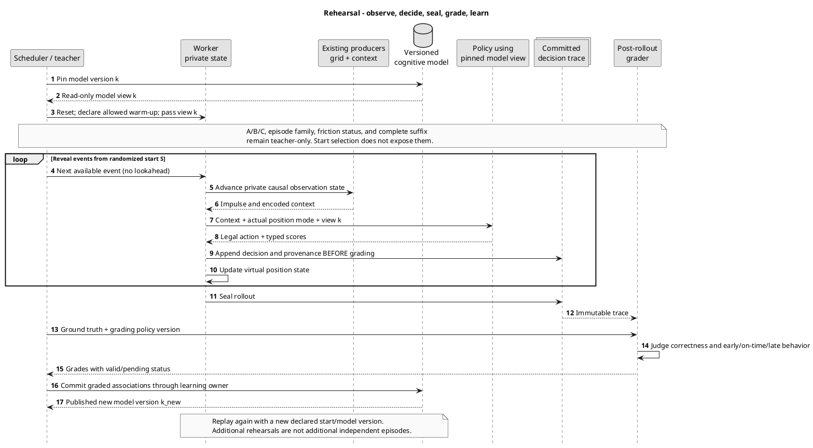

# SYMM Precursor Learning System
## Behavioral specification and implementation contract

**Version:** 0.1 — design draft for review  
**Date:** 2026-09-13  
**Audience:** project contributors, coding agents, reviewers, and experiment authors  
**Scope:** observation compression, temporal precursor learning, tape rehearsal, and forward economic learning  
**Status:** specification, not an implementation-completion claim

> **The system learns whether an observable sequence is developing toward an actionable ignition or termination, and when to act or wait. It does not require a hand-written explanation of what each individual market measurement means. Hindsight provides ground truth for judging committed decisions; live economic outcomes provide the main agent’s reward.**

## How to use this document

This is a standalone documentation file. It can be copied into the repository, for example as `docs/precursor-learning.md`. It requires no installer, patch application, or runtime dependency. Both diagrams are embedded as PlantUML source; a companion `.puml` contains identical definitions for editors and renderers.

The specification preserves the latest product description in the discussion. It does not silently replace that description with the uploaded implementation or with earlier suggestions about Manifold.

Four labels distinguish authority:

| Label | Meaning |
|---|---|
| **Intent** | A product decision explicitly stated by Danny in the discussion. |
| **Contract** | An engineering formalization proposed by this document to make that intent implementable and testable. Requirement IDs identify these statements. |
| **Observed** | Behavior inspected in the supplied source snapshot, not necessarily the target behavior or a verified runtime result. |
| **Open** | A policy or mathematical choice not settled by the discussion or supplied source. Coding agents must not invent its value. |

**MUST** denotes a requirement of the proposed contract. **SHOULD** denotes a recommendation whose deviation needs a recorded rationale. Requirements do not certify that current code conforms. Section 18 lists observed differences; section 20 lists decisions still needed.

The primary sources are the user’s guide and subsequent clarifications, plus `Pasted text(20260913-105401).txt`. Source references such as **[C4]** resolve to exact snapshot paths and line ranges in section 21. Historical Sensorium papers are background, not authority for this learning system’s labels, reward, or trading behavior.

## Contents

1. Purpose and research question
2. Foundational principles
3. Vocabulary and mathematical model
4. System architecture
5. Raw tape and observation contract
6. Impulse Map and sympathetic organization
7. Regions and temporal context
8. Hindsight and episode construction
9. Learner inputs, memory, and decisions
10. Rehearsal protocol
11. Ground-truth grading
12. Main agent and economic refinement
13. Logical data contracts
14. State ownership, versions, and failure behavior
15. Observability and user interface
16. Evaluation modes and experiment evidence
17. Manifold as an experimental learning mechanism
18. Current implementation mapping and differences
19. Acceptance tests
20. Open decision register
21. Sources and diagram tooling

---

## 1. Purpose and research question

**Intent.** Investigate whether the crypto market contains recurring structured behavior that becomes observable before ignition or exhaustion, and whether the complete instrumentation-and-learning chain can detect it.

The motivation includes the project’s preliminary research and its interpretation of documented recurring market-manipulation behavior. This is a motivation for the experiment, not a semantic label automatically attached to observations or episodes. The learner is not tasked with proving manipulation or identifying an actor.

The system’s computational task is:

- While **flat**, recognize potential **A→B entry precursors** and decide **Enter** or **Wait**.
- While **holding**, recognize development toward **C**, including exhaustion, stagnation, or reversal, and decide **Exit** or **Wait**.
- Learn from completed tape fragments, then test and refine behavior on the actual current tape through the main agent.

The system does not require a future-price curve, an interpretation of indicator names, or a fluid model of the order book. Recorded prices may be used by Hindsight, observation producers, and economic evaluation; excluding a price-regression target does not mean deleting factual prices from the system.

**REQ-01 — Preserve the task.** Implementation changes MUST preserve precursor recognition and action timing as the core task. A different predictive target, a new strategy rule, or a replacement perception model requires an explicit design decision.

**Evaluation statement.** Once decisions have been committed, the recorded tape and the declared evaluation rule provide the ground truth for judging those decisions and their timing. This statement is about the evaluator’s responsibility. No claim about successful learning, profitability, or general intelligence is added to it.

## 2. Foundational principles

### 2.1 Commit to not knowing the metrics’ meanings

Approximately 750 individual observations are available in the described system. The exact number is not an architectural constant. Their names identify sources and quantities; names are not explanations of causality and do not prescribe actions.

**REQ-02 — Semantic opacity.** No trading preference may be assigned merely because a metric’s name sounds bullish, bearish, predictive, or authoritative. Names remain available for lineage and inspection. Identity must remain stable even when presentation names change.

### 2.2 Compress behavior, not explanations

The grid reduces redundant or overlapping views of market activity. Its purpose is to reduce observational noise and matching friction, lower the effective dimensionality, and enlarge the learner’s recognition or **“hit” area**.

For example, different subsets of related measurements can activate the same region and therefore contribute to a recognizable situation. This is deliberately lossy representation. Raw events and member attribution remain recoverable outside the policy key.

**REQ-03 — Preserve the compression boundary.** The baseline learner MUST consume region-based context rather than silently bypassing the grid with raw metric strings or a hidden raw-feature classifier. A comparison using richer inputs is a separately identified experiment.

### 2.3 Separate perception, judgment, and economic reward

The grid measures relationships. The learner chooses actions. Hindsight and the grader assess completed episodes. The main agent observes economic consequences.

**REQ-04 — One meaning per signal.** Observation quality, relationship strength, precursor probability, action preference, geometric grade, and economic reward MUST remain distinguishable quantities. They must not share a scalar merely because all can be described informally as “confidence.”

### 2.4 Reuse the existing primitive architecture

**REQ-05 — Compose before adding.** Coding agents MUST first reuse, generalize, or compose existing primitives. A new wrapper around a monolithic subsystem is not a substitute for a composable primitive. The boxes in this document describe responsibilities; they do not require one new service, class, or repository package per box.

---

## 3. Vocabulary and mathematical model

### 3.1 Terms

| Term | Definition |
|---|---|
| **Tape** | Ordered, retained raw market events, with capture identity and enough timing/provenance to reconstruct what was observable. |
| **Observation** | A numerical reading emitted by a Signal or Logic Solver from the available tape. |
| **Quantity** | An identified observation channel, such as a source plus metric identifier; not an individual order. |
| **Universe key** | The scope in which a context is interpreted, initially a market symbol pair and its venue/instrument scope. |
| **Impulse Map / grid** | The organization of quantities by observed sympathetic relationships, together with current activation. |
| **Region** | A community of related quantities, with stable structural identity and changing activation. |
| **Region condition** | The encoded state of a region, such as its identity and level/change signs. |
| **Impulse** | The active regional reading produced at one observation frontier. It can contain several region conditions. |
| **Context** | A temporally ordered history of impulses for one universe and one working-state owner. |
| **Prior** | Learned associations accumulated before the current decision, with evidence and feedback provenance. |
| **A** | The selected beginning of a precursor interval on the tape, some distance before B; not a discovered physical singularity. |
| **B** | Hindsight’s ignition landmark under a declared event-definition policy. |
| **C** | Hindsight’s termination landmark: exhaustion, stagnation, or reversal under that policy. Not every C is necessarily a price maximum. |
| **S** | The actual randomized rehearsal start within the selected A→B interval. S is separate from A. |
| **Episode** | A tape fragment, its provenance, and teacher-only annotation. |
| **Rehearsal** | A causal rollout through an episode followed by grading and learning. |
| **Main agent** | The owner applying the learned decision method to current tape, initially through simulated execution, with PnL-based feedback. |

### 3.2 Timeline

For an episode with all three landmarks:

```text
A -------- S -------- B ---------------- C -------- end of fragment
precursor start       ignition           exhaustion / stagnation / reversal
           learner starts here
           only subsequently revealed events enter its working state
```

A valid positive-leg ordering is `A <= S < B < C <= fragment_end`. A negative, non-event, or truncated fragment may lack B or C. Such absence is explicit, not encoded as a fabricated landmark at index zero.

### 3.3 Formal interfaces, not an imposed learning algorithm

Let `e_<=t` denote events available by decision time `t`, `u` the universe key, and `v` the representation version. Define:

\[
 o_t = \Phi_v(e_{\le t}), \qquad I_t = G_v(o_{\le t}),
\]

\[
 c_t = E_v(I_{\le t}), \qquad
 a_t \sim \pi_{M_k}(\,\cdot\mid u,c_t,p_t\,),
\]

where `p_t` is the agent’s actual position state and `M_k` is the model version consulted. `Phi` is instrumentation, `G` is the grid/region projection, and `E` is context encoding. These symbols name existing responsibilities; they are not instructions to add new neural networks.

The teacher constructs episode annotation from the completed tape:

\[
 y_j = \mathcal H_{h}(e_{A_j:T_j}),
\]

and grades the immutable decision trace only after its rollout:

\[
 g_j = \mathcal J_{q}(y_j,\operatorname{trace}_j).
\]

`h` and `q` identify the Hindsight and grading policies. Their thresholds and timing maps are versioned choices, not supplied by this notation.

---

## 4. System architecture

The diagram describes the **target** information flow. Each worker and live universe has its own working state. Shared memory does not imply shared mutable replay state.

```plantuml
@startuml symm_precursor_architecture
title SYMM precursor learning - target responsibilities
left to right direction
skinparam shadowing false
skinparam monochrome true
skinparam componentStyle rectangle
skinparam defaultFontName SansSerif
skinparam wrapWidth 200

cloud "Current raw market events" as Market
database "Immutable raw tape" as Tape

package "Teacher side - completed history" {
  component "Hindsight\nepisode discovery and annotations" as Hindsight
  component "Rehearsal scheduler\nstrata, random S, causal delivery" as Scheduler
  component "Post-rollout grader\ncorrectness and timing" as Grader
}

package "Causal decision path - private working state" {
  component "Signals and Logic Solvers\nobservations available so far" as Observe
  component "Impulse Map\nrelationships, regions, activation" as Grid
  component "Temporal context\nregion-token history + position mode" as Context
  component "Learned policy\nEnter / Wait or Exit / Wait" as Policy
  artifact "Committed decision trace" as Trace
}

database "Shared cognitive model\nversioned associations and provenance" as Model
component "Learning commit\nrehearsal grades OR mature PnL\nexplicit feedback kind" as Commit
component "Main-agent execution\nsimulated first; actual fills define state" as Execute
component "Economic evaluator\nnet PnL and attribution" as Economy
component "Existing dashboard\nregions, replay lanes, model, PnL" as UI

Market --> Tape : capture
Tape --> Hindsight : completed episodes
Hindsight --> Scheduler : curriculum metadata
Hindsight --> Grader : teacher-only truth
Scheduler --> Observe : revealed prefix only
Market --> Observe : available live events
Observe --> Grid
Grid --> Context : impulse
Context --> Policy : causal context
Model --> Policy : pinned model view
Policy --> Trace : append before scoring
Trace --> Grader : completed rehearsal
Grader --> Commit : judged action + timing
Commit --> Model : publish new version
Trace --> Execute : live-mode decision
Execute --> Economy : fill/outcome records
Economy --> Commit : matured economic feedback
Grid ..> UI : read-only
Trace ..> UI : read-only
Economy ..> UI : read-only

note bottom of Scheduler
A/B/C, fragment class, remaining length,
and friction outcome are not policy features.
end note
note bottom of Commit
Economic refinement is target behavior.
The inspected snapshot has a test forbidding it;
that contract must be deliberately migrated.
end note
note bottom of Context
Manifold is a separate experimental candidate
for temporal association, not a required
replacement for the grid or policy.
end note
@enduml
```



The diagram’s common observation/grid/context boxes mean a common semantic pipeline, not one shared instance between workers. Execution is not called by rehearsal agents. The grader does not write into a working state that is still making decisions.

---

## 5. Raw tape and observation contract

**REQ-06 — Reconstructability.** Every episode, observation frame, and decision MUST be traceable to stable raw-event references. Persist the capture/run identity, event sequence and ordinal where applicable, universe key, event time, and availability time or equivalent causal frontier.

The system distinguishes four clocks: market-event time, observation availability, simulated/replayed position in the tape, and processing wall-clock time. Faster replay changes wall-clock duration; it does not change the represented market history.

**REQ-07 — Prefix causality.** A producer may use only events available at the current frontier. Normalization, feature windows, cached solver output, and calibration artifacts MUST follow the same rule. A cached field produced after that frontier cannot be backdated into an earlier observation.

**REQ-08 — Observation status.** A present zero, missing observation, stale retained value, and invalid numeric result MUST remain distinguishable. Missing values must not invent evidence of inactivity, agreement, or disagreement. Numeric failure must not be silently repaired into a plausible observation.

The approximately 750 channels need not publish simultaneously or on every raw event. Trade-, ticker-, and book-driven producers may arrive separately. A declared observation-bin policy determines which readings are comparable; packet scheduling alone must not define statistical relatedness.

Each measurement carries its identity, raw value, observation/support interval, availability, and quality metadata with definedness flags. An unknown SNR is not SNR zero. The same conventions apply in replay and on live tape.

**Open:** exact bin closure, stale-value lifetime, and warm-up rules remain policies. The inspected source has an observation-coverage bin mechanism, but this document does not certify every timing case in it. **[C1, C2]**

## 6. Impulse Map and sympathetic organization

### 6.1 Intended job

The map transforms overlapping perspectives into anonymous but attributable regional activity. “Anonymous” means no semantic privilege for a metric’s name; it does not mean losing its stable identity or provenance.

The displayed geometry is two-dimensional. The underlying affinity model need not be limited to relationships representable without distortion in that geometry.

### 6.2 Three priorities

**REQ-09 — Sympathetic relation.** The representation MUST support these separately inspectable considerations:

| Priority | Required interpretation |
|---|---|
| Co-movement | Quantities that repeatedly move together should attract or share representation. |
| Relative movement and consistency | Comparable movement in declared normalized units strengthens association. A stable inverse relationship is valid sympathy. A relationship that inconsistently changes orientation is not equivalent to a stable inverse. |
| Evidence quality | Maturity and SNR determine the strength of supported influence. Under otherwise comparable evidence, the weaker-established quantity should adjust more toward the stronger-established one than conversely. |

The contributions are additive in the user’s design, not an implicit lexicographic rule in which a lower priority never matters. Exact channel scaling, combination weights, and stability criteria require a declared policy.

For example, `A+ / B-` followed by `A- / B+` supports a persistent inverse. `A+ / B-` followed by `A- / B-` challenges that orientation. If A was not observed, the second comparison is missing; it is not automatically the same as A being observed at zero.

**REQ-10 — No invented relation.** Insufficient shared observations MUST be distinguishable from measured independence or inconsistency. A relationship cannot be inferred solely from both quantities being absent.

Maturity and SNR characterize evidence quality, not action profitability. The map must not learn a bullish or bearish preference from those quantities alone.

### 6.3 Formation and identity

**REQ-11 — Stable representation.** The quantity registry, normalization policy, affinity interpretation, partition, and condition-token encoding MUST have a representation identity/version. A model cannot silently interpret an old region ID using a new membership or sign convention.

**Observed.** The supplied implementation calibrates an affinity graph, solves a fixed distance-stress layout, then retains the formed graph and region membership. Ordinary observations update activation rather than restarting formation. Region membership is computed from the graph, not from bright connected pixels in the 2D display. **[C3, C4]**

For this draft, preserving that formed-layout behavior is the compatibility starting point. Continual reformation is a separate change requiring region-identity migration and an evaluation of existing memories.

**REQ-12 — Shared interpretation.** Workers contributing to a common model MUST either use an identical representation artifact or namespace their contexts by distinct representation identities. Independent private grids must not assign the same memory key to different communities.

## 7. Regions and temporal context

### 7.1 Structural region versus current activation

A region retains its identity while its activity rises, falls, reverses, or disappears. Its reading includes membership attribution, level/change condition, strength, and authority. Selecting salient regions must not rename the underlying communities.

**REQ-13 — Salience is not an action label.** A strongly active region MUST NOT be encoded as “Enter,” “Exit,” “ignition,” or “profitable” by the grid. Those relationships belong to learned memory and subsequent evaluation.

The initial guide allows SNR-aware thresholding such as Otsu, a topological water-table split, or mean-plus-standard-deviation selection. The source implements a strength-based Otsu-style selection after quality-weighted activation. These are not interchangeable unversioned defaults. **[C2, C4]**

### 7.2 Context representation

An impulse is potentially a set of simultaneously salient regions, not necessarily one token. Context is a sequence of those frames:

```text
{region 7 rising, region 12 falling}
  -> {region 7 rising, region 12 steady, region 20 rising}
  -> {region 7 steady, region 20 falling}
```

This example describes condition categories, not assigned market meanings.

**REQ-14 — Unambiguous encoding.** Temporal frame boundaries, region identity, and encoded condition MUST round-trip without delimiter collisions. A frame set `{R,S}` followed by `{T}` must not alias `{R}` followed by `{S,T}`.

**Observed baseline encoding.** `Context` sorts each frame by condition token and writes `[count:uint32][count * token:uint64]` in big-endian order. It retains at most 128 nonempty frames and ignores repeated nonzero versions. Magnitudes, authority, and elapsed time are not serialized directly. **[C5]**

The guide’s strongest-to-weakest presentation order therefore differs from the current canonical memory encoding. This draft preserves that distinction rather than silently adding rank to the key. Adding rank, continuous strength, timing, or silence tokens changes the representation and requires a new version.

**REQ-15 — Distinguish readiness.** The pipeline MUST expose `not_ready`, `ready_with_no_active_regions`, `ready_with_activity`, and `error` separately. An empty impulse is not automatically a learned Wait decision, and invalid computation is not quiet market behavior.

A baseline encoder may intentionally skip quiet frames, as the source does. It must document that omission; it must not claim to represent elapsed silence when it does not.

## 8. Hindsight and episode construction

### 8.1 Responsibility

Hindsight scans completed raw tape to identify legs and their A/B/C landmarks under a declared policy. It also records whether the applicable full upward leg clears the declared friction criterion.

**REQ-16 — Teacher-only annotations.** Episode class, landmark locations, event direction label, friction outcome, distances to B/C, and remaining fragment length MUST stay on the teacher/scheduler side. They are not policy features. This does not prohibit a policy from observing actual price or directional measurements available on the prefix.

### 8.2 Curriculum coverage

**REQ-17 — Include non-success regimes.** The curriculum MUST represent upward friction-clearing legs, upward legs that do not clear friction, downward movement, and flat/choppy or failed-development fragments. The sampling distribution and counts must be reported.

An episode’s geometric family and friction status are separate annotations. A real ignition can occur in a leg that never becomes economically worthwhile. The grader decides the action verdict under its declared policy; it must not erase the event’s existence to fit the verdict.

Training on downward movement does not automatically authorize opening short positions. In the current long-only action vocabulary, such tape can teach waiting while flat or exiting while holding. Shorting is a separate execution/action-space extension.

### 8.3 Missing landmarks and fragment ends

**REQ-18 — Explicit negative/censored schema.** A non-event or incomplete episode MUST carry explicit landmark validity and termination status. A missing B or C must not be replaced by an arbitrary index simply to satisfy a positive-leg interface.

A fragment ending before a terminal event can be judged is marked censored for that target. Pending or unjudgeable outcomes are not zero rewards. A forced administrative close at fragment end is not retroactively labeled an agent-chosen exit.

**Open.** The supplied snapshot does not contain the complete Hindsight detector or all discovery policies. It cannot establish the exact ignition threshold, the definition of stagnation, or complete negative-fragment coverage. Those policies must be supplied or recovered from their actual owners before coding their behavior. **[C8, C9]**

## 9. Learner inputs, memory, and decisions

### 9.1 Observable input

**REQ-19 — Policy input boundary.** A decision may depend on the causal region context, the universe key, actual position state, prior model state, and declared exploration state. It must not depend on the current fragment’s hidden outcome or teacher labels.

Stable IDs for audit records may accompany the request but are not predictive features. In particular, fragment identity, archive filename, replay pass, sampler offset relative to B, and curriculum stratum must not become shortcuts in the policy.

### 9.2 Action vocabulary

| Position mode | Learned actions | Meaning of Wait |
|---|---|---|
| Flat | Enter, Wait | Do not establish exposure at this point. |
| Holding long | Exit, Wait | Retain the current exposure at this point. |

**REQ-20 — Position-conditioned action.** Legal actions and context interpretation MUST respect position mode. Wait-while-flat and Wait-while-holding must not be pooled as an identical target without conditioning on that mode.

The initial guide’s quantity and Scale examples are not part of the current three-action vocabulary. Position sizing belongs to a separately declared execution/allocation policy until a learned sizing extension is specified. **[C6]**

Live execution must additionally distinguish order submission from fills. A requested Enter does not establish a filled holding until the execution owner says so. A pending or failed order is not a contradictory new learning action.

### 9.3 Priors and the matching historical lane

The model represents associations between observable temporal context and decisions, with evidence and feedback attached. The current design uses an immutable radix trie with exact matching and prefix/suffix backoff. **[C7]**

**REQ-21 — Memory scope.** The logical association scope MUST identify representation version, universe-sharing policy, position mode, context, and action. These may be represented through existing keys and owners; a new database is not required.

The parallel historical lane shows previous compatible experience and its completed evaluation. “Matching” is a declared retrieval rule, not necessarily exact equality and not an entitlement to repeat a previously rewarded action. When only aggregate evidence is available, the UI must not fabricate a particular remembered episode.

### 9.4 Probabilities versus preferences

The product asks about the probability of entry/exit precursor development and the decision to act. A conforming probability output must name its target, such as a particular event-development class or event window.

**REQ-22 — Typed output meaning.** An action score, evidence share, probability estimate, and uncertainty/undefined state MUST be labeled correctly. A normalized score is not automatically an empirically calibrated precursor probability. Probability claims require corresponding outcome-frequency evaluation.

No specific classifier, hazard model, calibration algorithm, or separate neural network is prescribed. The source’s `Confidence` and class evidence shares remain observed score outputs unless their event-probability meaning is independently established. Missing estimates stay undefined rather than becoming zero.

## 10. Rehearsal protocol

### 10.1 Start selection and reset

**REQ-23 — Randomized prefix exposure.** For a complete A/B episode, the scheduler MUST support reproducible starts `S` between A and B. Record the sampler version and seed. When a random source is supplied, the source samples uniformly over eligible frame indices; without one, it starts at offset zero. Uniform sampling in time is a different policy, not an equivalent description. **[C8]**

Negative episodes without B require their own eligible-start rule. Warm-up before S must be specified: either observations genuinely provided during warm-up, or a reconstruction of producer state from an allowed prefix. Future-derived producer state is never valid warm-up.

**REQ-24 — Reset ownership.** Before an independent rollout, clear episode-local history, virtual position state, outstanding decisions, producer/baseline state as required by the warm-up contract, and any transient Manifold state if that experiment is active. Preserve only the explicitly admitted learned model and representation artifacts.

### 10.2 Frozen decision view, then grading

**REQ-25 — Freeze the rollout’s model view.** The worker MUST use a pinned model version for the complete rollout. Other workers’ commits may produce later versions, but those versions must not retroactively change this rollout’s queries. State evolution from currently revealed inputs is allowed; reward-driven memory updates wait until grading.

**REQ-26 — Commit decisions before judgment.** Persist the available frontier, context/representation version, consulted model version, actual position mode, chosen action, scores, and exploration provenance before inspecting its grade.

**REQ-27 — Post-rollout learning.** Grade the completed immutable trace, then submit learning updates. No reinforcement derived from the current episode’s suffix may affect an earlier decision in the same rollout.

```text
prepare_rehearsal(episode, run_policy):
    truth_handle = keep_on_teacher_side(episode.annotation)
    start = sampler.choose_eligible_start(episode, run_policy.seed)
    model_view = model.pin(run_policy.model_version)
    working = reset_and_warm_from_allowed_prefix(start)
    trace = new_trace(model_view, representation_version, run_policy)

    for event in scheduler.reveal_in_recorded_order(start):
        observations = existing_producers.advance(event, working)
        impulse = existing_grid.advance(observations, working)
        context = existing_context.advance(impulse, working)
        decision = existing_policy.decide(context, working.position, model_view)
        trace.commit(decision, event.available_frontier)
        working.position = rehearsal_position_owner.apply(decision)

    trace.seal()
    grades = existing_grader.evaluate(truth_handle, trace)
    learning_owner.commit(trace, grades)   # same model, typed feedback
    return trace, grades
```

These are logical operations to map onto existing primitives, not instructions to introduce wrapper subsystems with these names. Data-error and readiness behavior follows sections 7 and 14.

### 10.3 Replay sequence diagram



### 10.4 Practice versus evidence

**REQ-28 — Separate exposure counts.** Record distinct episodes, distinct captures, replay passes, sampled starts, and update count separately. Repeating an episode is allowed training; it must not be reported as an equal number of independent supporting market events.

Frozen held-out evaluation never updates from its own grades. Rehearsal may revisit a known episode many times, but those revisits remain training observations.

## 11. Ground-truth grading

### 11.1 What the grader returns

The grader evaluates committed actions using the completed tape and annotation policy. It distinguishes action correctness from timing and records both before producing a reinforcement value.

**REQ-29 — Reproducible judgment.** The same tape, annotations, action trace, and grading-policy version MUST produce the same grades. Invalid or unavailable truth produces a typed failure or pending grade, not a neutral-looking successful evaluation.

Minimum output semantics:

| Field | Meaning |
|---|---|
| Verdict | Correct action, incorrect action, pending, or not applicable under the policy. |
| Timing class | Early, in the declared acceptable window, late, or not applicable. |
| Timing offset | Signed recorded-time difference from the relevant B/C reference, when defined. |
| Reinforcement | The declared mapping of verdict/timing into a learning signal. |
| Reason | Which rule and teacher landmark support the grade. |
| Validity | Whether the observed suffix is sufficient to judge this particular target. |

For diagnostics, `entry_offset = decision_time - B_time` and `exit_offset = decision_time - C_time` may be reported. Negative offsets mean before the reference; whether that is desirable or too early belongs to the declared grading rule.

**REQ-30 — No hidden grading policy.** Entry and exit acceptance windows, early/late penalties, wrong-action penalties, direction handling, and the treatment of non-friction-clearing moves MUST be specified and versioned. This draft does not choose numerical thresholds on the user’s behalf.

The existing source returns `Correctness`, `Timing`, and `Reinforcement` and contains concrete index-based formulas. Those formulas are an implementation baseline, not a complete approved policy for the broader curriculum. **[C9]**

### 11.2 Wait and negative episodes

Wait is graded in its position mode. For flat agents it is the alternative to entering; for holding agents it is the alternative to exiting. Whether its grade is the negative of the alternative action’s grade is a policy choice. It is not a universal identity.

A negative example should teach discrimination, not merely appear as an unlabeled sample among positive legs. The grader must define the applicable event and action targets even when no successful B→C leg exists.

### 11.3 Keep the two feedback domains explicit

**REQ-31 — Grade is not PnL.** Learner reinforcement derived from event geometry MUST be distinguishable from the main agent’s economic reward. No simulated wallet is required in the precursor learner merely to compute its geometric grade.

The full-leg friction annotation can define an economic category without becoming a forward input or a statement that every possible entry/exit pair within the leg clears friction.

---

## 12. Main agent and economic refinement

### 12.1 Forward operation

**Intent.** The main agent uses the learned model on the actual current tape, initially trading in simulation. Its economic reward is PnL, and the model is subsequently refined from mature outcomes.

**REQ-32 — Same causal method.** Live observation, representation, context, and decision semantics MUST match the versions used for the admitted model. Execution and portfolio ownership are additional main-agent responsibilities, not a new hidden predictor.

The execution boundary owns order requests, acknowledgments, fills, cancellations, fees, positions, and available capital. Policy choice and realized execution are distinct records. Simulated fills use a declared execution model; real fills use execution reports. Missing fill information must not become a fabricated fill.

**REQ-33 — Score before updating.** A live decision is recorded against its consulted model version. Economic feedback may affect only decisions made after that feedback becomes available. Unrealized, realized, and pending outcomes remain distinguishable.

### 12.2 Economic reward and attribution

A completed position’s net PnL is computed from its realized/simulated cash-flow ledger after declared fees and costs. Rehearsal grades and main-agent reward retain their units and provenance.

**REQ-34 — Explicit credit assignment.** The policy that allocates a position outcome to its Enter, Wait, and Exit decisions MUST be declared. Do not silently award the full terminal PnL independently to every tick in the position or write currency-valued PnL into a dimensionless probability field.

The main agent may refine the same shared learning system without creating a separate opaque “reward model.” If different feedback kinds update shared parameters, their combination, normalization, and conflict handling require an explicit rule.

**Observed difference.** The supplied snapshot includes a test requiring forward testing not to reinforce cognition. The latest user description requires economic refinement. This is an intentional target change requiring migration of both implementation and tests; this document does not claim it already exists. **[C10]**

### 12.3 Operational modes

Distinguish rehearsal, frozen evaluation, forward simulation with learning, frozen forward simulation, paper execution, and real execution. Do not let one mode silently stand in for another in telemetry.

**REQ-35 — No automatic account escalation.** Success in simulation does not itself authorize real orders. Mode and account changes require explicit operator configuration. This specification is not authorization to transact or modify a connected account.

---

## 13. Logical data contracts

These are semantic records, not mandatory new Go structs or a second storage architecture. Map them to existing payloads, keys, and owners wherever possible. Fields marked teacher-only must not appear in the learner’s feature serialization.

| Record | Required content and ownership |
|---|---|
| **Event reference** | Capture/run ID, ordinal/sequence, universe, raw payload reference, event/availability frontier. Owned by capture/replay. |
| **Observation** | Stable quantity ID, numerical reading, observation status, support interval, maturity/SNR with definedness, causal lineage. Owned by producer. |
| **Representation artifact** | Quantity registry, normalization/bin policy, affinity/partition, token schema, training/calibration provenance, version/hash. Owned by the existing perception/model publication boundary. |
| **Impulse** | Universe, representation ID, observation version/frontier, readiness status, active region readings. No teacher annotations. |
| **Episode annotation** | Episode/capture group, A/B/C validity and locations, terminal reason, direction/family, friction category, label/grader policy IDs. Teacher-only. |
| **Replay run** | Episode reference, sampler/seed, allowed warm-up, pinned model/representation versions, mode, start/end status. Scheduler-owned; identifying metadata is not a policy feature. |
| **Decision** | Immutable ID, causal frontier, context identity, universe/position mode, legal actions, selected action, typed scores/undefinedness, model version, exploration provenance. |
| **Grade** | Decision/trace reference, verdict/timing/validity, reinforcement, policy ID, availability frontier, feedback kind. |
| **Execution outcome** | Decision/order/fill/position linkage, prices, sizes, fees, actual or simulated execution identity, realized PnL, availability. Main-agent owned. |
| **Learning commit** | Source decision/grade references, feedback kind, idempotency key, prior/published model versions, replay-exposure and distinct-episode accounting. |
| **Model snapshot** | Existing learned state plus representation compatibility, feedback-policy versions, scope policy, provenance frontier, and serialization version. |

**REQ-36 — Typed absence and errors.** Nullable/undefined values MUST not be indistinguishable from measured zero. Invalid payloads fail explicitly at their owning boundary. An empty model is not an implicit recovery for corrupted stored memory.

**REQ-37 — Idempotent updates.** Re-delivery of the same learning commit MUST NOT reinforce twice. A deliberately scheduled new rehearsal is a new exposure with its own run identity, not a retry of an old commit.

## 14. State ownership, versions, and failure behavior

**REQ-38 — Private working state.** Each rehearsal worker and each independent universe context MUST have isolated mutable temporal state. Shared cognitive memory is versioned. Resetting one replay must not reset another worker or the live agent.

**REQ-39 — Consistent publication.** Publish a model and its compatible representation together. Restoring memory without its token/partition interpretation is an incompatibility error. Publishing a new model cannot mutate historical decision records.

**REQ-40 — Explicit failure.** Distinguish a policy-chosen Wait from a no-evidence fallback, unready perception, invalid input, exhausted compute budget, or execution failure. Operational fallback may prevent a new position, but it must not be recorded as successful learned abstention. Handling an existing exposure during a system fault belongs to the declared execution safety policy.

A compute budget or queue policy must expose what was skipped, delayed, coalesced, or rejected. Observations cannot disappear differently in replay and live operation without that resolution change being recorded.

**Contract recommendation.** Use the existing immutable-memory and streaming-primitive ownership model. Shared infrastructure should publish immutable snapshots or serialized commits rather than relying on a worker-local mutex to freeze a globally mutable model. **[C7, C8, C11]**

## 15. Observability and user interface

**REQ-41 — Learning changes are observable.** Changes to learning mechanics MUST be wired into the existing dashboard, not only logged in a kernel or hidden in a new internal object.

The dashboard should expose three related views:

**Perception.** Quantity-to-region attribution, activity, inverse orientation, evidence quality, missing/quiet status, formation and representation version. The graph/partition and its 2D drawing must not be confused with the current activation.

**Rehearsal.** Raw tape reference, A/B/C teacher overlays, actual randomized S, committed choices, early/on-time/late grades, replay pass, distinct-episode count, and consulted/published model versions. Teacher overlays are observational UI data, not learner input.

**Main agent.** Current legal mode, model decision, pending/executed orders, filled position, realized/unrealized PnL, fees, economic feedback maturity, and model update provenance. A historical matching lane must name the actual retrieved evidence or clearly state that the view is aggregated.

A live panel may show an estimated landmark or a retrospectively confirmed landmark with its confirmation time. It must not display an unknown future C as a known current fact.

The source already exposes quantity, region, rehearsal, answer, and position telemetry. Extend these owners rather than building a disconnected second viewer. **[C12]**

## 16. Evaluation modes and experiment evidence

**REQ-42 — Distinguish practice from assessment.** Reports MUST identify whether an episode was used for learning, frozen held-out assessment, or predict-then-update forward operation. A training replay is not renamed out-of-sample merely because that rollout did not update until its end.

Episode groups with overlapping raw tape or multiple sampled starts belong to the same data partition. Representation calibration and model fitting must respect the same separation. Hyperparameters or grader changes selected from a test report require a new untouched assessment set.

Report both task and economic outcomes:

| Level | Examples of required reported quantities |
|---|---|
| Perception | Active channels/regions, compression, missingness, formation stability, interpretation/version compatibility. |
| Precursor recognition | Defined target; false activations on negative tape; missed ignitions/terminations; evidence by episode family; probability calibration when probabilities are claimed. |
| Timing and action | Entry/exit offsets; early/late/wrong counts; Wait behavior by position mode; no-evidence versus deliberate Wait. |
| Economic | Net PnL, fees/costs, exposure and drawdown, execution/fill model, position count, realized versus pending outcomes. |
| Evidence and operation | Distinct captures/episodes, repetitions, seeds, model versions, runtime/latency and failure counts. |

These metrics are proposed assessment contracts, not claims that current experiments pass. Numerical success thresholds and minimum evidence requirements are open decisions; the specification does not choose arbitrary percentages.

Useful controls include the current symbolic learner, an explicitly specified simpler policy, and removal of a proposed new temporal mechanism while preserving input, readout, and grading. Any comparison that changes the information supplied must say so.

## 17. Manifold as an experimental learning mechanism

**Intent boundary.** Manifold’s exact role in these learning mechanics has not been selected. Nothing here requires modeling the order book as a fluid or replacing the grid’s compression.

**REQ-43 — Separate experiment from core.** A Manifold integration MUST identify the capability being tested, such as temporal state retention or associative retrieval across nonidentical region histories. It must not silently change the learner’s information budget, action space, ground truth, or reward.

The experiment contract must specify the input encoding, numerical units, working state, learned persistent state, readout, reset behavior, computational budget, and the observable behavioral output. Existing primitives must still be reused or generalized before introducing a new abstraction.

Only the currently observed prefix may constrain current inference. Historical complete examples can shape admitted priors; the present episode’s actual future B/C must never be clamped as known boundary data.

Consistently inverse observations must remain compatible where the grid says they are compatible. Raw phase cancellation is not automatically evidence of semantic contradiction. Similarly, field energy/coherence is not automatically probability, maturity is not automatically particle mass, and viscosity is not automatically learning rate. Any such mapping requires an explicit computational derivation and tests.

A candidate must be compared with the established symbolic pathway using the same region inputs and grading. Source existence or visually interesting dynamics are not acceptance evidence for the learning role. The existing order-book projection in `logic/manifold` is a different input/model boundary and must not be silently repurposed. **[C13]**

---

## 18. Current implementation mapping and differences

This is a source inspection, not a build or execution result. The file paths refer to the supplied snapshot, not an independently refreshed repository checkout.

### 18.1 Reuse map

| Responsibility | Existing owner to inspect/reuse |
|---|---|
| Quantity identity, quality, presence, grid lifecycle | `nomagique/learning/associative/grid/space.go`, `window.go` |
| Affinity and layout | `grid/affinity.go`, `relaxation.go` |
| Region formation and current salience | `grid/regions.go` |
| Condition token and temporal serialization | `grid/condition.go`, `associative/context.go` |
| Learn/recall sequencing | `nomagique/learning/associative/agent.go` |
| Shared associations and memory serialization | `nomagique/cognition/engine.go`, `key.go`, `weight.go` |
| Rehearsal and legal decisions | `strategy/agent.go`, `action.go` |
| Ground-truth grading | `strategy/evaluator.go`; actual Hindsight owners must be retrieved separately |
| Cohort and tape handoff | `strategy/training.go` |
| Execution and economic accounting | `strategy/main_agent.go` |
| Learning UI projection | `strategy/recognition.go` and existing telemetry/UI consumers |
| Existing physical substrate | `nomagique/physics/sensorium`; existing market projection in `logic/manifold` |

### 18.2 Differences that must not be silently reconciled

| Area | Observed source | Target or unresolved choice |
|---|---|---|
| Main-agent economic learning | An architecture test explicitly requires a completed forward trade not to modify cognition. **[C10]** | Latest intent requires PnL-driven refinement. Migrate deliberately; define reward attribution/combination. |
| Negative/non-event episodes | Tape publication and replay require a valid positive anchor index. Grading assumes B/C excursion geometry. **[C8, C9, C11]** | The stated curriculum includes failed, flat, choppy, and sub-friction fragments. Their truthful schema and grading are not established by this source. |
| Meaning of C | Evaluator names it `ExtremumIndex` and scores relative to an ascent/peak/retracement. **[C9]** | User intent includes exhaustion and stagnation as well as reversal. Specify detector and grader by terminal type. |
| Impulse order | Regional readings are strength-sorted, but context frames are sorted by condition ID. **[C4, C5]** | Do not claim strongest-first order reaches memory. Keep baseline or explicitly version a change. |
| Timing and silence | Context writes tokens/counts only and skips empty impulses. **[C5]** | Timing/silence sensitivity is not implicit. Decide before changing representation. |
| Relative magnitude | Affinity’s magnitude channel averages products of absolute standardized values. **[C1]** | This measures co-magnitude; it is not directly a numerical closeness penalty. Approve the intended definition before substituting a formula. |
| Relation threshold | Stability is `abs(consistency) > 0.5`; strength averages three channels. **[C1]** | These are current modeling choices, not values derived by this specification. |
| Region convergence | The source comment describes strictly improving formation; the body also has a 100-iteration cap. **[C4]** | Budget exhaustion and convergence are different statuses. Do not promise a global optimum or omit the cap from evidence. |
| Model isolation | Rollout delays its own grades, while cognition reads its root during evaluation and the cohort shares the engine. **[C7, C8, C11]** | Pinned cross-worker model views need verification/implementation; a local replay mutex alone is not proof. |
| Representation and universe scope | Workers own private grids; the shared model’s input is encoded context. **[C5, C7, C11]** | Verify equivalent partitions/IDs, universe namespace, and position conditioning before pooling updates. |
| Manifold learning role | A market/order-book projector and physics engine exist. **[C13]** | A region-driven temporal/associative learning integration is an experimental decision, not already established behavior. |

## 19. Acceptance tests

These are tests to implement or map to existing tests. They are **not reported as passed** in this document.

| ID | Fixture and required assertion | Requirement(s) |
|---|---|---|
| AT-01 | Rename quantity display strings bijectively while preserving identities and evidence; decisions remain equivalent after decoding IDs. | REQ-02 |
| AT-02 | Related subsets activate the same region without raw-name matching; every original member remains inspectable. | REQ-03, REQ-09 |
| AT-03 | Stable direct and stable inverse fixtures attract; inconsistent orientation is distinguished. | REQ-09 |
| AT-04 | Missing, measured-zero, stale, and invalid readings remain distinct through storage, grid, and telemetry. | REQ-08, REQ-36 |
| AT-05 | No common observation support does not produce inferred attraction or repulsion. | REQ-10 |
| AT-06 | A stronger-evidence quantity moves less in a symmetric pair fixture; magnitude of the behavior is policy-defined. | REQ-09 |
| AT-07 | A representation/schema change cannot reinterpret an old model silently; restore rejects incompatible artifacts. | REQ-11, REQ-39 |
| AT-08 | Identical input gives compatible token identities across workers, or the workers receive different namespaces. | REQ-12, REQ-21 |
| AT-09 | Temporal set boundaries round-trip; canonical set order does not erase frame order. | REQ-14 |
| AT-10 | Unready, ready-empty, active, and error states are distinguishable; a computation failure is not learned Wait. | REQ-15, REQ-40 |
| AT-11 | Mutate teacher-only A/B/C, friction labels, or suffix data while holding the delivered prefix/model/seed fixed; prefix decisions are unchanged. | REQ-07, REQ-16, REQ-19 |
| AT-12 | Alter future-derived normalization/cache contents; event lineage and the causal boundary reject them rather than producing a different past decision. | REQ-06, REQ-07 |
| AT-13 | Sample S reproducibly within the declared range; negative episodes use their own valid-start policy. | REQ-18, REQ-23 |
| AT-14 | All required curriculum families survive admission and receive applicable grades, not silent filtering. | REQ-17, REQ-18 |
| AT-15 | Reset one worker/universe; other working histories and the admitted model remain unchanged. | REQ-24, REQ-38 |
| AT-16 | Commit another worker’s update mid-rollout; the current rollout still reads its pinned model version. | REQ-25 |
| AT-17 | Grade inspection is impossible until decisions are sealed; grade delivery changes only subsequent model versions. | REQ-26, REQ-27 |
| AT-18 | Duplicate commit delivery changes memory once; scheduled repeated rehearsal is counted as repetition, not a new episode. | REQ-28, REQ-37 |
| AT-19 | Enter is unavailable while holding and Exit while flat; the two Wait targets retain their position mode. | REQ-20 |
| AT-20 | Grade the same trace twice with the same policy; verdicts and timing are identical, including early/late/negative cases. | REQ-29, REQ-30 |
| AT-21 | Missing C, insufficient suffix, or administrative fragment end does not manufacture a rewarded Exit or zero-valued final grade. | REQ-18, REQ-29 |
| AT-22 | A geometric grade and a PnL reward retain distinct kinds/units and use only the declared combination rule. | REQ-04, REQ-31, REQ-34 |
| AT-23 | A mature live economic outcome updates future decisions; the preceding decision record and score remain immutable. | REQ-32, REQ-33 |
| AT-24 | Submission without a fill does not create a filled position; a failed order is visible independently of the policy decision. | REQ-20, REQ-32 |
| AT-25 | All simulated/actual costs reconcile to the position ledger; attribution does not count terminal PnL once per tick. | REQ-34 |
| AT-26 | Simulation cannot submit real orders or promote itself without the explicit mode boundary. | REQ-35 |
| AT-27 | Dashboard teacher overlays and hand-assigned action labels do not appear in grid policy input; prior lanes reference real evidence. | REQ-13, REQ-16, REQ-41 |
| AT-28 | Overlapping episodes and randomized starts cannot straddle train/frozen-test partitions. | REQ-28, REQ-42 |
| AT-29 | A claimed probability is evaluated against its named target; undefined estimates and action preferences are not mislabeled. | REQ-22 |
| AT-30 | Review the primitive composition and target contract; any Manifold candidate preserves the task, receives the same allowed inputs, and is tested with and without its dynamics/readout contribution. | REQ-01, REQ-05, REQ-43 |

Acceptance of an implementation requires a traceability report connecting these tests to real code paths and executed results. Source inspection, unit fixtures, frozen assessment, and forward economic results are separate evidence classes.

## 20. Open decision register

A coding agent should resolve the relevant decision with the owner before changing behavior. Missing a policy must not be “solved” by choosing a convenient constant, relabeling a gap, or writing a no-op path.

| ID | Decision needed | Why it matters |
|---|---|---|
| D-01 | Exact Hindsight definitions of ignition, exhaustion, stagnation, reversal, and observation/price surface. | Determines B/C ground truth and reproducibility. |
| D-02 | Negative/censored episode annotation and sampling rules. | Required for the explicitly stated full curriculum. |
| D-03 | Entry/exit timing windows and reinforcement maps by episode family. | Determines what too early, too late, and wrong actually mean. |
| D-04 | Definition of friction classification and its role in geometric versus action grading. | Keeps genuine event structure separate from economic eligibility. |
| D-05 | Relative-magnitude normalization, relationship evidence, and channel-combination policy. | The current magnitude product is not literal closeness. |
| D-06 | Keep canonical token-only frames or add rank, magnitude, timing, or quiet frames. | Changes the learner’s information and model compatibility. |
| D-07 | Shared representation artifact versus namespaced private grids; universe-transfer policy. | Prevents contradictory meanings under the same model key. |
| D-08 | Probability target/event window and interpretation of current action scores. | Prevents ambiguous probability claims without forcing a new model class. |
| D-09 | Main-agent PnL credit assignment, normalization, and interaction with rehearsal feedback. | Required latest intent; current tests prohibit this feedback path. |
| D-10 | Start sampler, allowed warm-up, replay rate, and distinct-support accounting. | Makes randomized practice reproducible without offset shortcuts. |
| D-11 | Model publication/pinning and concurrency protocol. | Preserves stable rollout decisions while workers learn concurrently. |
| D-12 | Execution sizing, pending-order behavior, costs, and mode transitions. | Keeps the minimal action learner distinct from the execution system. |
| D-13 | Grid reformation/version migration policy. | Current formation is retained; perpetual reorganization is not implied. |
| D-14 | Manifold’s actual encoding, learned state, readout, and acceptance experiment. | Its learning role is not selected simply because a physics kernel exists. |

## 21. Sources and diagram tooling

### 21.1 Product sources

**[U1]** Danny’s *The Young Agent’s Guide to Becoming a Trader*, pasted in this conversation: sympathetic observation clustering, regions, temporal action sequences, keyed-universe lifecycle lanes, and priors.

**[U2]** Danny’s subsequent clarification of the grid: roughly 750 observations; refuse speculative metric semantics; compress overlapping perspectives; increase the recognition “hit area”; retain each observation’s contribution.

**[U3]** Danny’s precursor-loop description: A/B/C, full raw tape, successful and unsuccessful upward movement, downward/flat/choppy fragments, randomized A→B starts, post-rollout grading, and a main agent refined by live PnL.

**[U4]** Danny’s evaluation clarification: the recorded ground truth judges the committed action; whether recurring structure is observable and learnable is the research question. Motivation includes preliminary internal research and documented manipulation studies. No new empirical claim about those studies is made here.

### 21.2 Implementation source

File: `Pasted text(20260913-105401).txt`  
SHA-256: `c7f3ede6a292ba13c29153b77521e70ef3954cf94cc5dc4bdc7efdce728d93c2`

Ranges below use lines in the original concatenated snapshot, not the local line numbers within each extracted Go file.

| Reference | Snapshot range and content |
|---|---|
| [C1] | Lines 4486–4622: `grid/affinity.go`. Direction, consistency, magnitude, support, stability threshold. |
| [C2] | Lines 6371–7339: `grid/space.go` and `window.go`. Quantity identity, presence, quality-weighted activity, formation/reset, asynchronous observation bins. |
| [C3] | Lines 5849–6015: `grid/relaxation.go`. Fixed-objective layout and formed-state behavior. |
| [C4] | Lines 5257–5496: `grid/regions.go`. Signed-affinity communities, orientation, regional projection, salience selection, iteration cap. |
| [C5] | Lines 4727–4940 and 8086–8297: `grid/condition.go` and `associative/context.go`. Token and temporal-frame serialization. |
| [C6] | Lines 35799–35836: `strategy/action.go`. Enter/Exit/Wait and position-conditioned legality. |
| [C7] | Lines 2671–3688, 3746–3941, 4079–4236: cognition engine, key, and weight owners. |
| [C8] | Lines 35953–36640: `strategy/agent.go`. Private grid/context, action selection, randomized rehearsal, post-hoc reinforcement. |
| [C9] | Lines 37951–38224: `strategy/evaluator.go`. Current B/C geometric grading formulas. The full Hindsight discovery implementation is not included. |
| [C10] | Lines 37103–37140 in `strategy/architecture_test.go`: forward trading must leave cognition unchanged in this snapshot. |
| [C11] | Lines 40727–41154: `strategy/training.go`. Shared cognitive engine, cohort, tape admission, live/rehearsal delivery. |
| [C12] | Lines 39919–40605: `strategy/recognition.go`. Existing learning and region telemetry. |
| [C13] | Lines 318–735 and 1053–2121: `logic/manifold/dataset.go` and `solver.go`. Existing order-book-to-physics projection and field owner. |

No source change, repository mutation, native execution, or empirical performance result is implied by this document.

### 21.3 PlantUML

Both diagrams are included in the companion `SYMM_PRECURSOR_LEARNING_DIAGRAMS.puml`. PlantUML supports named diagrams and command-line rendering. Tooling reference: `https://plantuml.com/command-line`.

With an existing local PlantUML installation, for example:

```sh
java -jar /path/to/plantuml.jar -tsvg SYMM_PRECURSOR_LEARNING_DIAGRAMS.puml
```

This produces the named architecture and rehearsal diagrams. Rendering is optional and unrelated to the trading runtime. The delivered source has been checked for matching diagram delimiters and consistency with the embedded blocks; a PlantUML renderer was not available in the authoring environment, so native rendering is not reported as passed.
